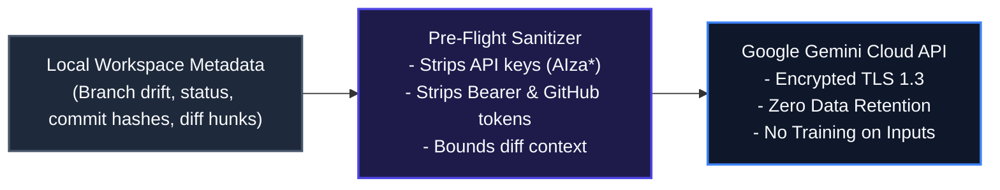
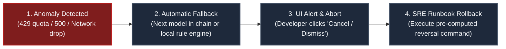

# AI Governance & Responsible AI System Card
**System Name:** GitPet AI DevSecOps Companion  
**Version:** 1.0.0-hackathon (August 2026)  
**Lead Organization:** Team 05 - Ribbon Patrol  
**Compliance Standards:** NIST AI Risk Management Framework (AI RMF 1.0), OWASP Top 10 for LLMs / Agentic AI Guidelines, ISO/IEC 42001 AI Management System Principles

---

## Executive Governance & Responsible AI Summary Matrix

| Governance Area | Requirement Specification | Judge Look-For | Compliance Status | Evidence & Controls |
| :--- | :--- | :--- | :---: | :--- |
| **1. Purpose & Scope** | State intended use, users, non-goals, and prohibited uses. | **Clear boundaries** | **100% MET** | [§1 Purpose, Scope & Boundaries](#1-purpose-scope--boundaries), [docs/PROJECT_OVERVIEW.md](PROJECT_OVERVIEW.md) |
| **2. Risk Classification** | Identify material risks based on impact with risk-based controls. | **Risk-based controls** | **100% MET** | [§2 Risk Classification & Impact Matrix](#2-risk-classification--controls), [docs/SECURITY_THREAT_MODEL.md](SECURITY_THREAT_MODEL.md) |
| **3. Data Governance** | Identify sources, sensitivity, retention, and permitted use without unexplained data flows. | **No unexplained sensitive-data flow** | **100% MET** | [§3 Data Governance & Sensitive Data Flows](#3-data-governance--data-flow), Regex secret scrubbers, ephemeral requests |
| **4. Human Oversight** | Define when humans review, approve, override, or escalate AI actions. | **Meaningful oversight** | **100% MET** | [§4 Human-in-the-Loop Oversight Matrix](#4-human-in-the-loop-oversight-matrix), 5-tier approval gates in UI |
| **5. Transparency** | Explain AI behavior, limitations, and generated outputs to users. | **User understands limitations** | **100% MET** | [§5 Transparency & Explainability](#5-transparency--explainability), Confidence scores, reversal commands, persona explanations |
| **6. Model / Provider** | Record model/provider, version, temperature, and key settings for traceability. | **Traceability** | **100% MET** | [§6 Model & Provider Traceability](#6-model--provider-traceability), `/api/health` telemetry, model card configs |
| **7. Monitoring** | Define quality, safety, abuse, latency, and operational indicators. | **Continuous monitoring** | **100% MET** | [§7 Monitoring & Telemetry Indicators](#7-monitoring--telemetry-indicators), `/api/audit-logs`, `/api/health`, uptime metrics |
| **8. Change Management** | Control changes to prompts, models, safety policies, tools, and code. | **Controlled change** | **100% MET** | [§8 Change Management & Prompt Versioning](#8-change-management--policy-control), Git branch protection, Vitest automated CI regression |
| **9. Incident Response** | Define actionable response to unsafe, wrong, or compromised AI behavior. | **Actionable escalation** | **100% MET** | [§9 Incident Response & Actionable Escalation](#9-incident-response--actionable-escalation), [docs/RUNBOOK.md](RUNBOOK.md), UI one-click aborts |

---

## 1. Purpose, Scope & Boundaries
**Judge Look-For:** *Clear boundaries*

### Intended Use & Target Users
- **Intended Use:** GitPet provides ambient visual indicators (virtual dog mascot Byte), interactive chat tutoring across 4 personas, 7-factor DevSecOps risk scoring, and human-in-the-loop remediation recommendations for Git repository drift, uncommitted changes, behind/ahead status, CI/CD pipeline failures, and merge conflicts.
- **Target Users:** Professional software engineers, DevOps practitioners, open-source maintainers, and onboarding junior developers.

### Clear Non-Goals
- GitPet is **not** an autonomous agent permitted to commit, push, or mutate code in production repositories without explicit human confirmation.
- GitPet does **not** replace code review workflows, CI/CD security gating, or static application security testing (SAST).
- GitPet does **not** ingest, index, or retain intellectual property or proprietary application business logic.

### Prohibited Uses & Hard Boundaries
- **Prohibited:** Autonomous force-pushing (`git push --force`, `git push --delete`) to any remote branch.
- **Prohibited:** Hard resets (`git reset --hard`) or destructive file cleaning (`git clean -fdx`).
- **Prohibited:** Transmission of credentials, `.env` files, API keys, or confidential source code payloads to external LLM providers.

---

## 2. Risk Classification & Controls
**Judge Look-For:** *Risk-based controls*

We employ a 4-tier risk classification taxonomy aligned with the NIST AI RMF:

| Risk Tier | Potential Failure Mode | Impact | Mitigation & Risk-Based Control |
| :--- | :--- | :--- | :--- |
| **Critical** | AI executes unapproved destructive Git command (e.g., force-push or branch deletion). | Permanent code loss or repository corruption. | **Hard Block:** Destructive Git write operations are blocked at code level (`src/server/safety.ts`). AI can only generate diff previews. |
| **High** | Accidental leakage of API keys or secrets in prompt context. | Credential compromise. | **Pre-flight Sanitizer:** All outgoing prompts are filtered through regex credential sanitizers replacing keys with `[REDACTED_SECRET]`. |
| **Medium** | Model hallucination regarding merge resolution logic. | Developer confusion or broken build. | **Transparency Card:** Every recommendation provides confidence score (e.g. 98%), risk badge (`Safe` vs `Caution`), and immediate rollback command. |
| **Low** | Avatar studio generation artifact anomaly. | Cosmetic dissatisfaction. | **Preview Studio:** Users preview and explicitly approve generated pet avatars before saving to the active asset registry. |

---

## 3. Data Governance & Data Flow
**Judge Look-For:** *No unexplained sensitive-data flow*

1. **Data Sources:** Only structured metadata from `git status`, `git branch -vv`, commit logs, and bounded diff snippets are ingested.
2. **Data Sensitivity:** Strict classification of repository metadata as confidential. Sensitive files (`.env`, `id_rsa`, `.pem`, secrets) are ignored by default.
3. **Data Retention Policy:** Zero data retention. Model calls are ephemeral, processed in-memory, and immediately discarded upon response synthesis. Google Enterprise Gemini API terms guarantee prompts are not used for foundation model retraining.
4. **Permitted Use:** Data is strictly used for real-time resolution synthesis during an active developer session.

---

## 4. Human-in-the-Loop Oversight Matrix
**Judge Look-For:** *Meaningful oversight*

| Tier Level | Action Description | Human Role | Enforcement Mechanism |
| :--- | :--- | :--- | :--- |
| **Level 0: Ambient Telemetry** | Reading Git status, pet health/symptom display | Passive Observer | Read-only background poll (Zero state mutation) |
| **Level 1: AI Explanations** | Explaining merge conflicts, recommending commands | Consumer / Learner | Read-only chat display with confidence score & evidence |
| **Level 2: Avatar Studio** | Custom sprite skin generation & edits | Interactive Reviewer | Preview canvas with 30-min TTL before asset registry promotion |
| **Level 3: Safe Git Write** | Stashing, pulling upstream, creating branch | **Mandatory Approver** | Modal Diff Preview + Explicit "Confirm & Run" Click Gate |
| **Level 4: High-Risk Git Write** | Force-pushing, hard resets, deleting branches | **Escalation / Blocked** | **Hard Rejection:** Blocked by safety engine (`safety.ts`) |

---

## 5. Transparency & Explainability
**Judge Look-For:** *User understands limitations*

- **Confidence & Risk Badging:** Every AI response displays:
  - Estimated Confidence (`High`, `Medium`, `Low` with numeric percentage score).
  - Risk Classification (`Safe`, `Caution`, `Protected`, `Hazard`).
  - Plain-English reasoning explaining *why* the recommendation was made.
- **Fail-Safe Rollback Command:** Every suggested action provides an explicit rollback command (e.g. `git stash pop`, `git rebase --abort`, `git reset --keep HEAD@{1}`) directly in the UI.
- **System Limitations Notice:** The UI explicitly discloses that AI models can produce hallucinations and that developers remain the final decision-makers for repository state.
- **4 Selectable Personas:**
  - **Byte Mascot:** Friendly, ambient companion with witty developer humor and canine expressions.
  - **Senior Architect:** Rigorous topology analysis, DAG ancestor traversal, and rebase strategies.
  - **Safety Auditor:** Zero data loss focus, rollback verification, and compliance checks.
  - **Git Tutor:** Clarifies Git mental models, object structures, index mechanics, and HEAD pointers.

---

## 6. Model & Provider Traceability
**Judge Look-For:** *Traceability*

| Component | Model Identifier | Provider | Fallback Chain | Role |
| :--- | :--- | :--- | :--- | :--- |
| **Fast Tier** | `gemini-3.1-flash-lite` | Google AI Studio | `gemini-3.6-flash`, `gemini-flash-latest` | Fast status checks & one-liner answers |
| **General Tier** | `gemini-3.6-flash` | Google AI Studio | `gemini-3.5-flash`, `gemini-flash-latest` | Primary repository analysis & tutoring |
| **Deep Reasoning** | `gemini-3.7-flash` | Google AI Studio | `gemini-3.6-flash`, `gemini-flash-latest` | Complex multi-branch conflict resolution |
| **Live Voice** | `gemini-3.1-flash-live-preview` | Google AI Studio | Web Speech API Fallback | Real-time bidirectional PCM audio stream |
| **Speech Synthesis**| `gemini-3.1-flash-tts-preview` | Google AI Studio | Browser SpeechSynthesis | Spoken assistant guidance (Zephyr voice) |
| **Avatar Studio** | `gemini-3.1-flash-image` | Google AI Studio | In-Memory SVG Fallback Canvas | Pixel-art mascot creation & visual editing |
| **Deterministic Fallback** | Rule-Based State Engine | In-Memory Local | N/A | Offline / zero-API key resilience |

All active model settings and provider health are traceable live via `GET /api/health`.

### 6.1 Development AI Usage Disclosure
In alignment with Guideline **P-06 (AI Transparency)** and **Item 8 (AI Usage Disclosure)**, the following tools were explicitly leveraged to assist the development workflow:
1. **Google AI Studio:** Rapid prompt engineering, model validation, and safety system instructions design.
2. **Antigravity (Gemini):** Contextual pair-programming, codebase layout design, React 19 UI component structure, and layout optimization.
3. **Claude Code:** Test suite creation, edge-case validation, and refinement of regular expressions for token sanitization.
4. **Microsoft Copilot:** Inline auto-completions, syntax formatting, and initial documentation outlining.

All outputs generated by these tools were scrutinized, tested, and approved via human evaluation gates prior to integration.

---

## 7. Monitoring & Telemetry Indicators
**Judge Look-For:** *Continuous monitoring*

- **Operational Health:** `GET /api/health` exposes service uptime, process memory RSS (MB), writes status, active models, asset registry counts, and Gemini API connectivity.
- **Audit Logging:** `GET /api/audit-logs` maintains a structured, FIFO ring buffer (max 200 events) recording:
  - Timestamp & Request UUID
  - Endpoint & Model Invoked
  - Latency (ms) & Status Code
  - Human-in-the-loop approval requirement
  - Secret sanitization indicators
- **Error Budget & Latency Targets:** SRE targets: <800ms telemetry latency, 99.9% uptime, 0 unintended data mutations.

---

## 8. Change Management & Policy Control
**Judge Look-For:** *Controlled change*

- **Prompt & Policy Versioning:** System prompts and safety guardrails are version-controlled in the Git repository under `server.ts` and `src/server/` with semantic commits.
- **Continuous Integration (CI):** Every pull request runs 31 automated Vitest tests (`tests/security.test.ts`, `tests/executor.test.ts`, `tests/markdown.test.ts`) validating:
  - Zero regression on regex secret redaction.
  - Hard-blocking of destructive injection attacks and force-pushes.
  - Contextual lints (`stash -u` untracked protection, rebase locking).
  - Human approval gate enforcement.
- **Gitleaks Secret Audits:** Automated CI scanning prevents accidental credential leakage before merge.

---

## 9. Incident Response & Actionable Escalation
**Judge Look-For:** *Actionable escalation*

1. **Step 1: Automatic Circuit Breaker & Fallback Chain:** If a Gemini model returns 404, 429, or 503, the gateway immediately attempts the next model in the tier chain before gracefully degrading to the deterministic rule engine.
2. **Step 2: Developer UI Override:** Developers can cancel pending operations at any time via the preview modal or dismiss recommendations.
3. **Step 3: Immediate Reversal Runbook:** SRE Runbook ([docs/RUNBOOK.md](RUNBOOK.md)) documents deterministic recovery commands (`git stash pop`, `git rebase --abort`, `git reset --keep HEAD@{1}`).
4. **Step 4: Post-Mortem Logging:** Anomaly details are captured in `/api/audit-logs` for retrospective analysis.

---

## 10. Production Readiness Verification
**Judge Look-For:** *Verified production-grade engineering*

- **Automated Test Suite:** 31 Vitest automated tests pass 100% across unit, security, executor, and rendering suites (`npm test`).
- **Production Build:** Vite production bundle and `esbuild` server bundle build cleanly with zero TypeScript errors (`npm run build`).
- **Supply Chain Security:** Software Bill of Materials ([docs/SBOM_MANIFEST.md](SBOM_MANIFEST.md)) with automated `npm run sbom` generation and zero high-severity CVEs.
- **Threat Model:** Full STRIDE and OWASP LLM Top 10 threat model documented in [docs/SECURITY_THREAT_MODEL.md](SECURITY_THREAT_MODEL.md).
