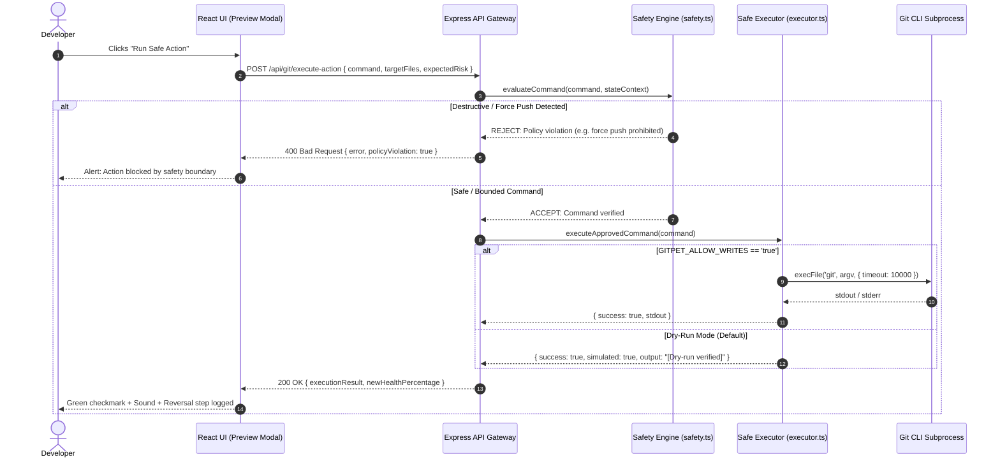

# Architecture & System Design Document: GitPet

**Project:** GitPet (Ribbon DevSecOps Companion)  
**Version:** 1.0.0-production  
**Team:** Ribbon Patrol (Team 05)  
**Standard:** C4 Model / NIST & OWASP DevSecOps Reference Architecture

---

## 1. High-Level System Architecture

```mermaid
graph TD
    %% Styling
    classDef main fill:#2a2b36,stroke:#7c3aed,stroke-width:2px,color:#ffffff;
    classDef ext fill:#1e1e24,stroke:#4b5563,stroke-width:1px,color:#d1d5db;
    classDef client fill:#1e3a8a,stroke:#3b82f6,stroke-width:2px,color:#ffffff;

    Dev["Developer (User)"]:::main
    
    subgraph GitPet Platform
        UI["GitPet React 19 Frontend<br/>(Multi-Page Dashboard / Canvas / Web Audio)"]:::client
        BE["GitPet Node.js Backend<br/>(Express Gateway Server - Port 3004)"]:::main
    end

    subgraph Local Workspace & Remotes
        GitCLI["Local Git CLI / Workspace"]:::ext
        GitHub["GitHub Live Test Fixture<br/>(farisnour/gitpet-acme-corp)"]:::ext
    end

    subgraph Google Cloud GenAI Services
        GeminiChat["Gemini 2.5 / 3 Flash & Pro<br/>(Reasoning & State Analysis)"]:::ext
        GeminiLive["Gemini 3.1 Flash Live<br/>(Bidirectional Audio WebSocket)"]:::ext
        GeminiImage["Gemini 3.1 Flash Image<br/>(Avatar Creation & Editing)"]:::ext
        GeminiTTS["Gemini 3.1 Flash TTS<br/>(Speech Synthesis)"]:::ext
    end

    Dev -->|Interacts / Voice / Keyboard / Sidebar Nav| UI
    UI <-->|"HTTP REST & WebSocket (/live)"| BE
    BE <-->|Safe CLI Scan / Dry-Run / Verified Writes| GitCLI
    BE <-->|Octokit / REST API (Live Branch Sync)| GitHub
    BE <-->|TLS 1.3 / Redacted API Keys| GeminiChat
    BE <-->|PCM Audio Stream| GeminiLive
    BE <-->|Image Prompts & Edits| GeminiImage
    BE <-->|Text to Audio| GeminiTTS
```

---

## 2. Container & Component Architecture (C4 Component Model)

```mermaid
graph TB
    %% Styling
    classDef module fill:#1e293b,stroke:#0f172a,color:#f8fafc;
    classDef group fill:none,stroke:#475569,stroke-dasharray: 5 5;

    subgraph ClientContainer [Frontend Application - React 19 + Vite]
        App["App.tsx<br/>Router & State Orchestrator"]:::module
        Sidebar["SidebarNav.tsx<br/>Collapsible Responsive Sidebar"]:::module
        TopBar["TopBar.tsx<br/>Breadcrumb & Quick Action Header"]:::module
        
        %% Pages
        P1["Ambient Companion<br/>PetStage.tsx & ChatStream.tsx"]:::module
        P2["RepositoryPage.tsx<br/>DAG Graph, Working Tree, Stashes, Audit"]:::module
        P3["CICDPage.tsx<br/>Pipelines, Flaky Tests, CVE Scans"]:::module
        P4["PRIntelligencePage.tsx<br/>PR Reviews, Inline Comments, Merges"]:::module
        P5["ReleaseReadinessPage.tsx<br/>5-Pillar Gate & Export Artifacts"]:::module
        P6["RiskScorePage.tsx<br/>7-Factor Risk Scorecard & Health Pool"]:::module
        
        %% Modals
        Modals["AICommitGeneratorModal.tsx<br/>PreviewChangesModal.tsx<br/>QuickPaletteModal.tsx"]:::module
    end

    subgraph ServerContainer [Backend Gateway Service - Node.js / Express]
        Router["Express REST Router<br/>(server.ts)"]:::module
        WSServer["WebSocket Server (/live)<br/>(Gemini Live Audio Streamer)"]:::module
        SafetyGate["safety.ts<br/>2-Layer Policy: Static Rules + Contextual Lints"]:::module
        Executor["executor.ts<br/>Safe argv Child Process Executor (GITPET_ALLOW_WRITES)"]:::module
        GitHubClient["githubClient.ts<br/>Live GitHub Repo Client & Rate Limiting"]:::module
        Telemetry["Observability Buffer<br/>FIFO Ring Buffer (max 200 events)"]:::module
        AssetRegistry["Asset Registry<br/>Ephemeral 30-min TTL Preview Store"]:::module
        Fallback["Rule-Based Fallback Engine<br/>Deterministic Offline Resilience"]:::module
    end

    %% Client component wiring
    App --> Sidebar
    App --> TopBar
    App --> P1
    App --> P2
    App --> P3
    App --> P4
    App --> P5
    App --> P6
    App --> Modals

    %% Client-Server communication
    P1 -->|POST /api/ai/chat| Router
    P2 -->|POST /api/git/execute-action| Router
    P3 -->|GET /api/gitpet/live-status| Router
    P5 -->|GET /api/ai/release-readiness| Router
    Modals -->|POST /api/ai/chat| Router

    %% Server internal wiring
    Router --> SafetyGate
    Router --> Executor
    Router --> GitHubClient
    Router --> Telemetry
    Router --> AssetRegistry
    Router --> Fallback
    WSServer --> Telemetry
```



---

## 3. Safe Git Command Execution & Approval Flow



---

## 4. Multi-Page Layout & Navigation Architecture

GitPet separates operational workflows into 6 distinct full-page views:

1. **Ambient Companion (`#companion`)**: Interactive pixel companion avatar with mood/symptom postures, live telemetry mission control quick deck, and multi-turn Gemini conversation stream.
2. **Repository Details & Graph (`#repository`)**: Interactive SVG DAG commit visualizer, multi-file working tree diff viewer, stash stack management, and session audit history.
3. **CI/CD Pipelines (`#cicd`)**: Pipeline stage progression tracking with expandable logs, flaky test quarantining, and CVE security alerts.
4. **Pull Request Intelligence (`#pr`)**: Active PR approval status, review turnaround tracker, inline comments with AI draft replies, and simulated squash & merge.
5. **Release Gate (`#release`)**: 5-pillar deployment readiness scorecard with exportable JSON audit artifacts and Markdown summaries.
6. **Risk & HP Scorecard (`#risk`)**: 7-factor weighted repository health scorecard with interactive factor breakdown and one-click remediation.
