# Architecture & System Design Document: GitPet

**Project:** GitPet (Ambient DevSecOps Repository Companion)  
**Version:** 1.0.0-production (August 2026)  
**Team:** Ribbon Patrol (Team 05)  
**Standards:** C4 Architecture Model / NIST AI RMF 1.0 / OWASP DevSecOps Reference Architecture  
**Repository:** [lucaswhitaker22/DevOps-for-GenAI---Ottawa-2026---Team-05-Ribbon-Patrol](https://github.com/lucaswhitaker22/DevOps-for-GenAI---Ottawa-2026---Team-05-Ribbon-Patrol)  

---

## 1. System Context Architecture (C4 Level 1)

GitPet operates as an ambient DevSecOps intelligence layer sitting directly beside the software developer's workstation. It continuously ingests telemetry from local Git repositories, live public GitHub fixtures, and CI/CD pipelines, synthesizes findings using Google Gemini models, and safely executes bounded, human-confirmed remediation actions.

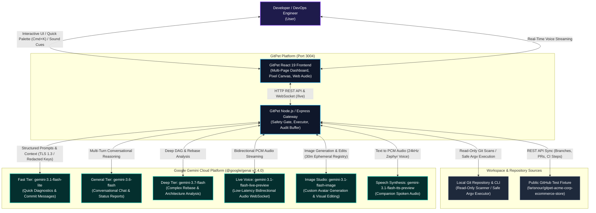

---

## 2. Container Architecture (C4 Level 2)

The GitPet platform consists of two high-performance containers running concurrently on the host: a React 19 Single Page Application (SPA) and a Node.js/Express API gateway with embedded WebSocket streaming.

```mermaid
graph TB
    %% Styling
    classDef client fill:#1e3a8a,stroke:#3b82f6,stroke-width:2px,color:#ffffff;
    classDef gateway fill:#2a2b36,stroke:#7c3aed,stroke-width:2px,color:#ffffff;
    classDef store fill:#064e3b,stroke:#10b981,stroke-width:1px,color:#ffffff;
    classDef ext fill:#1e293b,stroke:#475569,stroke-width:1px,color:#ffffff;

    subgraph ClientContainer ["Frontend Container (React 19 + Vite 6 + Tailwind 4)"]
        SPA["App.tsx State Orchestrator<br/>(Hash Router, Theme State, Scenario Manager)"]:::client
        AudioEffects["audioEffects.ts & audioStreamer.ts<br/>(Web Audio Synthesis & PCM Encoder)"]:::client
        Normalizer["gitDagNormalizer.ts & diffParser.ts<br/>(Topological Lineage & Unified Diff Parser)"]:::client
        ReleaseCalc["releaseReadiness.ts<br/>(5-Pillar Scorecard Calculation)"]:::client
    end

    subgraph ServerContainer ["Backend Gateway Container (Node.js 20+ / Express 4.21)"]
        ExpressApp["server.ts Express Router<br/>(14 REST Endpoints)"]:::gateway
        WSServer["WebSocket Server (/live)<br/>(ws 8.21 Streaming Gateway)"]:::gateway
        SafetyEngine["safety.ts<br/>(2-Layer Safety Policy: 8 Static + 7 Contextual)"]:::gateway
        Executor["executor.ts<br/>(Pure Argv Child Process Executor)"]:::gateway
        AuthMiddleware["auth.ts<br/>(Timing-Safe Constant-Time Basic Auth)"]:::gateway
        GitHubService["githubClient.ts<br/>(Octokit-free REST Client & Rate Limiting)"]:::gateway
        
        %% In-Memory Stores
        AuditBuffer[("FIFO Ring Buffer<br/>(Max 200 Audit Events)")]:::store
        AssetRegistry[("Asset Registry<br/>(30-Min TTL Preview Store)")]:::store
        FallbackEngine[("Deterministic Rule Engine<br/>(Zero API Key Offline Fallback)")]:::store
    end

    subgraph ExternalServices ["External Boundaries"]
        GitCLI["Local Git CLI (process.cwd)"]:::ext
        GitHubAPI["GitHub REST API"]:::ext
        GeminiAPI["Google Gemini Cloud APIs"]:::ext
    end

    %% Client Internal
    SPA --> AudioEffects
    SPA --> Normalizer
    SPA --> ReleaseCalc

    %% Client to Server
    SPA <-->|"HTTP JSON Requests"| ExpressApp
    SPA <-->|"Bidirectional Audio WebSocket"| WSServer

    %% Server Internal
    ExpressApp --> AuthMiddleware
    ExpressApp --> SafetyEngine
    ExpressApp --> Executor
    ExpressApp --> GitHubService
    ExpressApp --> AuditBuffer
    ExpressApp --> AssetRegistry
    ExpressApp --> FallbackEngine
    WSServer --> AuditBuffer

    %% Server to External
    Executor <-->|"execFile('git', argv)"| GitCLI
    GitHubService <-->|"HTTPS GET"| GitHubAPI
    ExpressApp <-->|"GoogleGenAI SDK (@google/genai)"| GeminiAPI
    WSServer <-->|"ai.live.connect"| GeminiAPI
```

---

## 3. Component Architecture (C4 Level 3)

### 3.1 Frontend Component Architecture

GitPet organizes the user interface into 6 dedicated full-page workspaces, global modal dialogues, and headless utility engines:

```mermaid
graph TB
    classDef core fill:#1e293b,stroke:#0f172a,color:#f8fafc;
    classDef page fill:#1e1b4b,stroke:#7c3aed,stroke-width:2px,color:#ffffff;
    classDef modal fill:#1e3a8a,stroke:#3b82f6,stroke-width:1px,color:#ffffff;
    classDef util fill:#064e3b,stroke:#10b981,stroke-width:1px,color:#ffffff;

    App["App.tsx<br/>Root Orchestrator & State Container"]:::core
    Sidebar["SidebarNav.tsx<br/>Collapsible Responsive Sidebar"]:::core
    TopBar["TopBar.tsx<br/>Breadcrumb Header & Controls"]:::core

    subgraph DedicatedPages ["6 Full-Page Workspaces"]
        P1["#companion: PetStage.tsx & ChatStream.tsx<br/>Pixel Mascot, 18 Symptoms, 4 Personas"]:::page
        P2["#repository: RepositoryPage.tsx<br/>GitDagVisualizer.tsx & DiffViewer.tsx"]:::page
        P3["#cicd: CICDPage.tsx<br/>5-Stage Progression & Flaky Quarantine"]:::page
        P4["#pr: PRIntelligencePage.tsx<br/>Turnaround Clock, Inline Threads, AI Reply"]:::page
        P5["#release: ReleaseReadinessPage.tsx<br/>5-Pillar Scorecard & Compliance Export"]:::page
        P6["#risk: RiskScorePage.tsx<br/>7-Factor HP Pool & Category Filters"]:::page
    end

    subgraph GlobalModals ["Global Modals & Utility Dialogs"]
        M1["AICommitGeneratorModal.tsx (Conventional Commits 1.0.0)"]:::modal
        M2["PreviewChangesModal.tsx (Dry-Run Approval Gate)"]:::modal
        M3["QuickPaletteModal.tsx (Command Palette ⌘K)"]:::modal
        M4["LiveVoiceModal.tsx (Live Audio Streaming UI)"]:::modal
        M5["ImageStudioModal.tsx (Pet Avatar Studio)"]:::modal
        M6["ReleaseReadinessModal.tsx (5-Pillar Gate Modal)"]:::modal
        M7["RiskScoreModal.tsx (7-Factor Health Breakdown)"]:::modal
    end

    subgraph HeadlessEngines ["Utility & Normalization Engines"]
        U1["gitDagNormalizer.ts (DAG Lane Routing & Topo Sort)"]:::util
        U2["diffParser.ts (Unified Diff Hunk Parsing)"]:::util
        U3["releaseReadiness.ts (5-Pillar Mathematical Formula)"]:::util
        U4["audioEffects.ts & audioStreamer.ts (Web Audio & PCM)"]:::util
    end

    App --> Sidebar
    App --> TopBar
    App --> P1 & P2 & P3 & P4 & P5 & P6
    App --> M1 & M2 & M3 & M4 & M5 & M6 & M7

    P2 --> U1 & U2
    P5 --> U3
    P1 --> U4
    M4 --> U4
```

### 3.2 Backend Subsystem Architecture (`server.ts` & `src/server/`)

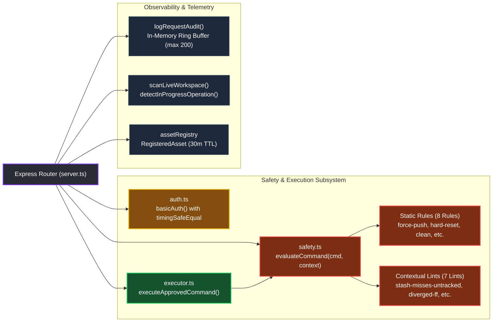

---

## 4. Core Data Flows & Interaction Sequences (C4 Level 4)

### Sequence 1: Live Workspace Scanning & Telemetry Ingestion
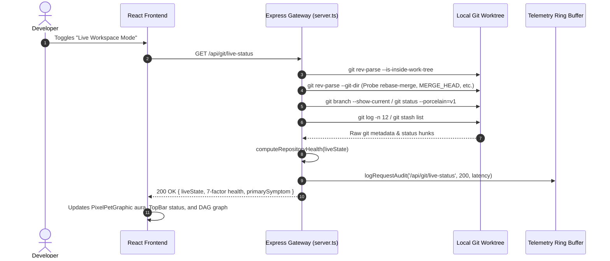

### Sequence 2: Conversational Chat Reasoning & Safe Action Recommendation
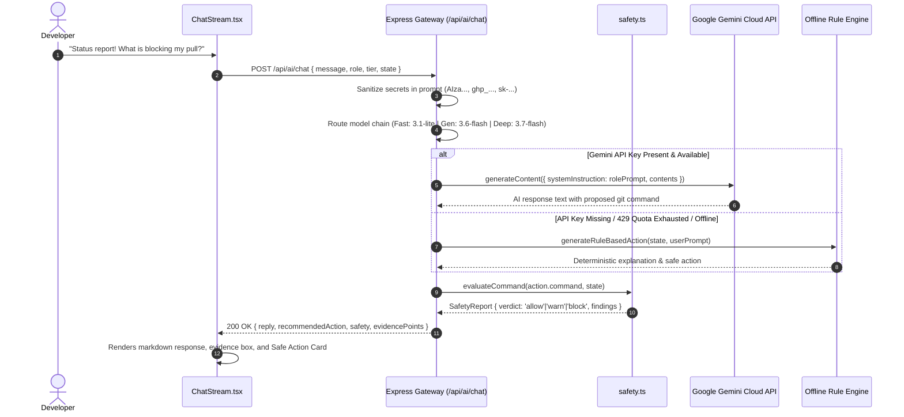

### Sequence 3: Dry-Run Safety Preview & Human-in-the-Loop Confirmation
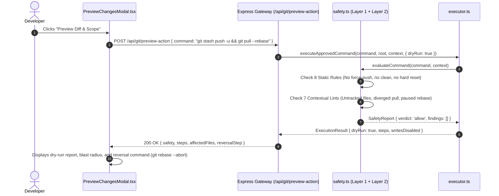

### Sequence 4: Bounded Git Command Execution
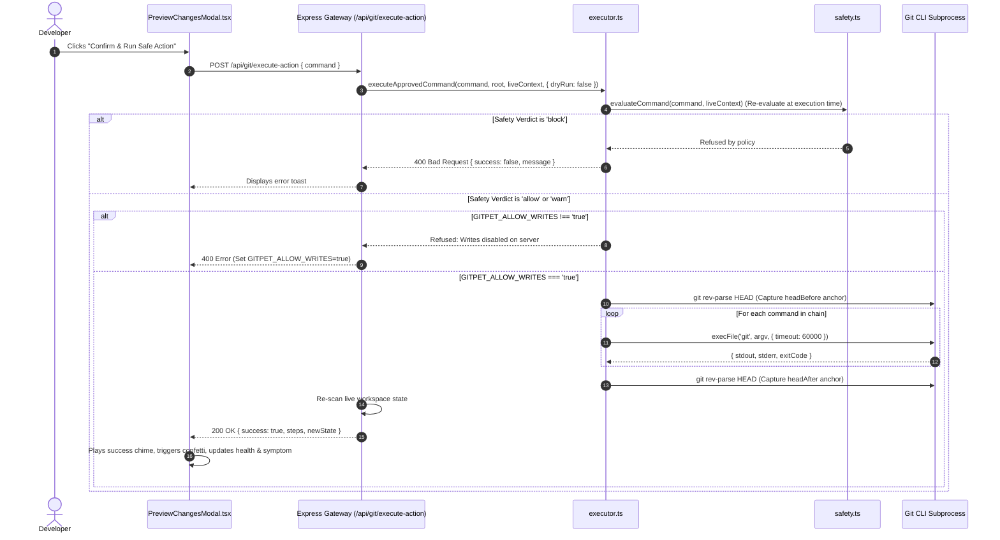

### Sequence 5: Bidirectional Gemini Live Audio Streaming
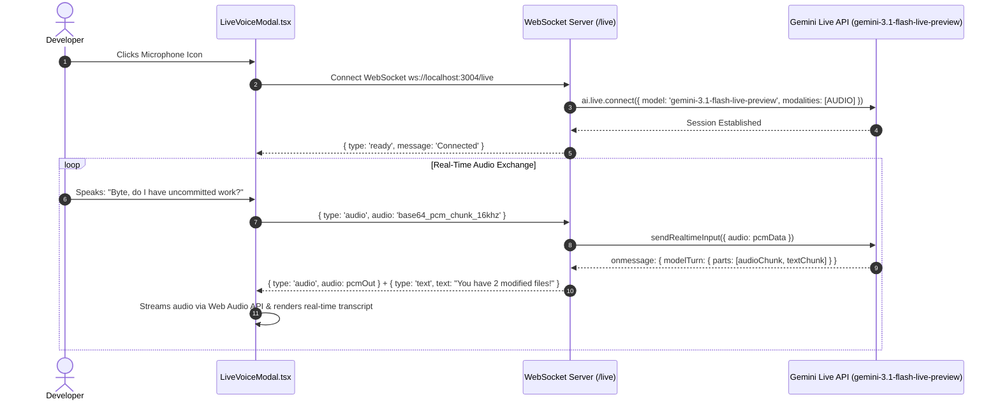

### Sequence 6: Ephemeral Image Generation, Editing & Promotion
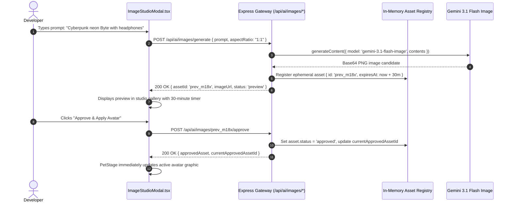

### Sequence 7: 5-Pillar Release Readiness Synthesis & Sign-Off
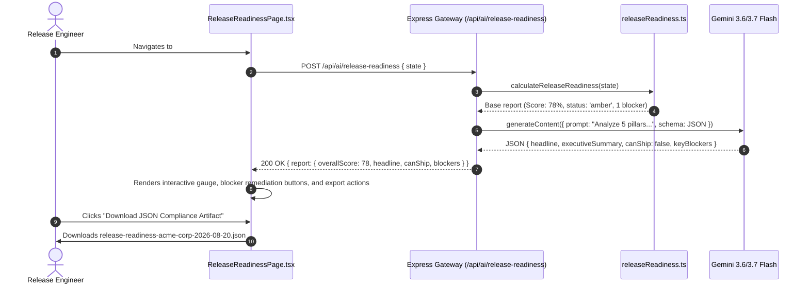

---

## 5. Security Architecture & Threat Boundaries

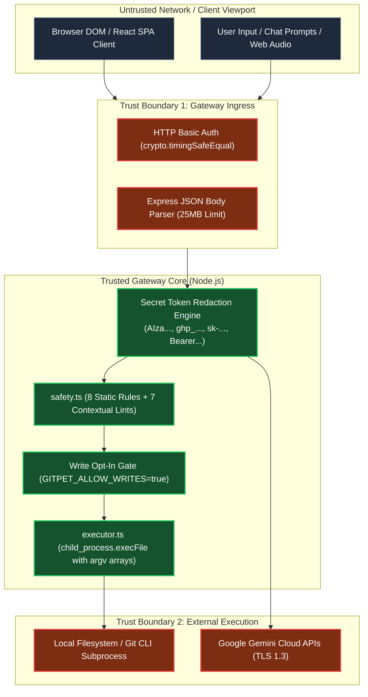

### Security Defenses:
1. **Argv Child Process Execution**: Commands never pass through a system shell (`sh`, `bash`, `cmd.exe`, `powershell`). Commands are split using quote-aware tokenization into argument arrays (`['git', 'pull', '--rebase']`), neutralizing command injection vulnerabilities.
2. **Contextual Untracked File Protection**: `safety.ts` detects untracked files in the working directory before approving `git stash`, preventing silent data loss.
3. **Strict Zero Force-Push Policy**: Prohibits un-leased force pushes (`--force`), destructive resets (`--hard`), and unmerged branch drops (`-D`).
4. **Secret Token Redaction**: Scans all prompt inputs and repository diffs for high-entropy API keys and tokens before sending context to Google Gemini.
5. **Timing-Safe Basic Authentication**: Optional HTTP Basic Auth verified using `crypto.timingSafeEqual` to eliminate timing side-channel attacks.

---

## 6. Deployment & Runtime Topology

GitPet supports two runtime topologies:

### Development Runtime (`npm run dev`):
* Express server runs via `tsx watch server.ts`.
* Vite dev server is embedded as Express middleware (`appType: 'spa'`).
* Vite HMR watcher excludes non-source repository files (`docs/**`, `.git/**`, `metadata.json`, screenshots) to prevent full page reloads and state loss during live repository scans.

### Production Runtime (`npm run build` && `npm run start`):
* Frontend is compiled to optimized static assets in `dist/` via `vite build`.
* Backend server is compiled and bundled into a single CommonJS file (`dist/server.cjs`) via `esbuild`.
* Express serves static assets from `dist/` and acts as a SPA fallback router for non-API routes.
* Dockerized deployment available via multi-stage `Dockerfile` and `docker-compose.yml`.
