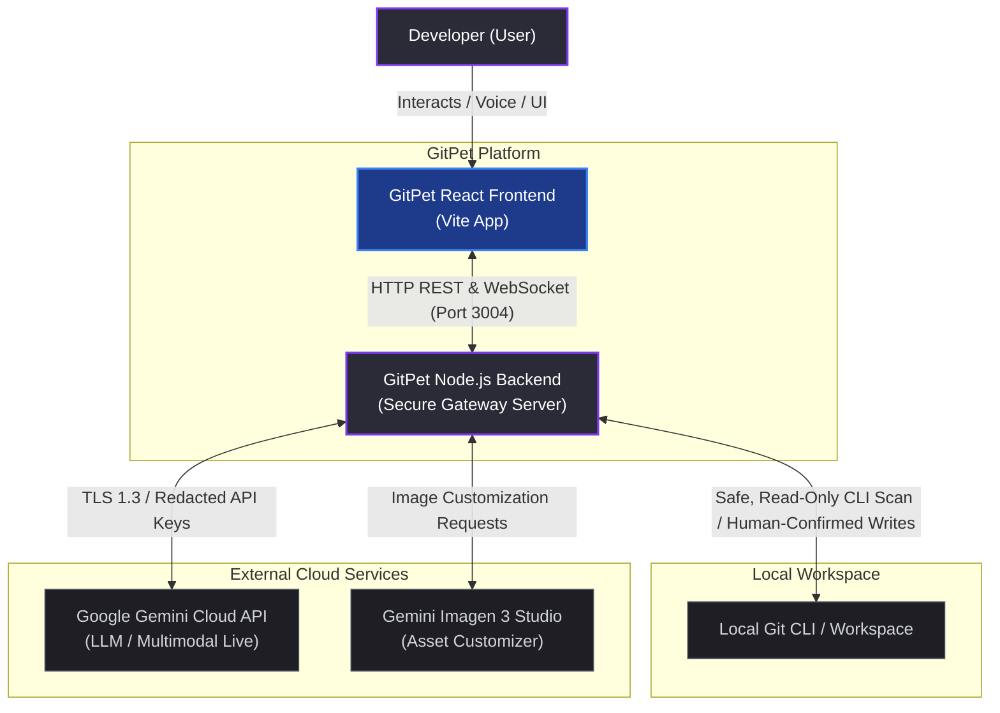
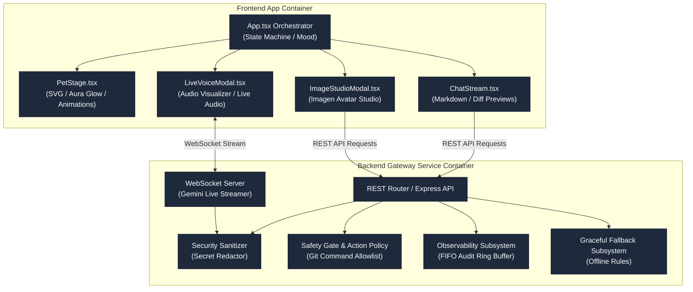
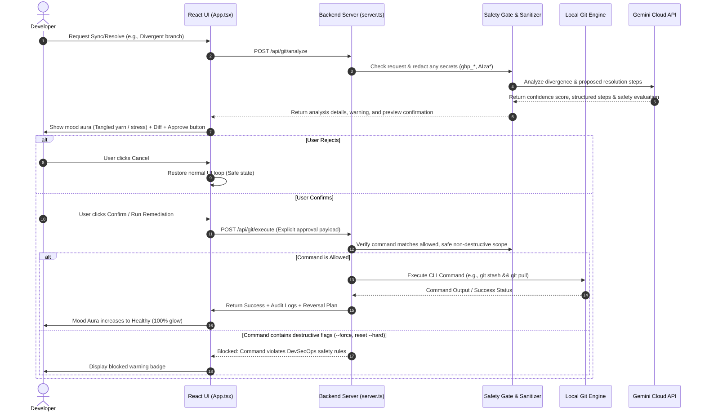

# Architecture & System Design Document: GitPet

**Project:** GitPet (Ribbon DevSecOps Companion)  
**Version:** 1.0.0-production  
**Team:** Ribbon Patrol (Team 05)  
**Standard:** C4 Model / NIST & OWASP DevSecOps Reference Architecture

---

## 1. High-Level System Architecture

### 1.1 System Context Diagram (C4 Context)
Describes the boundaries of GitPet, showing how users interact with the client, and how the Node.js backend secure gateway connects safely to local workspace Git commands and Google Cloud APIs.

### 1.2 Container & Component Diagram
Details the core subsystems running within both the Frontend Client (React) and the Backend Gateway Service (Node.js).

### 1.3 Safe Git Command Execution Flow
Illustrates how the user requested action is analyzed, vetted for safety, authorized, and executed.

---

## 2. Component Design & Responsibilities

### 2.1 Frontend Client (`src/`)
- **`App.tsx`**: Central orchestrator managing state machines for pet mood, active scenario, selected AI model persona, chat histories, and modal dialogs.
- **`PetStage.tsx`**: Interactive visual stage rendering SVG animations, health aura glows, emotional expressions (leash pull, tangled yarn, backpack), XP progression, and level badges.
- **`ChatStream.tsx`**: Full Markdown chat stream rendering assistant reasoning, cited repository evidence, risk confidence scores, syntax-highlighted diff previews, and interactive approval cards.
- **`LiveVoiceModal.tsx`**: Real-time microphone capture, audio visualizer, and low-latency bidirectional WebSocket connection streaming to the Gemini Live API.
- **`ImageStudioModal.tsx`**: Pet avatar customizer interfacing with Gemini Imagen 3 for prompt generation, asset preview isolation, and promotion.
- **`TopologyModal.tsx` & `DiffModal.tsx`**: Interactive visual representations of the Git DAG branch topology and file-level side-by-side diffs.

### 2.2 Backend Gateway Service (`server.ts`)
- **Security & Redaction Layer**: Intercepts all outgoing prompts to strip authorization headers, personal access tokens (`ghp_...`), and Google API keys (`AIza...`).
- **Safety Gate & Action Policy**: Guarantees that no mutating Git command (`git stash`, `git pull`, `git checkout`) can be executed without an explicit confirmation payload sent from the client preview modal. Destructive commands (`--force`, `reset --hard`) are rejected at the parser level.
- **Observability Subsystem**: Maintains an in-memory FIFO ring buffer of audited interactions, recording timestamp, model type, latency in milliseconds, prompt tokens, and status codes.
- **Graceful Fallback Subsystem**: Provides deterministic, rule-based responses if the Gemini API is unreachable or rate-limited.

---

## 3. Production Deployment & Security Path

1. **Build Artifacts:** Compiles frontend via Vite into optimized static assets (`dist/`) and bundles the server into `dist/server.cjs` via `esbuild`.
2. **Containerization / Cloud Target:** Ready for containerized deployment (e.g. Google Cloud Run, AWS ECS, or Kubernetes) using standard Node.js alpine images.
3. **Zero Secrets in Source:** All sensitive configuration is isolated in environment variables (`GEMINI_API_KEY`, `APP_URL`).
4. **Automated CI/CD:** GitHub Actions workflow executes linting, unit tests, adversarial security tests, Gitleaks scanning, and SBOM generation on every push.
