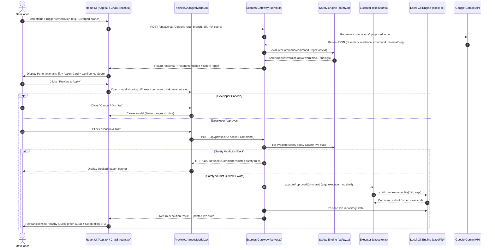

# Architecture & System Design Document: GitPet

**Project:** GitPet (Ribbon DevSecOps Companion)  
**Version:** 1.0.0-production  
**Team:** Ribbon Patrol (Team 05)  
**Standard:** C4 Model / NIST & OWASP DevSecOps Reference Architecture

---

## 1. High-Level System Architecture

```mermaid
graph TD
    %% Styling
    classDef main fill:#2a2b36,stroke:#7c3aed,stroke-width:2px,color:#ffffff;
    classDef ext fill:#1e1e24,stroke:#4b5563,stroke-width:1px,color:#d1d5db;
    classDef client fill:#1e3a8a,stroke:#3b82f6,stroke-width:2px,color:#ffffff;

    Dev["Developer (User)"]:::main
    
    subgraph GitPet Platform
        UI["GitPet React 19 Frontend<br/>(Vite App / Canvas / Web Audio)"]:::client
        BE["GitPet Node.js Backend<br/>(Express Gateway Server - Port 3004)"]:::main
    end

    subgraph Local Workspace & Remotes
        GitCLI["Local Git CLI / Workspace"]:::ext
        GitHub["GitHub Live Test Fixture<br/>(farisnour/gitpet-acme-corp)"]:::ext
    end

    subgraph Google Cloud GenAI Services
        GeminiChat["Gemini 3.6 / 3.7 Flash<br/>(Reasoning & State Analysis)"]:::ext
        GeminiLive["Gemini 3.1 Flash Live<br/>(Bidirectional Audio WebSocket)"]:::ext
        GeminiImage["Gemini 3.1 Flash Image<br/>(Avatar Creation & Editing)"]:::ext
        GeminiTTS["Gemini 3.1 Flash TTS<br/>(Speech Synthesis)"]:::ext
    end

    Dev -->|Interacts / Voice / Keyboard| UI
    UI <-->|"HTTP REST & WebSocket (/live)"| BE
    BE <-->|Safe CLI Scan / Dry-Run / Verified Writes| GitCLI
    BE <-->|Octokit / REST API (Live Branch Sync)| GitHub
    BE <-->|TLS 1.3 / Redacted API Keys| GeminiChat
    BE <-->|PCM Audio Stream| GeminiLive
    BE <-->|Image Prompts & Edits| GeminiImage
    BE <-->|Text to Audio| GeminiTTS
```

---

## 2. Container & Component Architecture (C4 Component Model)

```mermaid
graph TB
    %% Styling
    classDef module fill:#1e293b,stroke:#0f172a,color:#f8fafc;
    classDef group fill:none,stroke:#475569,stroke-dasharray: 5 5;

    subgraph ClientContainer [Frontend Application - React 19 + Vite]
        App["App.tsx<br/>Orchestrator & State Machine"]:::module
        PetStage["PetStage.tsx & PixelPetGraphic.tsx<br/>Ambient Canvas & 18 Symptom Expressions"]:::module
        ChatStream["ChatStream.tsx<br/>Evidence Markdown & Approval Cards"]:::module
        DAG["GitDagVisualizer.tsx<br/>Interactive Multi-Lane DAG Topology"]:::module
        CICD["CICDPipelineDrawer.tsx<br/>CI/CD Telemetry & Flaky Test Quarantine"]:::module
        PRDrawer["PRIntelligenceDrawer.tsx<br/>PR Reviews, Blockers & Changelogs"]:::module
        RiskModal["RiskScoreModal.tsx<br/>7-Factor DevSecOps Risk Score Engine"]:::module
        CommitGen["AICommitGeneratorModal.tsx<br/>Conventional Commits & Release Notes"]:::module
        DiffViewer["DiffViewer.tsx & PreviewChangesModal.tsx<br/>Side-by-Side Diffs & Human Approval Gate"]:::module
        LiveVoice["LiveVoiceModal.tsx<br/>Web Audio & Live Streaming Modal"]:::module
        ImageStudio["ImageStudioModal.tsx<br/>Avatar Customizer & Preview Gallery"]:::module
        Palette["QuickPaletteModal.tsx<br/>Command Palette (Cmd+K / Ctrl+K)"]:::module
    end

    subgraph ServerContainer [Backend Gateway Service - Node.js / Express]
        Router["Express REST Router<br/>(server.ts)"]:::module
        WSServer["WebSocket Server (/live)<br/>(Gemini Live Audio Streamer)"]:::module
        SafetyGate["safety.ts<br/>2-Layer Policy: Static Rules + Contextual Lints"]:::module
        Executor["executor.ts<br/>Safe argv Child Process Executor (GITPET_ALLOW_WRITES)"]:::module
        GitHubClient["githubClient.ts<br/>Live GitHub Repo Client & Rate Limiting"]:::module
        Telemetry["Observability Buffer<br/>FIFO Ring Buffer (max 200 events)"]:::module
        AssetRegistry["Asset Registry<br/>Ephemeral 30-min TTL Preview Store"]:::module
        Fallback["Rule-Based Fallback Engine<br/>Deterministic Offline Resilience"]:::module
    end

    %% Client component wiring
    App --> PetStage
    App --> ChatStream
    App --> DAG
    App --> CICD
    App --> PRDrawer
    App --> RiskModal
    App --> CommitGen
    App --> DiffViewer
    App --> LiveVoice
    App --> ImageStudio
    App --> Palette

    %% Client-Server communication
    ChatStream -->|POST /api/ai/chat| Router
    CommitGen -->|POST /api/ai/chat| Router
    ImageStudio -->|POST /api/ai/images/*| Router
    LiveVoice <-->|WebSocket /live| WSServer
    DiffViewer -->|POST /api/git/preview-action| Router
    DiffViewer -->|POST /api/git/execute-action| Router
    App -->|GET /api/git/live-status| Router
    App -->|GET /api/repo/live| Router

    %% Server internal wiring
    Router --> SafetyGate
    Router --> Executor
    Router --> GitHubClient
    Router --> Telemetry
    Router --> AssetRegistry
    Router --> Fallback
    WSServer --> Telemetry
```



---

## 3. Safe Git Command Execution & Approval Flow



---

## 4. Subsystem Details & Responsibilities

### 4.1 Frontend Client Architecture (`src/`)

* **`App.tsx`**: Primary application controller coordinating 18 preset scenarios, live workspace scanning, active branch telemetry, model tiers, and drawer states.
* **`PetStage.tsx` & `PixelPetGraphic.tsx`**: Dynamic SVG/Canvas pet renderer displaying Byte across 18 distinct symptoms, reactive eye tracking, particle effects, and audio-synced animations.
* **`GitDagVisualizer.tsx`**: Multi-lane DAG topology visualizer supporting linear commit chains, merge nodes, detached heads, hazard warnings, and collapsed commit runs.
* **`CICDPipelineDrawer.tsx`**: Real-time CI/CD telemetry drawer with build step statuses, flaky test quarantine list, CVE vulnerability details, and deployment logs.
* **`PRIntelligenceDrawer.tsx`**: Pull request intelligence inspector highlighting review blockers, requested changes, inline comment threads with line references, and automated release changelogs.
* **`RiskScoreModal.tsx`**: Interactive 7-factor DevSecOps risk score breakdown calculating impact deductions and providing clear remediations.
* **`AICommitGeneratorModal.tsx`**: AI conventional commit message, changelog, and release notes generator supporting standard types (`feat`, `fix`, `refactor`, `chore`, etc.).
* **`LiveVoiceModal.tsx`**: Low-latency bidirectional voice client streaming 16kHz PCM audio to Gemini Live over WebSockets with live transcription.
* **`ImageStudioModal.tsx`**: Pet avatar customizer interfacing with Gemini Image Generation, complete with aspect ratio controls and an isolated preview registry.
* **`DiffViewer.tsx` & `PreviewChangesModal.tsx`**: Syntax-highlighted side-by-side diff viewer and mandatory pre-execution confirmation gate.
* **`QuickPaletteModal.tsx`**: Fast keyboard-driven command palette (`Cmd+K` / `Ctrl+K`) for switching scenarios, triggering modals, and navigating tools.
* **`utils/audioEffects.ts`**: Pure Web Audio API sound effects synthesizer creating ambient sound cues (fanfare, alerts, clicks, swooshes, purrs).

---

### 4.2 Backend Gateway Architecture (`server.ts` & `src/server/`)

* **`safety.ts` (Two-Layer Safety Engine)**:
  * *Layer 1 (Static Rules):* Rejects dangerous commands across any repo (`push --force` without lease, `reset --hard`, `clean`, `branch -D`, `stash drop/clear`, history rewriting, and shell metacharacters `;&|>$`).
  * *Layer 2 (Contextual Lints):* Compares commands against observed working tree state (enforces `git stash -u` when untracked files exist, warns on pushing behind upstream, blocks actions during paused rebases).
* **`executor.ts` (Execution Gate)**:
  * Enforces `GITPET_ALLOW_WRITES=true` environment flag.
  * Uses parameter-array `execFile` execution (never raw shell) with fail-stop step chaining.
* **`auth.ts` (Access Control)**:
  * Optional HTTP Basic Authentication gate (`GITPET_AUTH_USER` / `GITPET_AUTH_PASS`).
* **`githubClient.ts` (Live GitHub Integration)**:
  * Fetches real commit DAGs, working tree diffs, and branch pointers from the public test fixture (`farisnour/gitpet-acme-corp-ecommerce-store`) with GitHub API rate-limit resilience.
* **Model Routing & Fallback Chains**:
  * Multi-tier model routing (`fast`, `general`, `deep`) with automatic 404/429 fallback cascades.
* **Telemetry & Observability Ring**:
  * In-memory FIFO ring buffer (max 200 events) accessible via `GET /api/audit-logs`.

---

## 5. Security & Production Deployment Path

1. **Static Build Artifacts:** Vite bundles the frontend into optimized static assets (`dist/`), while `esbuild` bundles the server into `dist/server.cjs`.
2. **Zero Secrets in Client:** All Gemini API keys, GitHub tokens, and auth secrets reside solely on the server in `.env`.
3. **Continuous Automated CI/CD:** GitHub Actions executes TypeScript linting, 31 Vitest unit/security/executor tests, Gitleaks secret scans, and SBOM generation on every commit.
4. **Disaster Recovery:** Every suggested Git action pre-computes an explicit reversal command (`git stash pop`, `git rebase --abort`, `git reset --keep HEAD@{1}`).
