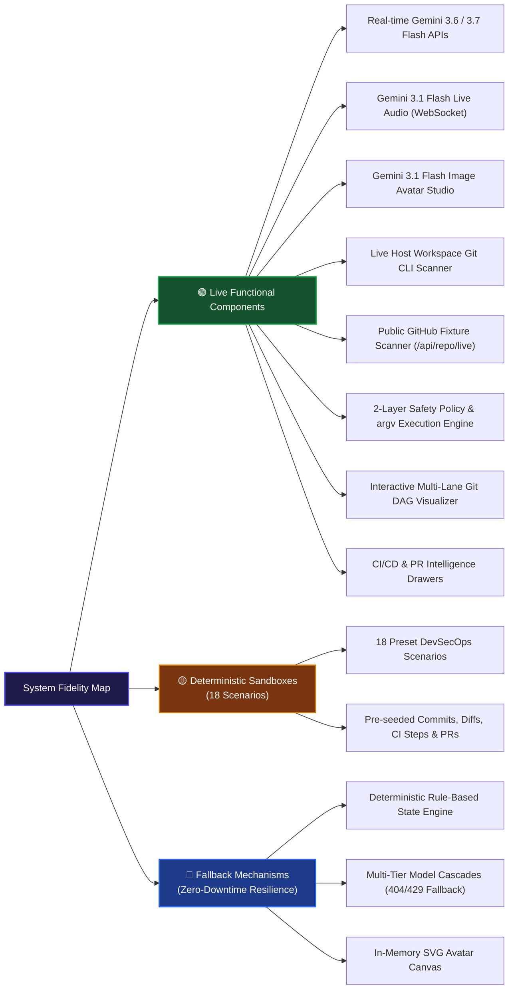

# Demo Integrity & Component Architecture Notes

**Project:** GitPet (DevOps for GenAI Hackathon 2026)  
**Guideline Compliance:** **P-15 (Demo Integrity)**

---

## 1. Executive Summary

In accordance with Hackathon Guideline **P-15**, this document explicitly differentiates between **live functional production subsystems**, **deterministic demo sandboxes**, and **graceful fallback mechanisms**.

---

## 2. Component Fidelity & Architecture Classification

---

## 3. Detailed Component Breakdown

### 3.1 Live AI Services
- **Gemini Chat Engine (`/api/ai/chat` & `/api/chat`):** Live calls to `@google/genai` using `gemini-3.6-flash`, `gemini-3.7-flash`, or `gemini-3.1-flash-lite`. Evaluates prompt context against the selected persona and enforces the 2-layer safety policy on all suggested commands.
- **Gemini Live Audio (`WebSocket /live`):** Live bidirectional 16kHz PCM audio streaming to `gemini-3.1-flash-live-preview` with real-time text transcription.
- **Gemini Image Studio (`/api/ai/images/*`):** Live calls to `gemini-3.1-flash-image` for custom avatar synthesis and iterative editing, isolated in a 30-minute preview registry until approved.
- **Gemini Speech Synthesis (`/api/voice/tts`):** Real-time text-to-speech generation via `gemini-3.1-flash-tts-preview` (Zephyr voice).

---

### 3.2 18 Deterministic Demo Sandbox Presets
The sandbox enables reviewers and judges to immediately explore diverse Git and DevSecOps conditions without manually modifying their workstation's `.git` folder:

1. **MVP: Remote Updates & Local Edits (`mvp_sync_divergence`):** 3 commits behind, 2 uncommitted files.
2. **Merge Conflict in Progress (`merge_conflict`):** Conflicting changes in 2 files pausing rebase.
3. **Detached HEAD State (`detached_head`):** Floating commit e4f9b12 without a named branch.
4. **Stale Merged Branch (`stale_branch`):** Branch merged 42 days ago ready for pruning.
5. **Unpushed Local Commits (`unpushed_work`):** 3 commits ahead of remote.
6. **Clean & Synchronized (`clean_healthy`):** 100% pristine repository state.
7. **Unsafe: Destructive Loss Hazard (`unsafe_loss_risk`):** 0% Health; remote force-pushed while 3 dirty files exist.
8. **CI/CD: Build Failure (`cicd_failed_build`):** TypeScript compilation & test failure in pipeline job #1042.
9. **CI/CD: Flaky Test Suite (`cicd_flaky_tests`):** Intermittent race conditions flagged in auth tests.
10. **CI/CD: Security Vulnerability (`cicd_vulnerability`):** High-severity CVE-2026-8819 in tar package.
11. **CI/CD: Deployment Success (`cicd_deploy_success`):** Flawless production rollout to Kubernetes cluster.
12. **PR #214: Changes Requested (`pr_changes_requested`):** Reviewer requested security fixes on authService.ts.
13. **PR #305: Pending Review (`pr_pending_review`):** PR waiting 4 days for reviewer attention.
14. **PR #189: Merge Conflicts (`pr_conflicted`):** Upstream main updates block PR automatic merge.
15. **PR #242: Approved & Ready (`pr_approved_ready`):** 3 reviewer approvals & green CI ready to merge.
16. **Lost Map: Terraform State Lock (`lost_map`):** Stuck state lock on S3 backend bucket.
17. **Smoke Cloud: Deployment Failure (`smoke_cloud`):** Pod CrashLoopBackOff due to missing secrets.
18. **Shield Cracked: Security Deviation (`shield_cracked`):** S3 bucket policy allows anonymous read access.

---

### 3.3 Live Workspace Mode
- Toggling **"Live Workspace"** switches from scenario fixtures to live scanning of the local workstation repository (`/api/git/live-status`) or the public GitHub test fixture (`/api/repo/live`).
- **Security Boundary:** All mutating commands remain gated behind dry-run preview diffs (`/api/git/preview-action`), the 2-layer safety policy, and mandatory human confirmation.
