# 🎬 GitPet Demo Presentation & Component Fidelity Notes

**Project:** GitPet — Ambient DevSecOps Repository Companion  
**Team:** Ribbon Patrol (Team 05) — Lucas Whitaker & David Castelli  
**Event:** [AWS Community Day Ottawa 2026](https://awscommunityday.ca/) — DevOps for GenAI Hackathon  
**Guideline Compliance:** **P-15 (Demo Integrity)**, **P-04 (Working System)**, **P-08 (Governance)**, **P-09 (Testing)**, **P-12 (Responsible AI)**  
**Live Application Target:** `http://localhost:3004` (`npm run dev` or `npm run start`)  
**Target Demo Duration:** 10–12 Minutes (Target: ~11 minutes 50 seconds)  
**Primary Repository:** [lucaswhitaker22/DevOps-for-GenAI---Ottawa-2026---Team-05-Ribbon-Patrol](https://github.com/lucaswhitaker22/DevOps-for-GenAI---Ottawa-2026---Team-05-Ribbon-Patrol)

---

## 📑 Table of Contents

1. [Executive Summary & Guideline P-15 Compliance](#1-executive-summary--guideline-p-15-compliance)
2. [System Fidelity & Component Classification Map](#2-system-fidelity--component-classification-map)
3. [Detailed Component Breakdown](#3-detailed-component-breakdown)
   - [3.1 Live Production Subsystems](#31-live-production-subsystems)
   - [3.2 Deterministic Demo Sandboxes (18 Presets)](#32-deterministic-demo-sandboxes-18-presets)
   - [3.3 Zero-Downtime Fallback & Resilience Engine](#33-zero-downtime-fallback--resilience-engine)
4. [Full 10–12 Minute Live Demo Script & Playbook](#4-full-1012-minute-live-demo-script--playbook)
   - [Act 1: Notice — Ambient Peripheral Awareness (0:00 – 2:00)](#act-1-notice--ambient-peripheral-awareness-000--200)
   - [Act 2: Understand — Multimodal AI Reasoning (2:00 – 4:30)](#act-2-understand--multimodal-ai-reasoning-200--430)
   - [Act 3: Resolve — 2-Layer Safety & Bounded Execution (4:30 – 6:30)](#act-3-resolve--2-layer-safety--bounded-execution-430--630)
   - [Act 4: Deep Dive — The 6 Dedicated Workspaces (6:30 – 9:30)](#act-4-deep-dive--the-6-dedicated-workspaces-630--930)
   - [Act 5: Live Workspace & Anomaly Sandbox (9:30 – 11:00)](#act-5-live-workspace--anomaly-sandbox-930--1100)
   - [Act 6: Verification, Compliance & Wrap-Up (11:00 – 12:00)](#act-6-verification-compliance--wrap-up-1100--1200)
5. [Keyboard Shortcuts & Power User Controls](#5-keyboard-shortcuts--power-user-controls)
6. [Judges' Q&A & Technical Defense Guide](#6-judges-qa--technical-defense-guide)
7. [Verification & Test Evidence Cross-Reference](#7-verification--test-evidence-cross-reference)

---

## 1. Executive Summary & Guideline P-15 Compliance

In strict compliance with **Hackathon Guideline P-15 (Demo Integrity)**, this document provides a completely transparent, line-by-line audit of what is **live and functional**, what operates inside **deterministic sandbox scenarios**, and what triggers **graceful fallback mechanisms**.

```
┌──────────────────────────────────────────────────────────────────────────────────────────────────┐
│                                GITPET SYSTEM INTEGRITY MATRIX                                    │
│                                                                                                  │
│  🟢 LIVE FUNCTIONAL          🟡 DETERMINISTIC SANDBOXES       🔵 ZERO-DOWNTIME FALLBACKS         │
│  • Google Gemini Chat APIs   • 18 DevSecOps Presets           • Deterministic State Engine       │
│  • Gemini Live Audio (WS)    • Pre-seeded Git Commits/Diffs   • Multi-Tier Model Cascades        │
│  • Gemini Flash Image Studio • 5-Stage CI Pipeline Fixtures   • Dynamic SVG Avatar Generator     │
│  • Live Host Git Scanner     • PR Threads & Code Comments     • Browser Web Speech TTS/ASR       │
│  • Public GitHub Fixture     • Infrastructure Lock Scenarios  • Offline Rule Invariants          │
│  • 2-Layer Safety Policy     • Anomaly Injection Suite                                           │
│  • Multi-Lane SVG DAG Graph                                                                      │
│  • 5-Pillar Release Gate                                                                         │
│  • 7-Factor Risk Health Pool                                                                     │
└──────────────────────────────────────────────────────────────────────────────────────────────────┘
```

---

## 2. System Fidelity & Component Classification Map

```mermaid
graph TD
    classDef live fill:#14532d,stroke:#16a34a,stroke-width:2px,color:#ffffff;
    classDef sandbox fill:#78350f,stroke:#d97706,stroke-width:2px,color:#ffffff;
    classDef fallback fill:#1e3a8a,stroke:#2563eb,stroke-width:2px,color:#ffffff;
    classDef main fill:#1e1b4b,stroke:#4f46e5,stroke-width:2px,color:#ffffff;

    Title["GitPet Architecture & Fidelity Map"]:::main

    Live["🟢 Live Functional Components"]:::live
    Sandbox["🟡 Deterministic Sandboxes<br/>(18 Scenarios)"]:::sandbox
    Fallback["🔵 Fallback Mechanisms<br/>(Zero-Downtime Resilience)"]:::fallback

    Title --> Live
    Title --> Sandbox
    Title --> Fallback

    %% Live Details
    Live --> L1["Gemini 3.6 / 3.7 / 3.1 Flash APIs (`/api/ai/chat`, `/api/chat`)"]
    Live --> L2["Gemini 3.1 Flash Live Audio (`WebSocket /live` @ 16kHz PCM)"]
    Live --> L3["Gemini 3.1 Flash Image Studio (`/api/ai/images/*` with 30m TTL)"]
    Live --> L4["Gemini 3.1 Flash TTS Synthesis (`/api/voice/tts` Zephyr)"]
    Live --> L5["Host Git CLI Scanner (`/api/git/live-status` with porcelain)"]
    Live --> L6["Public GitHub Fixture Scanner (`/api/repo/live`)"]
    Live --> L7["2-Layer Safety Policy & pure argv Execution (`safety.ts`)"]
    Live --> L8["Interactive Topological Multi-Lane SVG DAG Graph"]
    Live --> L9["5-Pillar Release Readiness Gate & AI Verdict Engine"]
    Live --> L10["7-Factor Dynamic 0-100 HP Health Pool & Risk Deductions"]

    %% Sandbox Details
    Sandbox --> S1["18 DevSecOps Presets (Git drift, CI/CD, PRs, Cloud Sec)"]
    Sandbox --> S2["Pre-seeded Git Diffs, Commit Logs & File Staging Trees"]
    Sandbox --> S3["Simulated Pipeline Failures, Flaky Test Specs & CVEs"]
    Sandbox --> S4["Interactive Anomaly Injection Suite (Remote commits, Conflicts)"]

    %% Fallback Details
    Fallback --> F1["Deterministic Rule-Based State Engine (`server.ts`)"]
    Fallback --> F2["Multi-Tier Model Cascade (3.7 -> 3.6 -> 3.1 Lite -> Rules)"]
    Fallback --> F3["In-Memory SVG Avatar Synthesis (`generateFallbackAvatar`)"]
    Fallback --> F4["Client-Side Web Speech Synthesis & Recognition"]
```



---

## 3. Detailed Component Breakdown

### 3.1 Live Production Subsystems

| Subsystem | Endpoint / Component | Implementation Details & Fidelity |
| :--- | :--- | :--- |
| **Multi-Turn Gemini Chat** | `POST /api/ai/chat`<br/>`POST /api/chat`<br/>`POST /api/gitpet/analyze` | Live calls to `@google/genai` (v2.4.0). Dynamically routes through 4 distinct system personas (*Byte Mascot*, *Senior Architect*, *Safety Auditor*, *Git Tutor*) and 3 performance tiers (*Fast*, *General*, *Deep*). Formats grounded structured output with cited commit hashes, file paths, confidence scores, and pre-computed rollback steps. |
| **Gemini Live Audio Streaming** | `WebSocket /live` | Bidirectional 16kHz PCM audio streaming to `gemini-3.1-flash-live-preview` with real-time text transcription, interruptibility handling, and Zephyr voice synthesis. |
| **Pet Image Studio & Avatar Registry** | `POST /api/ai/images/generate`<br/>`POST /api/ai/images/edit`<br/>`POST /api/ai/images/:id/approve` | Live generative synthesis using `gemini-3.1-flash-image`. Generated images are staged in an in-memory preview registry (30-minute TTL) for iterative prompt refinement before promotion to the active mascot avatar. |
| **Gemini Speech Synthesis (TTS)** | `POST /api/voice/tts` | Real-time speech audio generation via `gemini-3.1-flash-tts-preview` in Zephyr voice, streaming 24kHz audio chunks. |
| **Host Git Workspace Scanner** | `GET /api/git/live-status` | Executes read-only Git CLI commands (`git status --porcelain=v1 -uall`, `git rev-parse`, `git rev-list`, `git log`, `git stash list`, and marker file detection) to inspect the local workstation repository in real-time. |
| **Public GitHub Fixture Scanner** | `GET /api/repo/live` | Connects directly to the live GitHub repository [`farisnour/gitpet-acme-corp-ecommerce-store`](https://github.com/farisnour/gitpet-acme-corp-ecommerce-store) across 4 branches (`main`, `feature/cart-stepper`, `feature/payment-v2`, `refactor/checkout-v2`). |
| **2-Layer Safety Policy Engine** | `src/server/safety.ts`<br/>`src/server/executor.ts` | **Layer 1:** 8 static invariants (blocks force-pushes without lease, hard resets, destructive directory cleans, history rewrites, and shell metacharacters `;&|`$`).<br/>**Layer 2:** 7 contextual working-tree lints (auto-injects `-u` on stash if untracked files exist, validates rebase/merge operation locks).<br/>**Execution:** Pure argument array passing via `child_process.execFile` (zero shell interpolation). Gated by `GITPET_ALLOW_WRITES=true`. |
| **Multi-Lane Topological DAG Visualizer** | `GitDagVisualizer.tsx`<br/>`gitDagNormalizer.ts` | Computes topological commit order, assigns non-intersecting vertical lanes, calculates cubic bezier splines, detects merge bases (double-ring nodes), and highlights 11 commit roles. |
| **Working Tree Diff Studio** | `DiffViewer.tsx`<br/>`diffParser.ts` | Syntax-highlighted unified/split diffs, line addition/deletion metrics, file search filtering, and individual file checkbox staging controls. |
| **AI Conventional Commit Generator** | `AICommitGeneratorModal.tsx` | Analyzes staged and unstaged diff snippets using Gemini 3.1 Flash Lite to synthesize conventional commit messages (`feat`, `fix`, `chore`, `refactor`, `docs`) in seconds. |
| **5-Pillar Release Readiness Gate** | `ReleaseReadinessPage.tsx`<br/>`releaseReadiness.ts` | Deterministic weighted scoring across Tests Passing (25%), Coverage % (20%), CVEs (25%), PR Approvals (15%), and Branch Freshness (15%). Synthesizes executive verdict via `POST /api/ai/release-readiness` with 1-click JSON and Markdown artifact downloads. |
| **7-Factor Dynamic Health Pool** | `RiskScorePage.tsx`<br/>`mockScenarios.ts` | Real-time mathematical 0–100 HP health pool derived from 7 DevSecOps deduction factors (Branch Divergence, Test Failures, Secrets/Cloud Violations, CVEs, Code Smells, PR Lag, PR Scope) with category filters and 1-click remediation deep links. |
| **Web Audio Chiptune Soundscape** | `audioEffects.ts` | Real-time procedural Web Audio API synthesis (Sync success fanfare, conflict alarm, mascot chirps, coffee slurps, accessory equip clicks) with global mute control. |
| **Audit & Telemetry Log Buffer** | `GET /api/audit-logs`<br/>`GET /api/health` | FIFO ring buffer (200 events max) tracking request IDs, HTTP status codes, latency in milliseconds, model chains used, and sanitized payloads. |

---

### 3.2 Deterministic Demo Sandboxes (18 Presets)

The 18 scenario presets allow reviewers and judges to immediately simulate realistic Git conflicts, CI/CD failures, pull request bottlenecks, and infrastructure security deviations without corrupting their local `.git` repository:

| # | Preset ID | Scenario Title & Badge | Key Repository State & Telemetry | Mascot Expression & Symptom |
| :-: | :--- | :--- | :--- | :--- |
| **1** | `mvp_sync_divergence` | **MVP: Remote Updates & Local Edits** *(Hackathon MVP)* | 3 commits behind `origin/feature/cart`, 2 uncommitted files in working tree (`CartDrawer.tsx`, `pricingService.ts`). | Overfilled backpack & tugging toward remote leash (`behind_remote`). |
| **2** | `lost_map` | **Lost Map: Terraform State Lock** *(Infra Anomaly)* | State lock active on `s3://acme-tf-state/prod.tfstate` (DynamoDB lock ID: `8f9b201a...`). Backend unavailable. | Wandering with a torn map & looking confused (`lost_map`). |
| **3** | `smoke_cloud` | **Smoke Cloud: Deployment Failure** *(Infra Anomaly)* | ArgoCD sync degraded; 3 Kubernetes pods in CrashLoopBackOff due to missing `DATABASE_URL` secret. | Coughing beside a smoking cloud & pointing at broken pod (`smoke_cloud`). |
| **4** | `shield_cracked` | **Shield Cracked: Security Deviation** *(Security Risk)* | S3 storage bucket `acmepublicassets` configured with anonymous read access in `storage.tf:L42`. | Defensive posture holding a cracked glowing shield (`shield_cracked`). |
| **5** | `pr_changes_requested` | **PR #214: Changes Requested** *(PR Workflow)* | PR #214 waiting 3 days; reviewer requested sanitization on `src/auth/authService.ts:L42`. 1 approval pending. | Holding a clipboard with yellow warning notes (`pr_changes_requested`). |
| **6** | `pr_pending_review` | **PR #305: Pending Review** *(PR Workflow)* | PR #305 waiting 4 days for initial reviewer attention from `@marcus-vance` and `@alex-lead`. | Sitting beside an hourglass looking expectant (`pr_pending_review`). |
| **7** | `pr_conflicted` | **PR #189: Merge Conflicts** *(PR Workflow)* | Upstream `main` commits conflict with PR #189 in `src/services/payment.ts`. Merge blocked. | Tangled in glowing red conflict wires (`pr_conflicted`). |
| **8** | `pr_approved_ready` | **PR #242: Approved & Ready** *(PR Workflow)* | 3 reviewer approvals, 100% green CI/CD pipeline, clean mergeability. Ready for squash & merge. | Wearing a celebratory party hat and ribbon (`pr_approved_ready`). |
| **9** | `cicd_failed_build` | **CI/CD: Build Failure** *(CI/CD Pipeline)* | Pipeline job #1042 failed: TypeScript compilation and test error in `src/tests/auth.spec.ts`. | Wearing a fever thermometer and shivering (`failed_build`). |
| **10** | `cicd_flaky_tests` | **CI/CD: Flaky Test Suite** *(CI/CD Pipeline)* | Test suite `auth.spec.ts` has 70% pass rate (3 failures in last 10 runs). Flaky quarantine recommended. | Wearing dizzy spiral glasses (`flaky_tests`). |
| **11** | `cicd_vulnerability` | **CI/CD: Security Vulnerability** *(CI/CD Pipeline)* | High-severity CVE-2026-8819 discovered in `jsonwebtoken@8.5.1`. Dependabot patch available. | Inspecting a glowing biohazard bug with a magnifying glass (`vulnerability`). |
| **12** | `cicd_deploy_success` | **CI/CD: Deployment Success** *(CI/CD Pipeline)* | Pipeline job #1050 completed flawlessly; production rollout active on Kubernetes. Triggers confetti. | Leaping with joy surrounded by golden stars (`deploy_success`). |
| **13** | `unsafe_loss_risk` | **Unsafe: Destructive Loss Hazard** *(Hazard)* | **0% Health / Hazard.** Upstream force-pushed commit `f9a012c` while 3 dirty files exist locally. High overwrite risk. | Shivering in panic with siren auras and red alert beacon (`destructive_hazard`). |
| **14** | `merge_conflict` | **Merge Conflict in Progress** *(Blocked)* | Active git rebase paused; conflicting markers in `src/services/taxService.ts` and `CartDrawer.tsx`. | Tangled in red yarn with conflict scissors (`merge_conflict`). |
| **15** | `unpushed_work` | **Unpushed Local Commits** *(Sync Drift)* | 3 local commits ahead of remote tracking branch. Working tree clean. | Carrying a heavy glowing backpack of unpushed commits (`unpushed_work`). |
| **16** | `detached_head` | **Detached HEAD State** *(Topology Hazard)* | HEAD is detached at commit `e4f9b12`. Floating commit risks garbage collection. | Floating like an astronaut with untethered leash (`detached_head`). |
| **17** | `stale_branch` | **Stale Merged Branch** *(Hygiene)* | Branch `feat/cart-icon` merged 42 days ago into main. Ready for safe deletion. | Lounging with cobwebs and a calendar (`stale_branch`). |
| **18** | `clean_healthy` | **Clean & Synchronized** *(100% Pristine)* | **100 HP.** 0 ahead, 0 behind, 0 uncommitted diffs. All CI checks passing. | Beaming with golden halo, wagging tail, and pristine badge (`clean_sync`). |

---

### 3.3 Zero-Downtime Fallback & Resilience Engine

To guarantee rock-solid reliability during live demonstrations even if network connections fail or API quotas are exhausted, GitPet implements a three-tier resilience strategy:

1. **Multi-Tier Model Cascades:**
   - Deep Tier: `gemini-3.7-flash` ──► `gemini-3.6-flash` ──► `gemini-flash-latest` ──► Deterministic Rule Engine
   - General Tier: `gemini-3.6-flash` ──► `gemini-3.5-flash` ──► `gemini-flash-latest` ──► Deterministic Rule Engine
   - Fast Tier: `gemini-3.1-flash-lite` ──► `gemini-3.6-flash` ──► `gemini-flash-latest` ──► Deterministic Rule Engine
2. **Deterministic Rule Engine (`server.ts`):**
   - Automatically generates structured natural language explanations, cited evidence points, and safe, bounded Git recommendations when offline.
3. **In-Memory SVG Avatar Synthesis:**
   - Generates customized cyberpunk, pixel-art, or retro avatar SVGs with glowing neon rings when the generative image API is offline.
4. **Client-Assisted Speech Synthesis & Recognition:**
   - Seamlessly uses browser `SpeechSynthesis` and `webkitSpeechRecognition` when the live WebSocket is disconnected.

---

## 4. Full 10–12 Minute Live Demo Script & Playbook

```
┌──────────────────────────────────────────────────────────────────────────────────────────────────┐
│                                   LIVE DEMO TIMELINE (11:50)                                     │
│                                                                                                  │
│  [00:00-02:00] Act 1: Notice (Ambient Awareness, Byte Mascot, 18 Symptoms, Health Auras)        │
│  [02:00-04:30] Act 2: Understand (Gemini Personas, Speed Tiers, Live Audio, Image Studio)        │
│  [04:30-06:30] Act 3: Resolve (2-Layer Safety Policy, Diff Preview Modal, Rollback Log)         │
│  [06:30-09:30] Act 4: Deep Dive (DAG Graph, CI/CD Telemetry, PR Intelligence, Release Gate, HP) │
│  [09:30-11:00] Act 5: Live Mode vs Sandbox (Dual Scanners, Anomaly Injection Sandbox)           │
│  [11:00-11:50] Act 6: Verification & Governance (31 Tests, SBOM, Threat Model, SRE Runbook)     │
└──────────────────────────────────────────────────────────────────────────────────────────────────┘
```

---

### Act 1: Notice — Ambient Peripheral Awareness (0:00 – 2:00)

**Goal:** Establish the core problem of terminal blindness and show how GitPet translates complex repository drift into immediate peripheral awareness.

#### Speaker Actions & Cues:
1. **Open the browser** to `http://localhost:3004` in dark mode.
2. **Point out the Mascot (Byte)** on the left stage:
   > *"Modern developers lose up to 30% of their day context-switching across terminal tabs, CI/CD portals, and PR queues. GitPet solves terminal blindness through ambient peripheral awareness."*
3. **Demonstrate Ambient Telemetry:**
   - Point out Byte’s glowing amber aura and backpack posture indicating **3 incoming commits** and **2 uncommitted local edits**.
   - Review the **4 Telemetry Quick Deck Cards** at the bottom of the pet stage:
     - **Branch Sync Card:** 0 Ahead / 3 Behind (`origin/feature/cart`)
     - **Working Tree Card:** 2 Uncommitted Files
     - **CI/CD Pipeline Card:** Passing / Active
     - **PR Intelligence Card:** PR #214 (3 days turnaround lag)
4. **Demonstrate Interactive Feedback:**
   - Press `Space` or click Byte to pet the mascot. Observe the procedural chirp sound, heart particle burst, and speech bubble quip.
   - Switch accessories in the accessory dock (*Dev Headphones*, *Cyber Visor*, *Coffee Mug*, *Wizard Hat*).
   - Toggle the Dark/Light theme in the top bar.

---

### Act 2: Understand — Multimodal AI Reasoning (2:00 – 4:30)

**Goal:** Show how Google Gemini delivers structured, grounded diagnostics with multiple specialized personas and speed tiers.

#### Speaker Actions & Cues:
1. **Multi-Persona Selection (`ChatStream.tsx`):**
   - Click through the 4 persona buttons above the chat:
     - 🐶 **Byte Mascot:** Friendly, ambient companion with canine developer humor.
     - 🏛️ **Senior Architect:** Deep topological analysis, merge-base traversal, and DAG rebase strategy.
     - 🛡️ **Safety Auditor:** Zero data-loss compliance, working-tree validation, and explicit rollback anchoring.
     - 🎓 **Git Tutor:** Mental models explaining blobs, trees, staging index, and HEAD pointers.
2. **Speed Tier Routing:**
   - Point out the 3 model speed tiers powered by `@google/genai`:
     - **⚡ Fast Tier (`gemini-3.1-flash-lite`):** Sub-second status checks and commit message generation.
     - **🧠 General Tier (`gemini-3.6-flash`):** Conversational guidance, diff reviews, and tutoring.
     - **🔬 Deep Tier (`gemini-3.7-flash`):** Complex merge conflict resolution and release gate auditing.
3. **Send a Diagnostic Prompt:**
   - Click the quick prompt pill: *"Status report! What needs attention?"*
   - Show the structured AI response:
     - **Evidence Signals Box:** Explicitly lists branch name, ahead/behind counts, and uncommitted file count.
     - **Confidence Rating:** High (98%).
     - **Recommended Action Card:** Includes title, summary, exact command, risk level, and pre-computed rollback plan.
4. **Live Audio Streaming (`LiveVoiceModal.tsx`):**
   - Click the **Live Voice** button (microphone icon) in the chat bar.
   - Speak naturally: *"Byte, what's my branch status and do I have uncommitted work?"*
   - Show bidirectional 16kHz audio streaming with `gemini-3.1-flash-live-preview`, live transcript, and real-time voice reply.
5. **Pet Image Studio (`ImageStudioModal.tsx`):**
   - Open the Image Studio modal from the quick palette (`⌘K` -> *Open Pet Image Studio*).
   - Type: *"Cyberpunk developer robot dog with neon blue goggles"*.
   - Click **Generate Preview**. Show the live `gemini-3.1-flash-image` synthesis, 30-minute preview lifecycle, and click **Approve as Active Avatar**.

---

### Act 3: Resolve — 2-Layer Safety & Bounded Execution (4:30 – 6:30)

**Goal:** Demonstrate GitPet’s deterministic defense against **OWASP LLM08 (Excessive Agency)** and show safe, verified command execution.

#### Speaker Actions & Cues:
1. **The Dangerous Command Trap (The "Why"):**
   > *"Autonomous AI assistants with raw shell access can wipe uncommitted files by running un-gated pulls or force-pushes. GitPet enforces a 2-layer deterministic safety policy in code."*
2. **Preview Changes Modal (`PreviewChangesModal.tsx`):**
   - Click **Preview Changes** on the recommended action card.
   - Walk through the modal elements:
     - **Exact Tokenized Command:** `git stash push -u -m "WIP: Pre-sync backup" && git pull --rebase origin feature/cart && git stash pop`
     - **2-Layer Safety Verdict:** 🛡️ `VERIFIED SAFE (2-LAYER PASS)`
     - **Pre-Flight Blast Radius:** 2 files affected (`CartDrawer.tsx`, `pricingService.ts`).
     - **Atomic Rollback Command:** Pre-computed reversal plan (`git stash pop` / `git rebase --abort`).
3. **Execute & Observe State Transition:**
   - Click **Confirm & Execute Safe Action**.
   - Show the live progress bar, execution feedback, and repository health restoration from **62% (Attention)** to **100% (Healthy)** with celebratory confetti.
4. **Audit History & Rollback:**
   - Point out the **Audit History Log** in the repository workspace.
   - Click **Rollback Last Action** to restore the previous state in one click.

---

### Act 4: Deep Dive — The 6 Dedicated Workspaces (6:30 – 9:30)

**Goal:** Walk through all 6 dedicated workspaces in the collapsible sidebar navigation (`SidebarNav.tsx`).

#### 1. Repository Workspace (`#repository`):
- Click **Repository & DAG** in the sidebar (or press `⌘B`).
- **Topological SVG DAG Graph (`GitDagVisualizer.tsx`):**
  - Explore the multi-lane graph with cubic bezier splines.
  - Point out the double-ring **merge-base node** (`a0b1c2d`), the green **HEAD** node, and the blue **upstream** tracking node.
  - Click any commit node to open the **Commit Details Drawer** showing author, SHA, parents, and message.
- **Working Tree Diff Studio (`DiffViewer.tsx`):**
  - Search for `CartDrawer` in the filter bar.
  - Inspect the syntax-highlighted additions (green) and deletions (red).
  - Use the individual file checkboxes to stage/unstage specific files.
- **AI Conventional Commit Generator (`AICommitGeneratorModal.tsx`):**
  - Click **Generate Commit with AI**. Gemini 3.1 Flash Lite analyzes staged diffs and proposes `feat(cart): implement multi-currency checkout & tax rate service`.

#### 2. CI/CD Pipeline Telemetry (`#cicd`):
- Click **CI/CD Pipeline** in the sidebar.
- **5-Stage Pipeline Tracker:** Show the progression through *Lint*, *Tests*, *Security*, *Build*, and *Deploy*.
- **Expandable Step Logs:** Click the failed **Unit & Contract Tests** stage to expand raw console logs showing assertion failure in `auth.spec.ts`.
- **Flaky Test Suite Diagnostics:** Show the 70% pass rate card and click **Quarantine Test Spec** to unblock the pipeline.
- **Supply Chain CVE Scanner:** Inspect high-severity vulnerability `CVE-2026-8819` in `jsonwebtoken` and click **Draft Dependabot Patch**.

#### 3. Pull Request Intelligence (`#pr`):
- Click **Pull Requests** in the sidebar.
- **Review Telemetry:** Show PR #214 with a **3-day turnaround lag** clock and **1 of 2 required approvals**.
- **Inline Review Comment Thread:** Inspect Sarah Chen's comment on `src/auth/authService.ts:L42` (*"Sanitize token payload before storing"*).
- **AI Resolution Reply Composer:** Click **Draft AI Reply**. Gemini drafts a polite, technically accurate response comment with one click.
- **Squash & Merge:** Click **Armed Squash & Merge** to trigger safe merge and feature branch pruning.

#### 4. Release Gate & Readiness Scorecard (`#release`):
- Click **Release Gate** in the sidebar.
- **5-Pillar Scorecard (`releaseReadiness.ts`):**
  - Tests Passing: 88% (25% weight)
  - Code Coverage: 84% (20% weight)
  - Vulnerabilities: 1 High CVE (25% weight)
  - PR Approvals: 1 of 2 (15% weight)
  - Branch Freshness: Clean (15% weight)
  - **Overall Readiness:** 78% (Caution / Review)
- **AI Executive Verdict (`POST /api/ai/release-readiness`):** Headline and blocker breakdown.
- **Compliance Artifact Exports:** Click **Copy Markdown Summary** and **Download JSON Compliance Manifest**.

#### 5. Risk Scorecard & Health Pool (`#risk`):
- Click **Risk Scorecard** in the sidebar.
- **0–100 HP Health Pool Gauge:** 68 / 100 HP (Moderate Risk).
- **7-Factor Granular Deductions:** Walk through the 7 mathematical factors.
- **Category Filtering:** Filter factors by *All*, *Hazards (Critical)*, *Warnings*, and *Healthy*.
- **Remediate with Byte:** Click any factor's **Remediate with Byte** button to deep-link straight back into companion chat with pre-populated diagnostic context.

---

### Act 5: Live Workspace & Anomaly Sandbox (9:30 – 11:00)

**Goal:** Demonstrate real-world versatility by switching between the 18 sandbox presets and live repository inspection.

#### Speaker Actions & Cues:
1. **Scenario Switcher Bar (`ScenarioSwitcher.tsx`):**
   - Click through preset scenarios to show instantaneous state, mascot posture, aura, and sound transitions:
     - Select **Lost Map: Terraform State Lock** (Mascot holds torn map; suggests `terraform force-unlock`).
     - Select **Smoke Cloud: Deployment Failure** (Mascot coughs near smoke; suggests `kubectl describe pod` for missing `DATABASE_URL`).
     - Select **Shield Cracked: Security Deviation** (Mascot holds cracked shield; detects public S3 bucket in `storage.tf`).
     - Select **Unsafe: Destructive Loss Hazard** (0% HP; shivers in panic; blocks force-pushes).
2. **Sandbox Anomaly Injectors:**
   - Click **+ Inject Remote Commit** to simulate an upstream push from a teammate.
   - Click **+ Inject Local Edit** to simulate a local working-tree modification.
   - Click **🚨 Inject Conflict** to pause rebase with conflict markers.
   - Click **✨ Reset to Clean** to return to 100% pristine state.
3. **Live Workspace Mode (`/api/git/live-status`):**
   - Toggle **Live Workspace** in the top bar.
   - Show real-time scanning of the workstation's actual Git repository (`lucaswhitaker22/DevOps-for-GenAI---Ottawa-2026---Team-05-Ribbon-Patrol`).
   - Switch branches via the branch dropdown to inspect live commits, diffs, and tracking status.

---

### Act 6: Verification, Compliance & Wrap-Up (11:00 – 12:00)

**Goal:** Reiterate production engineering rigor, test coverage, and hackathon compliance.

#### Speaker Actions & Cues:
1. **Automated Verification Suite:**
   - Mention the **31 automated Vitest tests** passing with 100% success rate:
     - `tests/security.test.ts` (9 tests: prompt sanitization, secret token redaction, jailbreak rejection, approval gates)
     - `tests/executor.test.ts` (19 tests: static rules, contextual lints, dry-run simulation, execution errors)
     - `tests/markdown.test.ts` (3 tests: GFM rendering, code block highlighting, sanitization)
2. **Enterprise Governance & Security Manifests:**
   - CycloneDX SBOM Manifest: `npm run sbom`
   - STRIDE Security Threat Model: `docs/SECURITY_THREAT_MODEL.md`
   - NIST AI RMF 1.0 AI Governance Card: `docs/AI_GOVERNANCE.md`
   - SRE Operational Runbook: `docs/RUNBOOK.md`
3. **Closing Statement:**
   > *"GitPet turns hidden Git and DevSecOps risks into continuous ambient awareness, provides grounded multimodal AI reasoning, and enforces unbreakable human-in-the-loop safety. See risk. Understand evidence. Resolve safely. Thank you!"*

---

## 5. Keyboard Shortcuts & Power User Controls

| Keybinding | Action & Scope | Description |
| :--- | :--- | :--- |
| `⌘K` / `Ctrl+K` | **Quick Command Palette** | Opens universal command palette to switch scenarios, navigate pages, trigger AI tools, or toggle themes. |
| `⌘B` / `Ctrl+B` | **Toggle Repository Workspace** | Instantly toggles between Ambient Companion (`#companion`) and Repository/DAG (`#repository`). |
| `Space` | **Pet Byte Mascot** | Plays cheerful procedural chirp sound, emits heart particle shower, and triggers new mascot quip. |
| `Escape` | **Layered Modal Dismissal** | Dismisses modals in strict hierarchy: Confirmation Diff Modal ──► Quick Palette ──► Commit Modal. |
| `TopBar Mute` | **Audio Soundscape Toggle** | Toggles procedural Web Audio chiptunes with state persistence across browser reloads. |

---

## 6. Judges' Q&A & Technical Defense Guide

### Q1: How does GitPet prevent hallucinated or destructive AI operations (OWASP LLM08)?
**Answer:**  
GitPet never gives LLMs direct shell access. Safety is enforced through a **2-layer deterministic code barrier** in `safety.ts`:
1. **Static Invariants:** Hard-blocks destructive commands (`push --force` without lease, `reset --hard`, `clean -fdx`, `branch -D`, `filter-branch`, shell injection `;&|`$`).
2. **Contextual Lints:** Inspects observed working-tree telemetry (e.g. automatically forces `-u` on stashing if untracked files exist, blocks non-continue commands during active rebases).
3. **Execution Gate:** Commands are executed strictly via `child_process.execFile` with pure argument arrays, requiring explicit human confirmation in the dry-run Diff Preview Modal.

### Q2: What happens if the Gemini API key is missing, rate-limited (429), or offline?
**Answer:**  
GitPet implements **multi-tier model cascades** (`gemini-3.7-flash` -> `gemini-3.6-flash` -> `gemini-3.1-flash-lite`) and falls back seamlessly to the **in-memory deterministic rule engine** (`generateRuleBasedAction()` in `server.ts`). The UI remains 100% responsive with full diagnostic explanations, cited telemetry facts, and verified Git actions.

### Q3: How is the 0–100 HP dynamic health score calculated?
**Answer:**  
In `mockScenarios.ts` and `releaseReadiness.ts`, repository health starts at 100 HP and applies mathematical deductions across 7 real-time telemetry factors:
- Branch divergence (-8 to -35 pts)
- CI/CD build failures & flaky tests (-14 to -28 pts)
- Secrets and cloud security policy deviations (-15 to -30 pts)
- Supply chain CVE vulnerabilities (-10 to -25 pts)
- Merge conflicts & code smells (-25 to -40 pts)
- PR review turnaround lag (-5 to -15 pts)
- Oversized PR scopes (-5 to -10 pts)

### Q4: How does Live Workspace mode work without risking production repositories?
**Answer:**  
By default, the Live Workspace scanner (`/api/git/live-status`) is **strictly read-only**. To permit local write execution, the developer must explicitly opt in by setting `GITPET_ALLOW_WRITES=true` in `.env`. Even with writes enabled, every single mutating command must pass the 2-layer safety policy, render a pre-flight diff modal, and receive manual human confirmation.

---

## 7. Verification & Test Evidence Cross-Reference

| Evidence Category | Document Location | Verified Metric / Status |
| :--- | :--- | :--- |
| **Automated Test Report** | [docs/TEST_REPORT.md](TEST_REPORT.md) | **31 / 31 Vitest Tests Passing (100%)** |
| **AI System Governance** | [docs/AI_GOVERNANCE.md](AI_GOVERNANCE.md) | **NIST AI RMF 1.0 Aligned System Card** |
| **Security Threat Model** | [docs/SECURITY_THREAT_MODEL.md](SECURITY_THREAT_MODEL.md) | **STRIDE Threat Modeling & LLM Mitigations** |
| **Operational SRE Runbook** | [docs/RUNBOOK.md](RUNBOOK.md) | **Disaster Recovery, Health Probes & Monitoring** |
| **Guidelines Compliance Matrix** | [docs/GUIDELINES_COMPLIANCE.md](GUIDELINES_COMPLIANCE.md) | **100% Compliance across P-01 to P-15** |
| **Software Bill of Materials** | [docs/SBOM_MANIFEST.md](SBOM_MANIFEST.md) | **CycloneDX / JSON SBOM (`npm run sbom`)** |
| **Presentation Slide Blueprint** | [docs/presentation/PRESENTATION_SLIDES.md](presentation/PRESENTATION_SLIDES.md) | **13-Slide Master Blueprint & Talking Points** |

---

*GitPet — Built with pride by Team Ribbon Patrol (Team 05) for AWS Community Day Ottawa 2026.*
