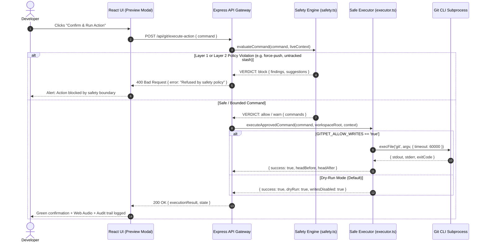

# 🛡️ Feature 08: Safety & DevSecOps Governance

GitPet bridges agentic automation and strict DevSecOps safety protocols through a **2-Layer Safety Verification Engine**, pure argv execution, guaranteed reversibility, automated secret redaction, and NIST AI RMF governance.

---

## 🌟 Key Functional Capabilities

---

## 1. The 2-Layer Safety Policy Engine (`src/server/safety.ts`)

### Layer 1: Static Safety Rules (Syntax-Level Rejection)
Evaluates commands independent of repository state to block dangerous operations:

* **`force-push`**: Blocks un-leased force pushes (`git push --force` / `-f`); suggests `--force-with-lease`.
* **`remote-ref-delete`**: Blocks remote branch deletion (`git push --delete` / `-d`).
* **`hard-reset`**: Blocks destructive resets (`git reset --hard`); suggests `--keep`.
* **`clean`**: Blocks permanent untracked file deletion (`git clean`).
* **`force-branch-delete`**: Blocks unmerged branch deletion (`git branch -D`); suggests `-d`.
* **`stash-destroy`**: Blocks stash drops (`git stash drop` / `git stash clear`).
* **`history-rewrite`**: Blocks history rewrites (`filter-branch`, `--filter-repo`).
* **`checkout-paths`**: Blocks uncommitted file overwrites (`git checkout -- <paths>`).
* **`shell-metacharacters`**: Rejects shell control characters (`;`, `|`, `` ` ``, `$`, `>`, `<`, `&&` inside unquoted segments).

### Layer 2: Contextual Safety Lints (State Mismatch Rejection)
Compares proposed commands against observed working tree and repository state:

* **`stash-misses-untracked`**: Warns when `git stash` is proposed while untracked files exist; suggests `git stash push -u`.
* **`stash-pop-empty`**: Warns when popping from an empty stash list.
* **`pull-dirty-tree`**: Warns when pulling or merging with dirty uncommitted files without `--autostash`.
* **`unresolved-conflicts`**: Blocks operations while conflict markers remain in the working tree.
* **`operation-in-progress`**: Restricts commands to `--continue`, `--skip`, `--abort`, staging, or read-only queries during paused rebase/merge.
* **`ff-only-on-diverged`**: Blocks `git pull --ff-only` on diverged branches (ahead > 0 and behind > 0); suggests `--rebase`.
* **`push-while-behind`**: Warns when pushing while commits are behind upstream.

---

## 2. Safe Execution Engine (`src/server/executor.ts`)

* **Pure Argv Execution**: Commands are tokenized and executed via `child_process.execFile('git', args)` without shell interpolation, neutralizing command injection attacks.
* **Write Opt-In Control**: Mutations are disabled by default; requires `GITPET_ALLOW_WRITES=true` in environment to execute writes.
* **Atomic Step Execution**: Multi-step command chains halt immediately on the first non-zero exit code.
* **Recovery Commit Anchors**: Records `headBefore` and `headAfter` commit hashes for 1-click rollback recovery.

---

## 3. Automated Secret Token Redaction

GitPet automatically sanitizes prompt inputs, diff snippets, and telemetry before transmitting context to LLMs:

* **Google Cloud API Keys**: `AIza[0-9A-Za-z-_]{35}` → `[REDACTED_SECRET]`
* **GitHub Personal Access Tokens**: `ghp_[0-9a-zA-Z]{36}` → `[REDACTED_SECRET]`
* **Generic / OpenAI API Keys**: `sk-[0-9a-zA-Z]{32,}` → `[REDACTED_SECRET]`
* **HTTP Bearer Tokens**: `bearer [A-Za-z0-9\-\._~\+\/]+=*` → `[REDACTED_SECRET]`

---

## 4. Optional Basic Authentication (`src/server/auth.ts`)

When deployed to a shared network or exposed via a tunnel, GitPet provides optional HTTP Basic Authentication:
* Configured via `GITPET_AUTH_USER` and `GITPET_AUTH_PASS`.
* Evaluated using constant-time comparison (`crypto.timingSafeEqual`) to prevent timing side-channel attacks.

---

## 5. AI Governance & NIST AI RMF 1.0 Alignment

GitPet adheres to the NIST AI Risk Management Framework (AI RMF 1.0):
* **Map**: Detailed threat models and trust boundary mappings ([SECURITY_THREAT_MODEL.md](../SECURITY_THREAT_MODEL.md)).
* **Measure**: Automated Vitest security suite (`tests/security.test.ts` and `tests/executor.test.ts`) validating 31 test cases.
* **Manage**: 5-tier Human-in-the-Loop oversight matrix guaranteeing zero autonomous write execution.
* **Govern**: Request auditing via in-memory FIFO ring buffer (`GET /api/audit-logs`) and operational health telemetry (`GET /api/health`).
