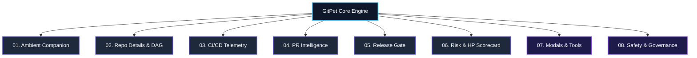

# 📦 GitPet Feature Documentation Suite

Welcome to the comprehensive feature documentation suite for **GitPet** (Team Ribbon Patrol). This directory provides modular, exhaustive, in-depth architectural and operational guides for every subsystem, full-page workspace, specialized modal, and DevSecOps safety boundary within the application.

---

## 🗂️ Documentation Directory

| Document | Focus Area | Description |
| :--- | :--- | :--- |
| [**01. Ambient Companion**](01_AMBIENT_COMPANION.md) | `#companion` | Pixel pet canvas, 18 symptom auras, interactive dock, 4-card telemetry quick deck, multi-turn Gemini stream with 4 personas & 3 model tiers. |
| [**02. Repository Details & DAG Graph**](02_REPOSITORY_AND_DAG_GRAPH.md) | `#repository` | Multi-lane topological DAG graph, working tree diffs, checkbox file staging, stash stack manager, and immutable audit rollback log. |
| [**03. CI/CD Pipeline Telemetry**](03_CICD_PIPELINE_TELEMETRY.md) | `#cicd` | 5-stage progression pipeline tracker, live expandable terminal logs, flaky test suite diagnostics & quarantine, and supply chain CVE scanner. |
| [**04. Pull Request Intelligence**](04_PULL_REQUEST_INTELLIGENCE.md) | `#pr` | Turnaround duration metrics, reviewer approvals vs. changes requested counters, inline review threads, AI resolution reply composer, and squash & merge. |
| [**05. Release Gate Readiness**](05_RELEASE_GATE_READINESS.md) | `#release` | 5-pillar deployment readiness gate, blocker remediation, Markdown release note export, and machine-readable JSON compliance artifact download. |
| [**06. Risk Scorecard & Health Pool**](06_RISK_SCORECARD_AND_HEALTH_POOL.md) | `#risk` | 7-factor weighted repository risk scorecard, dynamic health pool gauge (0–100 HP), factor category filters, and 1-click remediation deep links. |
| [**07. Specialized Modals & Tools**](07_MODALS_AND_TOOLS.md) | Global Modals | AI Conventional Commit generator, Preview Changes safety gate, Quick Command Palette (`⌘K`), Gemini Live Audio streaming, and Image Studio. |
| [**08. Safety & DevSecOps Governance**](08_SAFETY_AND_GOVERNANCE.md) | Security Engine | 2-layer static & contextual safety policies, zero force-push boundaries, mandatory human confirmation, and token redaction. |

---

## 🧭 System Architecture Summary

---

*GitPet — Built by Ribbon Patrol (Team 05) for DevOps for GenAI Hackathon 2026.*
