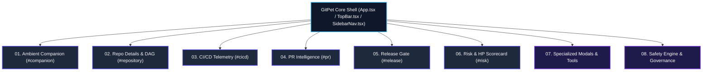

# 📦 GitPet Feature Documentation Suite

Welcome to the comprehensive feature documentation suite for **GitPet** (Team Ribbon Patrol). This directory provides modular, exhaustive, in-depth architectural and operational guides for every subsystem, full-page workspace, specialized modal, scoring algorithm, and DevSecOps safety boundary within the application.

---

## 🗂️ Documentation Directory

| Document | Focus Area | Description |
| :--- | :--- | :--- |
| [**01. Ambient Companion**](01_AMBIENT_COMPANION.md) | `#companion` | Animated pixel pet canvas, 18 physical symptom auras, interactive action dock, 4-card live telemetry quick deck, multi-turn Gemini chat stream with 4 personas & 3 speed tiers. |
| [**02. Repository Details & DAG Graph**](02_REPOSITORY_AND_DAG_GRAPH.md) | `#repository` | Multi-lane topological DAG graph visualizer, syntax-highlighted working tree diffs, checkbox file staging controls, stash snapshot restoration, and immutable audit rollback log. |
| [**03. CI/CD Pipeline Telemetry**](03_CICD_PIPELINE_TELEMETRY.md) | `#cicd` | 5-stage progression pipeline tracker, live expandable terminal logs, flaky test suite diagnostics & 1-click quarantine, and supply chain CVE dependency scans. |
| [**04. Pull Request Intelligence**](04_PULL_REQUEST_INTELLIGENCE.md) | `#pr` | Review turnaround duration clock, reviewer approvals vs. changes requested counters, inline review comment threads, 1-click AI reply composer, and squash & merge execution. |
| [**05. Release Gate & Readiness**](05_RELEASE_GATE_READINESS.md) | `#release` | 5-pillar deployment readiness gate, blocker remediation workflows, Markdown release note export, and machine-readable JSON compliance artifact download. |
| [**06. Risk Scorecard & Health Pool**](06_RISK_SCORECARD_AND_HEALTH_POOL.md) | `#risk` | 7-factor weighted repository risk scorecard, dynamic health pool gauge (0–100 HP), factor category filters (All, Hazards, Warnings, Healthy), and 1-click remediation deep links. |
| [**07. Specialized Modals & Tools**](07_MODALS_AND_TOOLS.md) | Global Modals | AI Conventional Commit generator, Preview Changes safety gate, Quick Command Palette (`⌘K`), Gemini Live Audio WebSocket streaming (`/live`), and Pet Image Studio. |
| [**08. Safety & DevSecOps Governance**](08_SAFETY_AND_GOVERNANCE.md) | Security Engine | 2-layer safety policy (8 static rules + 7 contextual lints), pure argv execution, zero force-push boundaries, token sanitization, and NIST AI RMF governance. |

---

## 🧭 System Architecture & Navigation Topology



---

## 🚀 Live Demo & Getting Started

To launch the entire GitPet web application locally:

```bash
# Install dependencies
npm install

# Configure environment (add your GEMINI_API_KEY)
cp .env.example .env

# Run development server with Vite hot-reload & Express gateway
npm run dev
```

Navigate to **`http://localhost:3004`** in your browser.

*GitPet — Built by Ribbon Patrol (Team 05) for DevOps for GenAI Hackathon 2026.*
