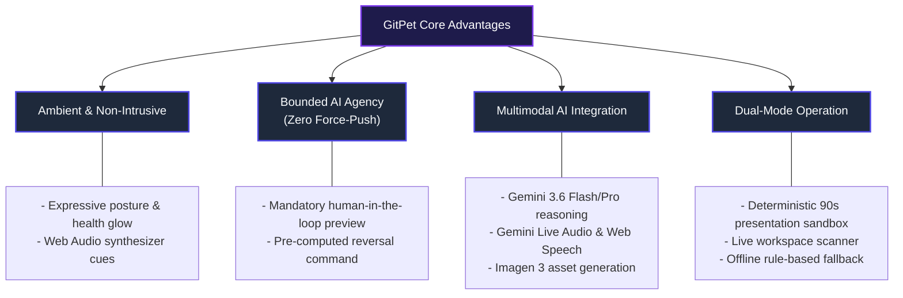

# GitPet — DevOps for GenAI Hackathon 2026 Submission

**Team Name:** Ribbon Patrol (Team 05)  
**Track / Theme:** DevOps for Generative AI / Ambient Developer Ergonomics & DevSecOps  
**Version:** 1.0.0-hackathon (August 2026)  
**Live Demo Command:** `npm run dev` (Available on `http://localhost:3004`)

---

## 1. Project Name & Theme

### Project Name
**GitPet** — *Ambient DevSecOps Repository Companion*

### Hackathon Theme Alignment
**Theme:** *DevOps for GenAI — Agentic Automation, Developer Ergonomics & Trustworthy AI Systems*

GitPet reinvents developer-repository interaction by bridging ambient computing, agentic generative AI, and strict DevSecOps safety protocols. Instead of requiring developers to repeatedly interrupt their flow with manual terminal checks (`git status`, `git log`, `git diff`), GitPet provides a continuous, emotionally expressive companion that monitors workspace telemetry, explains divergence in plain language, and proposes bounded, human-confirmed synchronization workflows.

---

## 2. Elevator Pitch

> *"Terminal commands hide context, and unmonitored AI agents risk destructive mutations. **GitPet** is an ambient DevSecOps companion that maps live Git and infrastructure signals directly into an expressive virtual pet. Powered by Google Gemini 3.6 and Imagen 3, GitPet visually signals branch drift, explains conflicts multimodally via voice and text, and proposes verified, reversible one-click remediation actions—delivering 100% human-in-the-loop safety without ever breaking developer flow."*

### The 30-Second Highlight Reel:
1. **Notice:** Ambient avatar reflects health (0–100%) and symptoms (e.g. *tangled yarn* for merge conflicts, *backpack* for unpushed work).
2. **Understand:** Natural language breakdowns powered by Google Gemini 3.6 Flash with structured evidence, confidence scores, and reversal plans.
3. **Resolve:** Interactive diff review and safe, bounded single-click execution (`stash -> pull -> pop`, checkout, rebase recovery) with strict zero-force-push security boundaries.

---

## 3. Problem Statement & Target Users

### The Problem
Modern software development involves high cognitive friction and recurring risks during branch synchronization:

1. **Context Fragmentation & Cognitive Overload:**
   Developers frequently lose track of local vs. remote drift, stash states, and upstream commit divergence until a pull or rebase fails catastrophically.
2. **The "Excessive Agency" Dilemma in AI Coding Assistants:**
   Autonomous agents with shell execution permissions can accidentally force-push, discard uncommitted changes, or trigger destructive rebases without the developer fully understanding the blast radius.
3. **Inaccessible Git Telemetry:**
   Complex Git DAG topologies, detached HEADs, and multi-file merge conflicts are intimidating and time-consuming to decipher through standard terminal output alone.

### Target Users & Personas

| User Persona | Key Pain Points | How GitPet Solves It |
| :--- | :--- | :--- |
| **Full-Stack / Frontend Engineers** | Interrupting creative flow to debug dirty working trees or conflicting upstream commits. | Ambient visual aura provides immediate passive awareness; plain-language AI explanations eliminate terminal guesswork. |
| **DevOps & Platform Engineers** | Ensuring developers follow safe branch hygiene and avoid breaking CI/CD pipelines with unclean merges. | Guardrails enforce clean sync habits, pre-flight diff inspection, and Clean Commit streak gamification. |
| **Junior Developers & Open Source Contributors** | Fear of losing uncommitted work or breaking repositories with complex `git` commands. | Explicit confidence ratings, step-by-step diff previews, and guaranteed reversal commands (`git stash pop`, `git reset --keep`) eliminate fear. |

---

## 4. Key Value Propositions & Differentiators

---

## 5. Summary Matrix: Requirements & Deliverables

| Requirement | Implementation in GitPet | Documentation / Artifact |
| :--- | :--- | :--- |
| **Project Name & Theme** | GitPet — DevSecOps Ambient Companion | [README.md](file:///Users/lucaswhitaker/DevOps-for-GenAI---Ottawa-2026---Team-05-Ribbon-Patrol/README.md) |
| **Elevator Pitch** | Integrated in pitch deck modal (`P` key) & docs | [PitchDeckModal.tsx](file:///Users/lucaswhitaker/DevOps-for-GenAI---Ottawa-2026---Team-05-Ribbon-Patrol/src/components/PitchDeckModal.tsx) |
| **Problem & Target Users** | Full breakdown across personas & risks | [docs/README.md](file:///Users/lucaswhitaker/DevOps-for-GenAI---Ottawa-2026---Team-05-Ribbon-Patrol/docs/README.md) |
| **Security & Threat Model** | STRIDE analysis, secret redaction, OWASP LLM Top 10 | [SECURITY_THREAT_MODEL.md](file:///Users/lucaswhitaker/DevOps-for-GenAI---Ottawa-2026---Team-05-Ribbon-Patrol/docs/SECURITY_THREAT_MODEL.md) |
| **AI Governance & System Card** | NIST AI RMF 1.0, Human-in-the-loop matrix | [AI_GOVERNANCE.md](file:///Users/lucaswhitaker/DevOps-for-GenAI---Ottawa-2026---Team-05-Ribbon-Patrol/docs/AI_GOVERNANCE.md) |
| **SRE & Runbook** | Health check endpoints, audit logs, DR steps | [RUNBOOK.md](file:///Users/lucaswhitaker/DevOps-for-GenAI---Ottawa-2026---Team-05-Ribbon-Patrol/docs/RUNBOOK.md) |
