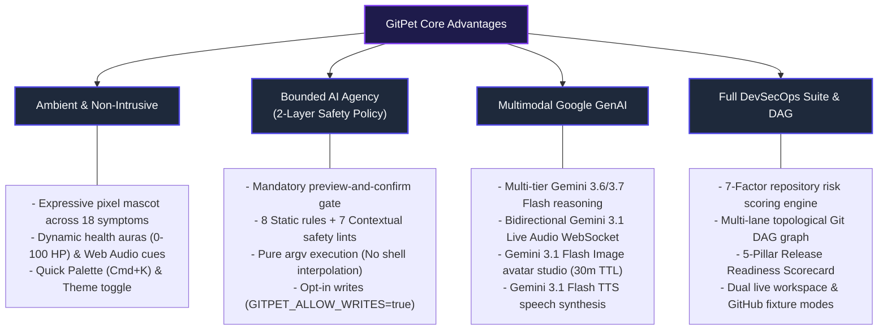
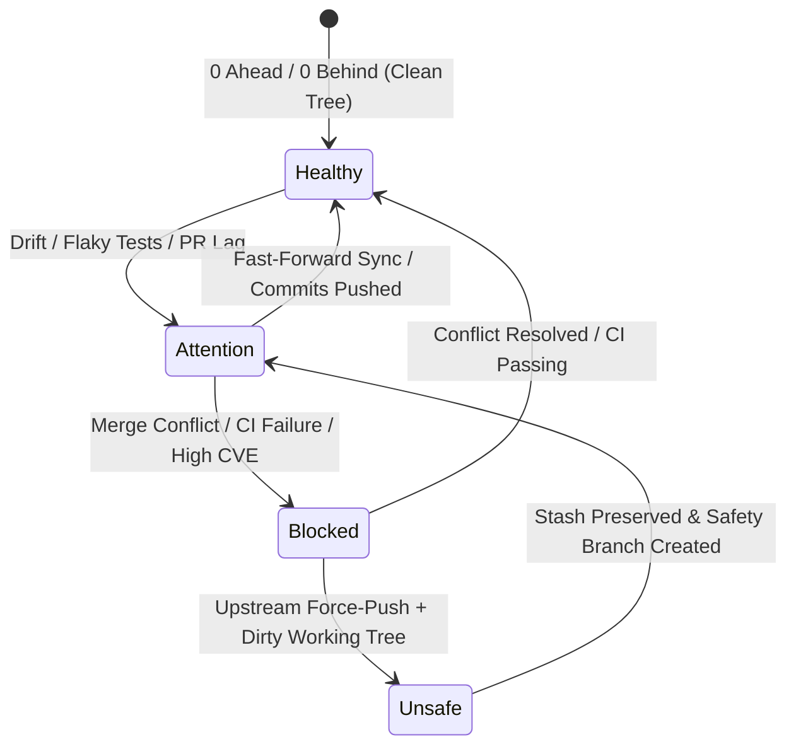
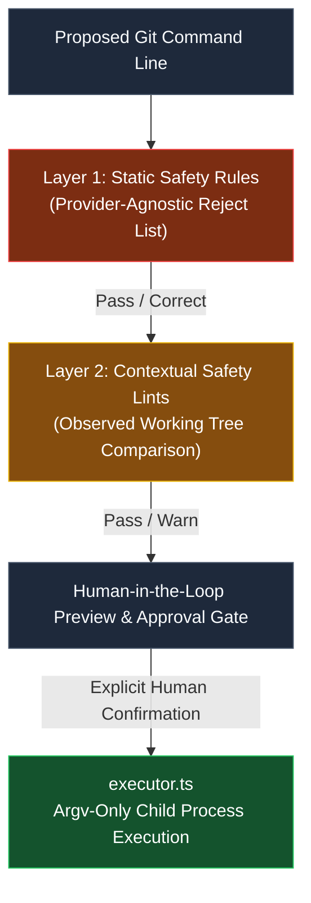
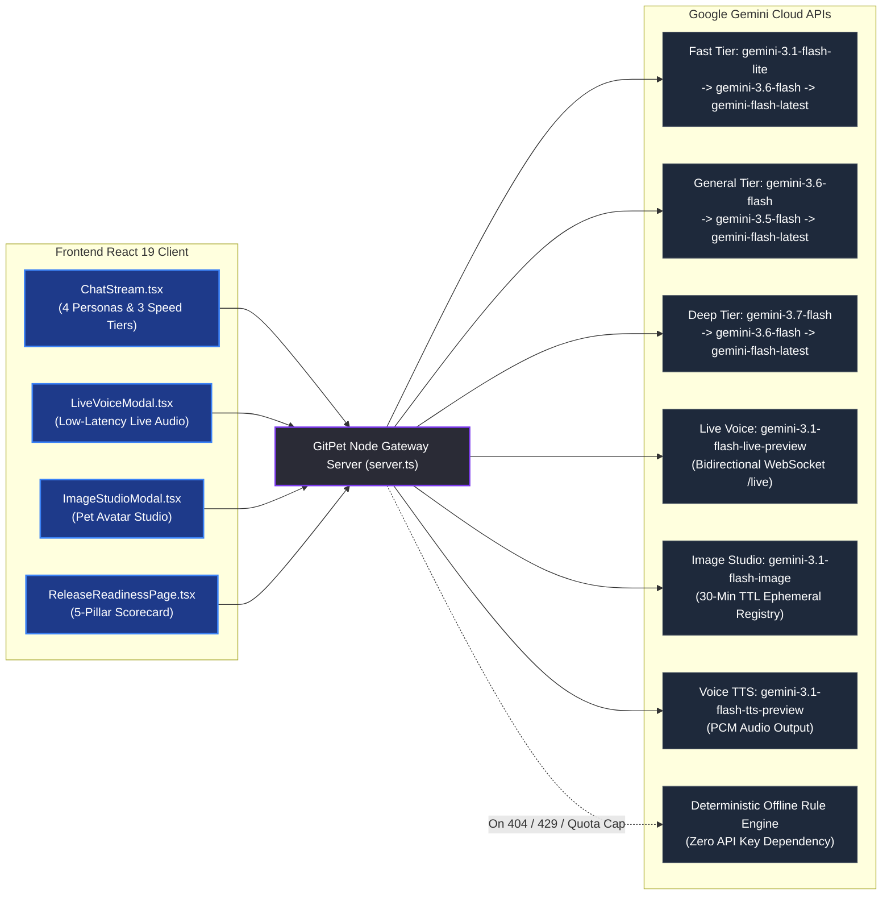

# GitPet — DevOps for GenAI Hackathon 2026 Submission

**Team Name:** Ribbon Patrol (Team 05)  
**Track / Theme:** DevOps for Generative AI / Agentic Automation, Developer Ergonomics & DevSecOps  
**Version:** 1.0.0-hackathon (August 2026)  
**Live Demo Command:** `npm run dev` (Runs locally on `http://localhost:3004`)  
**Repository:** [lucaswhitaker22/DevOps-for-GenAI---Ottawa-2026---Team-05-Ribbon-Patrol](https://github.com/lucaswhitaker22/DevOps-for-GenAI---Ottawa-2026---Team-05-Ribbon-Patrol)  

---

## 1. Project Name & Theme Alignment

### Project Name
**GitPet** — *Ambient DevSecOps Repository Companion*

### Hackathon Theme Alignment
**Theme:** *DevOps for GenAI — Agentic Automation, Developer Ergonomics & Trustworthy AI Systems*

GitPet reinvents developer-repository interaction by bridging ambient computing, agentic generative AI, and strict DevSecOps safety protocols. Instead of forcing developers to repeatedly interrupt their flow with manual terminal queries (`git status`, `git log`, `git diff`, CI log hunting, and PR triage), GitPet provides a continuous, emotionally expressive virtual companion (**Byte**) that lives alongside their development environment. GitPet monitors repository and pipeline telemetry in real time, explains branch divergence and build failures in natural language, computes a 7-factor DevSecOps risk score, evaluates a 5-pillar release readiness gate, and proposes bounded, human-confirmed remediation workflows with guaranteed zero unverified shell execution.

---

## 2. Elevator Pitch & Highlight Reel

> *"Terminal commands hide context, and unmonitored AI agents risk destructive mutations. **GitPet** is an ambient DevSecOps companion that maps live Git, CI/CD, and infrastructure signals directly into an expressive virtual pet. Powered by Google Gemini (Gemini 3.6 & 3.7 Flash, Gemini 3.1 Live Audio, and Gemini 3.1 Flash Image), GitPet visually signals branch drift and pipeline failures, explains conflicts multimodally via voice and text, and proposes verified, reversible one-click remediation actions—delivering 100% human-in-the-loop safety without ever breaking developer flow."*

### The 30-Second Highlight Reel (Notice → Understand → Resolve):
1. **Notice (Ambient Awareness):** An interactive pixel mascot reflects repository health (0–100 HP) and 18 physical symptoms (e.g. *tangled yarn* for merge conflicts, *heavy backpack* for unpushed work, *fever thermometer* for CI build failures, *cracked shield* for cloud storage security policy deviations, *lost map* for stuck Terraform locks).
2. **Understand (Multimodal Reasoning):** Plain-language breakdowns powered by Google Gemini 3.6/3.7 Flash with structured evidence citations, confidence ratings, 7-factor risk breakdowns, and pre-computed rollback plans (`git stash pop`, `git rebase --abort`).
3. **Resolve (Bounded Human-Approved Execution):** Interactive diff inspection and safe, single-click execution (`stash -> pull -> pop`, rebase recovery, branch anchoring) enforced by a 2-layer safety policy (8 static rules + 7 contextual lints) with strict zero-force-push boundaries and dry-run safety validation.

---

## 3. Problem Statement & Target Persona Analysis

### The Problem
Modern software development suffers from severe cognitive friction and recurring operational hazards during branch synchronization, code review, and release:

1. **Context Fragmentation & Cognitive Overload:**
   Developers constantly juggle local edits, remote tracking branches, stash stacks, CI/CD build logs, and PR comments across separate tools, missing drift until a rebase or pull fails catastrophically.
2. **The "Excessive Agency" Dilemma in AI Coding Assistants:**
   Autonomous agents with unrestricted shell permissions can accidentally force-push, discard uncommitted changes (`git reset --hard`, `git clean -fd`), or overwrite colleague branches without the developer understanding the blast radius.
3. **Inaccessible Git & Pipeline Telemetry:**
   Complex Git DAG topologies, detached HEADs, flaky test suites, and multi-file merge conflicts are intimidating and slow to decipher through raw terminal logs alone.

### Target Personas & Value Delivery

| User Persona | Key Pain Points | How GitPet Solves It |
| :--- | :--- | :--- |
| **Full-Stack & Frontend Engineers** | Interrupting creative flow to debug dirty working trees, untracked file collisions, or conflicting upstream commits. | Ambient visual aura provides passive peripheral awareness; plain-language AI explanations eliminate terminal guesswork and context switching. |
| **DevOps & Platform Engineers** | Ensuring engineers follow safe branch hygiene, avoid breaking CI/CD pipelines, and resolve stuck infrastructure locks. | Continuous guardrails enforce clean sync habits, pre-flight diff inspection, CI/CD telemetry monitoring, and Clean Commit streak gamification. |
| **Junior Developers & Open Source Contributors** | Fear of losing uncommitted work or corrupting repositories with complex `git` commands (e.g. detached HEAD, interactive rebase). | Explicit confidence ratings, step-by-step diff previews, interactive DAG topology visualizer, and guaranteed reversal commands eliminate fear. |
| **Release Managers & Security Leads** | Manually inspecting test coverage, vulnerability scans, and PR approvals before production deployments. | Automated 5-Pillar Release Readiness Scorecard with AI executive synthesis, sign-off checklist, and exportable Markdown/JSON compliance artifacts. |

---

## 4. Key Value Propositions & Differentiators



---

## 5. The 6 Dedicated Multi-Page Workspaces

GitPet organizes DevSecOps workflows into 6 dedicated full-page workspaces connected by a responsive, collapsible sidebar (`SidebarNav.tsx`), URL hash navigation, and a rich top bar (`TopBar.tsx`):

```
┌────────────────────────────────────────────────────────────────────────────────────────────────┐
│  GitPet TopBar: acme-corp/ecommerce-store  |  feature/cart  |  🔥 Streak: 5  |  Live Toggle  │
├──────────────┬─────────────────────────────────────────────────────────────────────────────────┤
│  SIDEBAR NAV │  DEDICATED FULL-PAGE WORKSPACE CONTENT                                          │
│              │                                                                                 │
│  🐶 Companion│  1. Ambient Companion (#companion): Pixel stage, chat stream, quick deck       │
│  🌿 Repo/DAG │  2. Repository Details & DAG (#repository): Interactive graph, diffs, stashes   │
│  ⚡ CI/CD    │  3. CI/CD Pipeline Telemetry (#cicd): 5-stage logs, flaky test quarantines      │
│  🔍 PR Intel │  4. Pull Request Intelligence (#pr): Review metrics, inline threads, merges     │
│  🚀 Release  │  5. Release Gate (#release): 5-pillar scorecard, AI verdict, sign-off export    │
│  🛡️ Risk HP  │  6. Risk Scorecard (#risk): 0-100 HP health pool, 7 factor breakdowns           │
└──────────────┴─────────────────────────────────────────────────────────────────────────────────┘
```

1. **Ambient Companion (`#companion`):**
   * **Interactive Pixel Stage (`PetStage.tsx` / `PixelPetGraphic.tsx`):** Animated companion rendering 18 distinct physical symptoms, emotional states, and health auras.
   * **Telemetry Quick Deck:** 4 live mission control cards displaying Ahead/Behind drift, uncommitted working tree files, CI/CD pipeline status, and active PR turnaround.
   * **Multi-Turn AI Chat Stream (`ChatStream.tsx`):** Multi-role conversational assistance supporting 4 personas (*Byte Mascot*, *Senior Architect*, *Safety Auditor*, *Git Tutor*) and 3 model speed tiers (*Fast*, *General*, *Deep*).
   * **Modals:** Pet Image Studio (`ImageStudioModal.tsx`), Gemini Live Audio (`LiveVoiceModal.tsx`), AI Commit Generator (`AICommitGeneratorModal.tsx`), and Quick Palette (`QuickPaletteModal.tsx`).

2. **Repository Details & Topological DAG (`#repository`):**
   * **Multi-Lane DAG Visualizer (`GitDagVisualizer.tsx`):** Topological Git commit graph with lane routing, merge base detection, fork points, detached HEAD indicators, and commit role highlights (`head`, `upstream_head`, `local_ahead`, `remote_behind`, `merge_base`, `hazard`).
   * **Working Tree Diff Viewer (`DiffViewer.tsx`):** Side-by-side / inline syntax-highlighted diffs with individual file staging checkboxes and stage-all controls.
   * **Stash Management:** Visual stash stack inspection and 1-click snapshot restoration.
   * **Audit & Rollback:** Chronological audit trail with 1-click rollback of previous operations.

3. **CI/CD Pipeline Telemetry (`#cicd`):**
   * **5-Stage Execution Tracker:** Real-time visualization of pipeline stages (*Lint & Static Analysis*, *Unit & Adversarial Tests*, *Security & Secret Scans*, *Container Build*, *Staging Deployment*).
   * **Expandable Step Logs:** Direct inspection of execution logs, compilation errors, and broken test assertions.
   * **Flaky Test Suite Diagnostics:** Identifies intermittent test specs, tracks failure rates, and provides 1-click test quarantine recommendations.
   * **Dependency CVE Scanner:** Surfaces high/critical supply chain vulnerabilities with upgrade paths.

4. **Pull Request Intelligence (`#pr`):**
   * **PR Health & Turnaround:** Tracks waiting duration (e.g. 4 days lag), approval counts vs. required thresholds, and mergeability status.
   * **Inline Code Review Threads:** Displays reviewer comments with file paths and line numbers.
   * **1-Click AI Reply Drafting:** Generates contextual code-review response comments.
   * **Squash & Merge Execution:** Safe merge workflows with automatic feature branch pruning.

5. **Release Gate & Deployment Sign-Off (`#release`):**
   * **5-Pillar Scorecard (`releaseReadiness.ts`):** Evaluates Tests Passing (25%), Code Coverage % (20%), Vulnerabilities (25%), PR Approvals (15%), and Branch Freshness (15%).
   * **Executive AI Synthesis:** Gemini-generated release readiness headline, risk verdict, and blocker breakdown.
   * **Compliance Artifact Export:** 1-click download of JSON compliance manifest and Markdown release sign-off report.

6. **Risk Scorecard & Health Pool (`#risk`):**
   * **0–100 HP Health Pool:** Granular deduction breakdown across 7 DevSecOps risk factors.
   * **Category Filtering:** Filter factors by *All*, *Hazards (Critical)*, *Warnings*, and *Healthy*.
   * **Remediate with Byte:** 1-click deep links that route directly to conversational remediation in the companion stage.

---

## 6. Ambient Companion Engine & 18 Physical Symptoms

GitPet defines an expressive, continuous state machine mapping repository and infrastructure conditions to visual symptoms, accessories, animations, and Web Audio sound cues:



| Symptom Key | Visual Mascot Expression & Accessory | Repository / Telemetry Signal | Operator Meaning |
| :--- | :--- | :--- | :--- |
| `clean_sync` | Playful wagging tail, vibrant green aura | 0 commits ahead/behind, clean tree | Repository in pristine state. Ready for release. |
| `behind_remote` | Pulling forward on leash, amber pulse | Local branch is behind upstream | Fast-forward pull or stash before sync. |
| `unpushed_work` | Heavy backpack with commit stars | Local commits ahead of upstream | Push commits upstream for backup & review. |
| `merge_conflict` | Tangled red & gray yarn with alert signs | Rebase/merge paused on conflict markers | Inspect conflicting files and continue or abort. |
| `stale_branch` | Sleepy nightcap, dusty cobwebs | Branch merged >30 days ago | Safely delete merged branch to maintain hygiene. |
| `detached_head` | Wandering compass & question mark | HEAD checked out directly to commit hash | Anchor floating commit to a named branch. |
| `destructive_hazard` | Frozen grayscale with crimson warning barrier | Upstream force-pushed with dirty tree | **Halt writes!** Stash changes to prevent loss. |
| `failed_build` | Sick bot with fever thermometer | CI/CD pipeline job compilation error | Inspect build logs and fix broken assertions. |
| `flaky_tests` | Trembling companion with sweat drops | Tests passed only on auto-retry | Quarantine intermittent test cases. |
| `vulnerability_risk`| Shielded bot with metallic armor | High/critical CVE vulnerability flagged | Update vulnerable package dependencies. |
| `deploy_success` | Party hat with confetti & fireworks | CD pipeline deployed cleanly to prod | Production deployment healthy and verified. |
| `pr_changes_requested` | Review clipboard with red indicator | Reviewer requested code changes | Address review comments in PR files. |
| `pr_pending_review` | Tapping foot with hourglass timer | PR waiting >3 days for initial review | Send polite review nudge ping to reviewers. |
| `pr_conflicted` | Conflict warning signs | PR has merge conflicts with base | Rebase feature branch on updated base. |
| `pr_approved_ready` | Golden approval stamp & green badge | PR has required approvals & green CI | Squash and merge PR into primary branch. |
| `lost_map` | Holding upside-down map in circles | Terraform remote state lock stuck | Force unlock stuck backend state. |
| `smoke_cloud` | Running through smoke with soot marks | Pod CrashLoopBackOff in Kubernetes rollout | Inject missing environment secrets. |
| `shield_cracked` | Cracked shield in defensive stance | Cloud storage bucket allows public read | Enforce private bucket security policy. |

---

## 7. DevSecOps 7-Factor Risk Engine & 5-Pillar Release Gate

### 7-Factor DevSecOps Risk Score Engine
GitPet calculates a real-time repository health pool (0–100 HP) by evaluating 7 core DevSecOps risk factors:

```
Health Pool (100 HP)
  ├── 1. Branch Divergence (-0 to -35 pts): Commits ahead/behind, detached HEAD, work-loss hazards
  ├── 2. Failed & Flaky Tests (-0 to -28 pts): CI build failures, flaky test suites, rollout crashes
  ├── 3. Secrets & Security Policies (-0 to -30 pts): Exposed API keys, public cloud storage buckets
  ├── 4. Open Vulnerabilities (-0 to -22 pts): High/Critical CVEs in dependency lockfiles
  ├── 5. Code Smells & Debt (-0 to -15 pts): Uncommitted dirty sprawl (>8 files), lint warnings
  ├── 6. Unreviewed Commits & PR Lag (-0 to -15 pts): Stale PR queues (>3 days), changes requested
  └── 7. Large PR Size (-0 to -8 pts): Changesets exceeding 400 lines or 15 files
```

### 5-Pillar Release Readiness Calculator
For deployment readiness sign-off, GitPet evaluates 5 weighted pillars:

| Release Pillar | Weight | Evaluation Criteria | Blocker Condition |
| :--- | :--- | :--- | :--- |
| **1. Tests Passing** | 25% | CI test suite pass rate (Target: 100%) | Any failing test suite or compilation failure |
| **2. Code Coverage** | 20% | Line coverage percentage (Target: ≥80%) | Coverage below minimum threshold (<60%) |
| **3. Vulnerabilities** | 25% | CVE severity count in dependencies (Target: 0) | ≥1 Critical or High severity CVE |
| **4. PR Approvals** | 15% | Peer reviewer approval count vs. required | Pending review or changes requested |
| **5. Branch Freshness** | 15% | Commits behind upstream main (Target: 0) | >5 commits behind or merge conflicts |

---

## 8. Dual Workspace Awareness: Local Scanner & Public GitHub Fixture

GitPet provides seamless dual-mode operational telemetry:

1. **Local Workspace Scanner (`GET /api/git/live-status`):**
   * Inspects the active repository on disk (`process.cwd()` or `GITPET_WORKSPACE_ROOT`).
   * Scans branch pointers, ahead/behind counts, working tree diffs, stash entries, and in-progress operations (`rebase-merge`, `MERGE_HEAD`, `CHERRY_PICK_HEAD`, `REVERT_HEAD`, `BISECT_LOG`).
   * Remains strictly read-only unless `GITPET_ALLOW_WRITES=true` is explicitly configured.

2. **Live Public GitHub Fixture (`GET /api/repo/live`):**
   * Integrates with real-world public test repository: [`farisnour/gitpet-acme-corp-ecommerce-store`](https://github.com/farisnour/gitpet-acme-corp-ecommerce-store).
   * Live branch switching between `main`, `feature/cart`, `fix/checkout-tax`, and `refactor/auth-v2`.
   * Built-in GitHub API rate limit handling (`GitHubRateLimitError`) with reset timestamp reporting.

---

## 9. 2-Layer Safety Policy & Bounded Execution Engine

To prevent catastrophic AI mutations and eliminate excessive agency, GitPet enforces an uncompromising 2-layer command safety engine in `src/server/safety.ts`:



### Layer 1: Static Safety Rules (Reject on Syntax)
* `force-push`: Blocks un-leased force pushes (`git push -f` / `--force`); automatically suggests `--force-with-lease`.
* `remote-ref-delete`: Blocks remote ref deletion (`git push --delete` / `-d`).
* `hard-reset`: Blocks destructive tree resets (`git reset --hard`); suggests `--keep`.
* `clean`: Blocks untracked file deletion (`git clean`).
* `force-branch-delete`: Blocks unmerged branch deletion (`git branch -D`); suggests `-d`.
* `stash-destroy`: Blocks permanent stash drops (`git stash drop` / `clear`).
* `history-rewrite`: Blocks history rewrites (`filter-branch`, `--filter-repo`).
* `checkout-paths`: Blocks uncommitted file overwrites (`git checkout -- <paths>`).
* `shell-metacharacters`: Rejects shell control characters (`;`, `|`, `` ` ``, `$`, `>`, `<`, `&&` inside unquoted segments).

### Layer 2: Contextual Safety Lints (Reject on State Mismatch)
* `stash-misses-untracked`: Flags `git stash` when untracked files are present; suggests `git stash push -u`.
* `stash-pop-empty`: Warns when attempting to pop from an empty stash list.
* `pull-dirty-tree`: Warns when pulling or merging with dirty uncommitted files without `--autostash`.
* `unresolved-conflicts`: Blocks operations while merge/rebase conflict markers exist.
* `operation-in-progress`: Restricts commands to `--continue`, `--skip`, `--abort`, staging, or read-only queries during paused rebase/merge.
* `ff-only-on-diverged`: Blocks `git pull --ff-only` when a branch has diverged (ahead > 0 and behind > 0); suggests `--rebase`.
* `push-while-behind`: Warns when pushing while commits are behind upstream.

### Execution Engine (`src/server/executor.ts`)
* **Argv Execution:** Commands execute directly via `execFile('git', args)` without shell interpolation.
* **Write Opt-In:** All mutating actions fail closed unless `GITPET_ALLOW_WRITES=true` is present in the environment.
* **Atomic Recovery:** Captures `headBefore` and `headAfter` commit hashes; halts execution immediately on any intermediate step failure.

---

## 10. Multimodal AI Integration & Model Fallback Chains

GitPet integrates the official Google GenAI SDK (`@google/genai` v2.4.0) with robust multi-tier fallback chains to ensure 100% uptime:



### Multi-Tier Fallback Strategy

| Tier | Primary Candidate | Fallback 1 | Fallback 2 | Primary Use Case |
| :--- | :--- | :--- | :--- | :--- |
| **Fast** | `gemini-3.1-flash-lite` | `gemini-3.6-flash` | `gemini-flash-latest` | One-liner queries, quick status checks, commit message generation |
| **General** | `gemini-3.6-flash` | `gemini-3.5-flash` | `gemini-flash-latest` | Default conversational chat, tutoring, and repository state analysis |
| **Deep** | `gemini-3.7-flash` | `gemini-3.6-flash` | `gemini-flash-latest` | Complex rebase conflicts, DAG topology analysis, release sign-off |
| **Live Voice** | `gemini-3.1-flash-live-preview` | Client Web Speech | — | Bidirectional real-time voice conversations over WebSocket (`/live`) |
| **Image Gen** | `gemini-3.1-flash-image` | Dynamic SVG Generator | — | Custom mascot generation and visual editing with 30-min preview TTL |
| **Voice TTS** | `gemini-3.1-flash-tts-preview` | SpeechSynthesis API | — | Spoken voice audio synthesis with Zephyr persona |

---

## 11. Security Threat Model, AI Governance & SRE Runbook

GitPet satisfies enterprise DevSecOps standards through exhaustive governance documentation:

1. **[Security Threat Model & STRIDE Analysis](SECURITY_THREAT_MODEL.md):**
   * STRIDE threat evaluation across all trust boundaries (Spoofing, Tampering, Repudiation, Information Disclosure, Denial of Service, Elevation of Privilege).
   * OWASP Top 10 for LLMs mitigations (Prompt Injection, Sensitive Information Disclosure, Excessive Agency, Insecure Output Handling).
   * Real-time regex sanitization redacting Google API keys (`AIza...`), GitHub PATs (`ghp_...`), and Bearer tokens.
2. **[AI Governance & System Card](AI_GOVERNANCE.md):**
   * NIST AI Risk Management Framework (AI RMF 1.0) compliance.
   * 5-tier Human-in-the-Loop oversight matrix guaranteeing zero autonomous write execution.
   * Incident escalation protocols, fallback telemetry, and model transparency disclosures.
3. **[Operations & SRE Runbook](RUNBOOK.md):**
   * Live operational monitoring via `GET /api/health` and `GET /api/audit-logs`.
   * Standard Operating Procedures (SOPs) for quota exhaustion, rate limiting, and write-permission recovery.
4. **[Supply Chain & SBOM Inventory](SBOM_MANIFEST.md):**
   * Complete OpenSSF / CycloneDX compatible software bill of materials (`npm run sbom`).

---

## 12. Automated Verification & Test Coverage

GitPet includes an automated Vitest test suite covering security guardrails, safety policies, command execution, and rendering:

```bash
npm test
```

### Test Suite Execution Summary (31 Tests Passing):
```
 ✓ tests/security.test.ts (9 tests)
    ✓ Redact leaked API keys and bearer tokens from prompts
    ✓ Block jailbreak attempts targeting system instructions
    ✓ Block destructive shell injections (rm -rf .git, fork bombs)
    ✓ Pass benign developer questions about Git status and conflicts
    ✓ Reject safe write operations if human has not confirmed preview
    ✓ Strictly block unrecoverable destructive operations (force-push, hard reset)
    ✓ Record model and provider traceability settings
    ✓ Trigger graceful fallback when Gemini API is unavailable
    ✓ Enforce risk classification based on impact level

 ✓ tests/executor.test.ts (19 tests)
    ✓ Blocks unconditional force-push and suggests --force-with-lease
    ✓ Blocks reset --hard and suggests --keep
    ✓ Blocks stash drop and stash clear
    ✓ Rejects shell metacharacters (; | ` $ > <)
    ✓ Rejects non-git binaries (sudo, rm)
    ✓ Allows ordinary fast-forward pull
    ✓ Warns when stash would leave untracked files behind and suggests -u
    ✓ Accepts stash once -u is included
    ✓ Warns when pushing while behind upstream
    ✓ Blocks ordinary operations during paused rebase
    ✓ Permits continuing or aborting paused rebase
    ✓ Warns when popping from empty stash
    ✓ Evaluates multi-step chains and reports worst verdict
    ✓ Keeps quoted messages intact during tokenization
    ✓ Blocks fast-forward pull on diverged branch and suggests --rebase
    ✓ Allows rebase pull on diverged branch
    ✓ Allows fast-forward pull when merely behind
    ✓ Accepts pull with --autostash on dirty tree
    ✓ Warns on pull with dirty tree without autostash

 ✓ tests/markdown.test.ts (3 tests)
    ✓ Render bold text, inline code, and lists
    ✓ Render fenced code blocks with copy structure
    ✓ Render GFM markdown tables correctly
```

---

## 13. Summary Matrix: Requirements, Deliverables & Evidence

| Hackathon Requirement | Implementation in GitPet | Key Source Files | Documentation Artifact |
| :--- | :--- | :--- | :--- |
| **Project Overview & Pitch** | Complete overview, elevator pitch & theme alignment | [App.tsx](../src/App.tsx) | [PROJECT_OVERVIEW.md](PROJECT_OVERVIEW.md) |
| **Functional Specification** | Comprehensive functional & technical specification | [types.ts](../src/types.ts) | [docs/README.md](README.md) |
| **System Architecture** | C4 Container & Component diagrams, sequence flows | [server.ts](../server.ts) | [ARCHITECTURE.md](ARCHITECTURE.md) |
| **Security & Threat Model** | STRIDE analysis, secret sanitization, OWASP LLM Top 10 | [safety.ts](../src/server/safety.ts) | [SECURITY_THREAT_MODEL.md](SECURITY_THREAT_MODEL.md) |
| **AI Governance & System Card**| NIST AI RMF 1.0, 5-tier Human-in-the-loop matrix | [server.ts](../server.ts) | [AI_GOVERNANCE.md](AI_GOVERNANCE.md) |
| **Operations & SRE Runbook** | `/api/health`, `/api/audit-logs`, failure SOPs | [server.ts](../server.ts) | [RUNBOOK.md](RUNBOOK.md) |
| **Test Report & Verification** | 31 Automated Vitest unit, security & safety tests | [tests/](../tests) | [TEST_REPORT.md](TEST_REPORT.md) |
| **Supply Chain & SBOM** | Automated dependency manifest (`npm run sbom`) | [package.json](../package.json) | [SBOM_MANIFEST.md](SBOM_MANIFEST.md) |
| **Live Workspace Scanner** | Real filesystem scanner + public GitHub fixture | [githubClient.ts](../src/services/githubClient.ts) | [LIVE_WORKSPACE.md](LIVE_WORKSPACE.md) |
| **Demo Integrity Notes** | 18 full scenarios vs. live inspection breakdown | [mockScenarios.ts](../src/data/mockScenarios.ts) | [DEMO_NOTES.md](DEMO_NOTES.md) |
| **End-User Guide** | Complete visual walkthrough of all 6 workspaces | [components/](../src/components) | [USER_GUIDE.md](USER_GUIDE.md) |
| **Feature Deep Dive** | Exhaustive feature manual and scenario dictionary | [mockScenarios.ts](../src/data/mockScenarios.ts) | [FEATURES.md](FEATURES.md) |

---

## 14. AI Usage Disclosure

In accordance with Hackathon Guideline **P-06 (AI Transparency)** and **Item 8 (AI Usage Disclosure)**, AI tools assisted the development process as follows:

### Runtime AI Integration (Application Level)
* **Google Gemini 3.6 / 3.7 Flash:** Core reasoning engine for repository health analysis, merge conflict explanations, and contextual advice.
* **Google Gemini 3.1 Live Audio (`gemini-3.1-flash-live-preview`):** Bidirectional WebSocket audio streaming for real-time live voice interaction.
* **Google Gemini 3.1 Flash Image (`gemini-3.1-flash-image`):** Avatar generation and visual editing in the Pet Image Studio.
* **Google Gemini 3.1 Flash TTS (`gemini-3.1-flash-tts-preview`):** Audio synthesis for conversational companion speech.

### Development & Engineering Assistance (Human-in-the-Loop)
* **Google AI Studio:** Rapid prototyping of role system instructions, structured JSON response schemas, and parameter tuning.
* **Antigravity (Gemini):** Pair programming assistant for TypeScript architecture, React 19 component design, and CSS token systems.
* **Claude Code & Copilot:** Automated test writing assistance (Vitest), documentation formatting, and edge-case security verification.

All AI-suggested code, safety filters, and test boundaries were fully reviewed, audited, and approved by the team.
