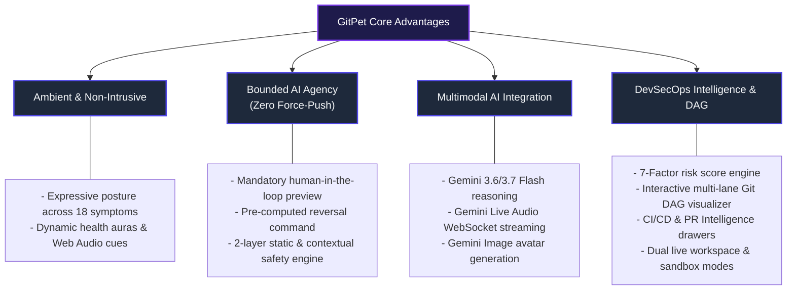

# GitPet — DevOps for GenAI Hackathon 2026 Submission

**Team Name:** Ribbon Patrol (Team 05)  
**Track / Theme:** DevOps for Generative AI / Agentic Automation, Developer Ergonomics & DevSecOps  
**Version:** 1.0.0-hackathon (August 2026)  
**Live Demo Command:** `npm run dev` (Available at `http://localhost:3004`)

---

## 1. Project Name & Theme

### Project Name
**GitPet** — *Ambient DevSecOps Repository Companion*

### Hackathon Theme Alignment
**Theme:** *DevOps for GenAI — Agentic Automation, Developer Ergonomics & Trustworthy AI Systems*

GitPet reinvents developer-repository interaction by bridging ambient computing, agentic generative AI, and strict DevSecOps safety protocols. Instead of requiring developers to repeatedly interrupt their flow with manual terminal checks (`git status`, `git log`, `git diff`, CI log hunting), GitPet provides a continuous, emotionally expressive virtual companion (Byte) that monitors workspace telemetry, explains divergence in plain language, computes a 7-factor risk breakdown, and proposes bounded, human-confirmed remediation workflows.

---

## 2. Elevator Pitch

> *"Terminal commands hide context, and unmonitored AI agents risk destructive mutations. **GitPet** is an ambient DevSecOps companion that maps live Git, CI/CD, and infrastructure signals directly into an expressive virtual pet. Powered by Google Gemini (Gemini 3.6 & 3.7 Flash) and Gemini Live Audio, GitPet visually signals branch drift and pipeline failures, explains conflicts multimodally via voice and text, and proposes verified, reversible one-click remediation actions—delivering 100% human-in-the-loop safety without ever breaking developer flow."*

### The 30-Second Highlight Reel:
1. **Notice:** Ambient avatar reflects health (0–100%) and 18 expressive symptoms (e.g. *tangled yarn* for merge conflicts, *backpack* for unpushed work, *fever thermometer* for CI build failures, *shield* for cloud security policy deviations).
2. **Understand:** Natural language breakdowns powered by Google Gemini 3.6/3.7 Flash with structured evidence citations, confidence ratings, 7-factor risk breakdowns, and reversal plans.
3. **Resolve:** Interactive diff inspection and safe, bounded single-click execution (`stash -> pull -> pop`, rebase recovery, branch anchoring) with strict zero-force-push security boundaries and dry-run safety validation.

---

## 3. Problem Statement & Target Users

### The Problem
Modern software development involves high cognitive friction and recurring risks during branch synchronization and release:

1. **Context Fragmentation & Cognitive Overload:**
   Developers frequently lose track of local vs. remote drift, stash states, upstream commit divergence, and PR review comments until a pull or rebase fails catastrophically.
2. **The "Excessive Agency" Dilemma in AI Coding Assistants:**
   Autonomous agents with shell execution permissions can accidentally force-push, discard uncommitted changes, or trigger destructive rebases without the developer fully understanding the blast radius.
3. **Inaccessible Git & Pipeline Telemetry:**
   Complex Git DAG topologies, detached HEADs, flaky test suites, and multi-file merge conflicts are intimidating and time-consuming to decipher through standard terminal logs alone.

### Target Users & Personas

| User Persona | Key Pain Points | How GitPet Solves It |
| :--- | :--- | :--- |
| **Full-Stack / Frontend Engineers** | Interrupting creative flow to debug dirty working trees or conflicting upstream commits. | Ambient visual aura provides immediate passive awareness; plain-language AI explanations eliminate terminal guesswork. |
| **DevOps & Platform Engineers** | Ensuring developers follow safe branch hygiene and avoid breaking CI/CD pipelines with unclean merges. | Guardrails enforce clean sync habits, pre-flight diff inspection, CI/CD pipeline telemetry, and Clean Commit streak gamification. |
| **Junior Developers & Open Source Contributors** | Fear of losing uncommitted work or breaking repositories with complex `git` commands. | Explicit confidence ratings, step-by-step diff previews, interactive DAG topology, and guaranteed reversal commands (`git stash pop`, `git rebase --abort`) eliminate fear. |

---

## 4. Key Value Propositions & Differentiators

---

## 5. Summary Matrix: Requirements & Deliverables

| Requirement | Implementation in GitPet | Documentation / Artifact |
| :--- | :--- | :--- |
| **Project Name & Theme** | GitPet — DevSecOps Ambient Companion | [README.md](README.md) |
| **Elevator Pitch** | Integrated in pitch deck modal (`P` key) & docs | [PitchDeckModal.tsx](../src/components/PitchDeckModal.tsx) |
| **Problem & Target Users** | Full breakdown across personas & risks | [docs/README.md](README.md#product-objectives) |
| **Architecture Diagram** | Complete C4 system & container diagrams | [ARCHITECTURE.md](ARCHITECTURE.md) |
| **Security & Threat Model** | STRIDE analysis, secret redaction, OWASP LLM Top 10 | [SECURITY_THREAT_MODEL.md](SECURITY_THREAT_MODEL.md) |
| **AI Governance & System Card** | NIST AI RMF 1.0, 5-tier Human-in-the-loop matrix | [AI_GOVERNANCE.md](AI_GOVERNANCE.md) |
| **SRE & Runbook** | Health check endpoints, audit logs, disaster recovery | [RUNBOOK.md](RUNBOOK.md) |
| **Testing & Verification** | 31 automated Vitest unit, security, and executor tests | [TEST_REPORT.md](TEST_REPORT.md) |
| **Supply Chain & SBOM** | OpenSSF & CycloneDX compatible inventory (`npm run sbom`) | [SBOM_MANIFEST.md](SBOM_MANIFEST.md) |
| **Live Workspace Mode** | Dual-mode local scanner & public GitHub fixture | [LIVE_WORKSPACE.md](LIVE_WORKSPACE.md) |
| **Demo Integrity Notes** | 18 full scenarios vs. live inspection breakdown | [DEMO_NOTES.md](DEMO_NOTES.md) |
