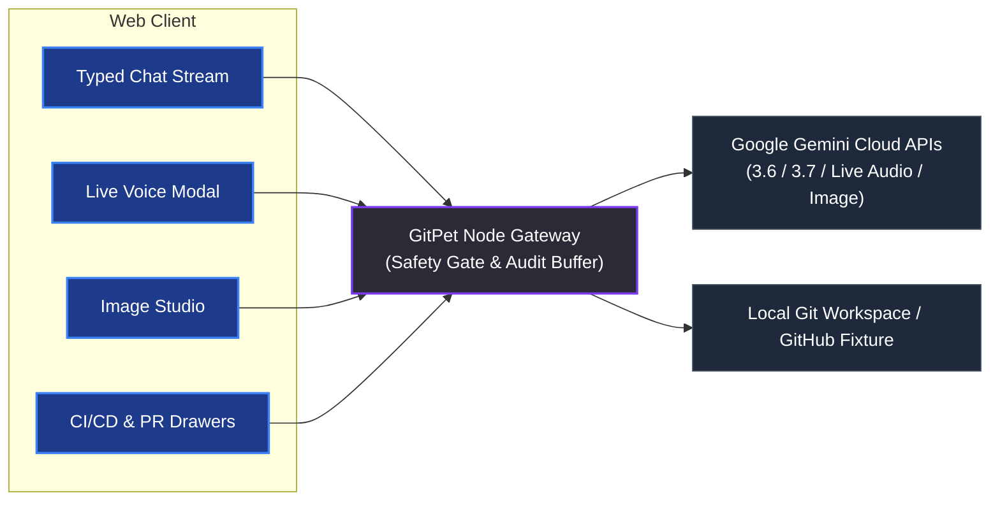

# Functional Specification Document: GitPet

## Functional Specification: GitPet

Repository work often hides context across branches, remotes, and local changes. GitPet makes that state visible without a terminal-first investigation.

GitPet is an ambient DevSecOps repository companion. It maps repository signals and infrastructure telemetry directly to an expressive virtual pet (Byte). It explains issues clearly in natural language, calculates a multi-factor risk score, and proposes bounded, safe Git actions for human approval.

GitPet follows a continuous DevSecOps loop:

1. **Notice:** The pet makes repository health and pipeline state visible at a glance via ambient postures, auras, and audio cues.
2. **Understand:** The developer receives an evidence-based explanation with confidence ratings, cited file hunks, and risk breakdowns.
3. **Resolve:** The developer approves a bounded, reversible repository action verified against strict safety policies before execution.

---

### Product Objectives

* **At-a-glance repository status:** Surface healthy, attention, blocked, and unsafe states through posture, mood, auras, and audio effects.
* **Lower cognitive load:** Explain branch divergence, merge conflicts, uncommitted diffs, CI/CD build failures, and PR review comments in plain language.
* **Human-approved actions:** Enforce a mandatory preview-and-confirm gate for every write operation with zero unverified shell execution.
* **Explainable recommendations:** Show repository evidence, expected impact, step-by-step breakdowns, and verified reversal commands (`git stash pop`, `git rebase --abort`).
* **DevSecOps Risk Scoring:** Provide a 7-Factor risk score breakdown factoring in branch divergence, test failures, exposed secrets, CVE vulnerabilities, code smells, unreviewed commits, and PR sizing.
* **Interactive DAG Topology:** Render a multi-lane Git commit graph with lane routing, merge bases, and commit role highlights.
* **PR & CI/CD Intelligence:** Inspect pull request review blockers, requested changes, and CI/CD pipeline steps with flaky test quarantines.
* **Multimodal assistance:** Support typed and voice repository conversations powered by Google Gemini (Gemini 3.6/3.7 Flash and Gemini 3.1 Live Audio).
* **Expressive pet customization:** Generate and edit pet avatars using Gemini Image Generation without mutating repository state.

---

### Core Mechanics & State Machine

#### Health & Emotional State Mapping

The pet state combines **Repository Health** (0–100%) and **Repository Symptom**. Health conveys urgency, while symptoms identify the exact repository or pipeline condition.

| Health Level | Health % | Visual Treatment | Operator Meaning |
| :--- | :--- | :--- | :--- |
| **Healthy** | 90–100% | Relaxed, playful tail wag, vibrant green aura | Branch is synchronized, clean working tree, CI green |
| **Attention** | 60–89% | Uneasy, amber warning pulse | Review local/remote drift, flaky tests, or PR review lag |
| **Blocked** | 1–59% | Distressed, red pulse, barrier indicators | Resolve a merge conflict, CI failure, or stale lock |
| **Unsafe** | 0% | Frozen, grayscale distress aura, crimson alert | Destructive hazard: upstream force-push with uncommitted edits |

#### 18 Comprehensive Symptom Presets

| Symptom Key | Pet Expression | Repository & DevSecOps Signal | Operator Meaning |
| :--- | :--- | :--- | :--- |
| `clean_sync` | Playful tail, green aura | 0 commits ahead/behind, clean tree | Repository in pristine state. Ready for release. |
| `behind_remote` | Pulling on leash | Local branch is behind upstream | Fast-forward pull or stash before sync. |
| `unpushed_work` | Heavy backpack with commit stars | Local commits ahead of upstream | Push commits upstream for backup & review. |
| `merge_conflict` | Tangled red & gray yarn | Rebase/merge paused on conflict markers | Inspect conflicting files and continue or abort. |
| `stale_branch` | Sleepy nightcap, dusty cobwebs | Branch merged >40 days ago with no commits | Safely delete merged branch to maintain hygiene. |
| `detached_head` | Wandering compass & question mark | HEAD checked out directly to commit hash | Anchor floating commit to a named branch. |
| `destructive_hazard` | Frozen grayscale with warning barrier | Upstream force-pushed with uncommitted local work | Halt writes! Stash changes to prevent permanent loss. |
| `failed_build` | Sick bot with fever thermometer | CI/CD pipeline job compilation error | Inspect build logs and fix broken assertions. |
| `flaky_tests` | Trembling companion with sweat drops | Tests passed only on auto-retry | Quarantine intermittent test cases. |
| `vulnerability_risk`| Shielded bot with metallic armor | High/critical CVE vulnerability flagged | Update vulnerable package dependencies. |
| `deploy_success` | Party hat with confetti & fireworks | CD pipeline deployed cleanly to production | Production deployment healthy and verified. |
| `pr_changes_requested` | Review clipboard with red indicator | Reviewer requested code changes | Address review comments in PR files. |
| `pr_pending_review` | Tapping foot with hourglass timer | PR waiting >3 days for initial review | Send polite review nudge ping to reviewers. |
| `pr_conflicted` | Conflict warning signs | PR has merge conflicts with base branch | Rebase feature branch on updated base. |
| `pr_approved_ready` | Golden approval stamp & green badge | PR has required approvals & green CI | Squash and merge PR into primary branch. |
| `lost_map` | Holding upside-down map in circles | Terraform remote state lock stuck | Force unlock stuck backend state. |
| `smoke_cloud` | Running through smoke with soot marks | Pod CrashLoopBackOff in Kubernetes rollout | Inject missing environment secrets. |
| `shield_cracked` | Cracked shield in defensive stance | Cloud storage bucket allows anonymous read | Enforce private bucket security policy. |

---

### DevSecOps 7-Factor Risk Score Engine

GitPet aggregates 7 real-time telemetry factors into a single 0–100 DevSecOps Health Score:

1. **Branch Divergence:** Evaluates commits ahead/behind, detached HEAD, and merge base distance.
2. **Failed & Flaky Tests:** Deducts points for CI pipeline build failures and flaky test suites.
3. **Secrets & Security Policies:** Flags unencrypted API keys or permissive cloud infrastructure policies.
4. **Open Vulnerabilities:** Detects High/Critical CVEs in dependency lockfiles.
5. **Code Smells & Debt:** Measures uncommitted dirty file sprawl and complex code patterns.
6. **Unreviewed Commits & PR Lag:** Highlights unreviewed protected branch commits and stale PR review queues.
7. **Large PR Size:** Flags oversized changesets (>400 lines) that increase review risk.

---

### Interactive Visual & Intelligence Drawers

* **Git DAG Visualizer:** Interactive SVG commit topology graph featuring multi-lane branch routing, commit role badges (HEAD, Upstream, Merge Base, Hazard), and collapsed commit runs.
* **CI/CD Pipeline Drawer:** Real-time pipeline step monitoring, pass rates, test suite health, flaky test quarantine list, and deployment targets.
* **PR Intelligence Drawer:** Complete PR metadata, review statuses, inline review comments with line numbers, waiting time tracker, and automated changelog generation.
* **AI Commit & Changelog Generator:** Conventional commit assistant (`feat`, `fix`, `refactor`, `docs`, `chore`, etc.) synthesizing atomic messages, changelogs, and release notes.
* **Risk Score Breakdown Modal:** Drilldown modal visualizing each factor's point deductions, severity status, and remediation advice.

---

### End-to-End Experience

```
  [ Healthy Pet ]  --->  ( Repository / Pipeline Event )  --->  [ Pet Signals Symptom & Aura ]
         ^                                                                  |
         |                                                                  v
  [ Verified State ] <--- ( Developer Confirms Write ) <--- [ Multi-Factor Risk & Explanation ]
```

#### 1. Ambient Workspace Awareness
* GitPet sits beside your editor or terminal.
* The top bar displays active repository, branch, Clean Commit streak, and Live Workspace toggle.

#### 2. Symptom Shift & Telemetry Update
* An event occurs (e.g. remote commits pushed, failed CI build, or PR changes requested).
* Health drops, auras shift, audio cues trigger, and Byte visually manifests the symptom.

#### 3. Conversational AI Guidance
* Developer asks: *"Status report!"* or *"What is blocking my PR?"* (via text or voice).
* Gemini analyzes repository context using the selected persona (Byte Mascot, Senior Architect, Safety Auditor, Git Tutor).
* Response displays plain-English explanation, cited evidence points, and risk assessment.

#### 4. Safe Action & Human Approval Gate
* GitPet proposes one bounded, safe Git action with confidence score, expected impact, and reversal steps.
* Developer clicks **Preview changes** to inspect affected files and commands in a diff viewer.
* Developer confirms action; the backend executes argv commands safely, re-scans the repository, and updates the pet state.

#### 5. Real-Time Live Voice
* Developer clicks the microphone icon to connect to Gemini Live Audio (`gemini-3.1-flash-live-preview`).
* Streamlined audio chunks stream bidirectionally over WebSockets with real-time text transcription.

#### 6. Avatar Image Studio
* Developer generates or edits custom pet avatars using Gemini Image Generation (`gemini-3.1-flash-image`).
* Generated assets are held in an ephemeral preview registry (30-minute TTL) until explicitly approved.

---

### AI Integration Specification

#### Architecture
The client connects to a secure Node.js backend gateway that manages Gemini API keys, rate limits, request audits, and execution safety.



#### Multi-Tier Model Fallback Chains

| Tier | Primary Candidate | Fallback 1 | Fallback 2 | Purpose |
| :--- | :--- | :--- | :--- | :--- |
| **Fast** | `gemini-3.1-flash-lite` | `gemini-3.6-flash` | `gemini-flash-latest` | Ultra-fast one-liner queries & status checks |
| **General** | `gemini-3.6-flash` | `gemini-3.5-flash` | `gemini-flash-latest` | Standard chat, tutoring, and status analysis |
| **Deep** | `gemini-3.7-flash` | `gemini-3.6-flash` | `gemini-flash-latest` | Complex rebase conflicts & architecture guidance |
| **Image** | `gemini-3.1-flash-image` | Offline SVG Generator | — | Avatar generation and visual editing |
| **Live Voice** | `gemini-3.1-flash-live-preview` | Web Speech API | — | Low-latency bidirectional voice streams |
| **TTS** | `gemini-3.1-flash-tts-preview` | Browser SpeechSynthesis | — | Synthesized assistant speech |

---

### Backend API Routes

* `GET /api/health` — Returns server uptime, memory usage, writes status, active models, and telemetry averages.
* `GET /api/audit-logs` — Returns FIFO ring buffer of recent requests, latencies, and human approval flags.
* `GET /api/git/live-status` — Scans local workspace repository state (branches, ahead/behind, working tree, stashes).
* `GET /api/repo/live` — Scans the live public GitHub test fixture (`farisnour/gitpet-acme-corp-ecommerce-store`).
* `POST /api/git/preview-action` — Dry-run safety analysis of proposed Git commands.
* `POST /api/git/execute-action` — Executes human-approved Git commands (active when `GITPET_ALLOW_WRITES=true`).
* `POST /api/ai/chat` (and `/api/chat`) — Multi-turn conversational chat with repo context injection and safety validation.
* `POST /api/gitpet/analyze` — Structured JSON repository analysis and action proposal.
* `POST /api/ai/images/generate` — Generates pet avatar previews.
* `POST /api/ai/images/edit` — Edits existing pet avatars.
* `POST /api/ai/images/:id/approve` — Promotes preview asset to active pet set.
* `GET /api/ai/images/approved` — Retrieves current approved pet assets.
* `POST /api/voice/tts` — Synthesizes speech using Gemini TTS.
* `WebSocket /live` — Real-time bidirectional Gemini Live Audio streaming session.

---

### AI Usage Disclosure

In accordance with Hackathon Guideline **P-06 (AI Transparency)** and **Item 8 (AI Usage Disclosure)**, development was assisted by:
* **Google AI Studio:** Prompt engineering, safety system instructions, and schema definitions.
* **Antigravity (Gemini):** Pair programming, TypeScript types, React 19 UI components, and test suites.
* **Claude Code & Copilot:** Syntax formatting, documentation reviews, and edge-case verification.
