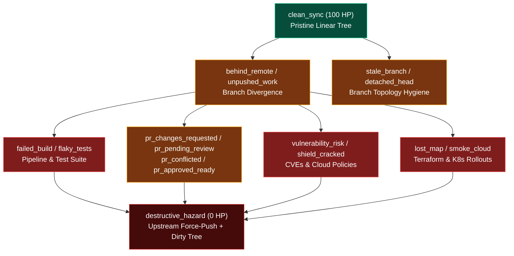
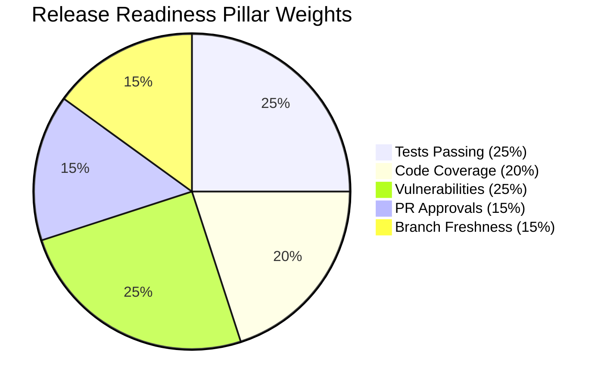
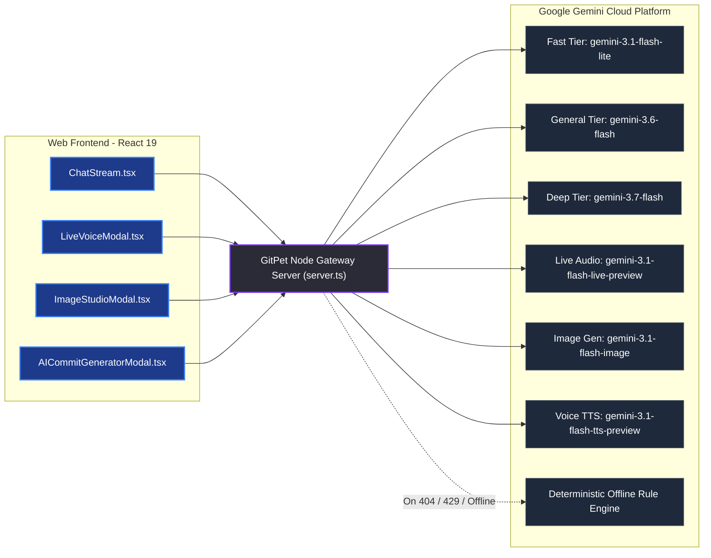

# GitPet: Functional & Technical Specification Document

**Project Name:** GitPet — Ambient DevSecOps Repository Companion  
**Team Name:** Ribbon Patrol (Team 05)  
**Version:** 1.0.0-production (August 2026)  
**Event:** DevOps for GenAI Hackathon Series 2026 (Ottawa)  
**Live Endpoint:** `http://localhost:3004` (`npm run dev`)  
**Repository:** [lucaswhitaker22/DevOps-for-GenAI---Ottawa-2026---Team-05-Ribbon-Patrol](https://github.com/lucaswhitaker22/DevOps-for-GenAI---Ottawa-2026---Team-05-Ribbon-Patrol)  

---

## 1. Executive Overview & System Vision

Modern software development requires engineers to continuously maintain mental context across disparate systems: local file changes, remote tracking branches, stash stacks, CI/CD pipeline steps, supply chain vulnerability alerts, and pull request review queues. Terminal-first inspection (`git status`, `git diff`, `git log`, CI web portals) creates high cognitive friction, breaks developer flow, and leaves teams vulnerable to destructive mistakes when using autonomous AI coding tools with unbounded shell execution.

**GitPet** is an ambient, multimodal DevSecOps repository companion that maps live repository signals, infrastructure state, and pipeline telemetry directly into an emotionally expressive virtual pet (**Byte**). GitPet continuously monitors repository state, explains issues in natural language, computes a 7-factor DevSecOps health score, evaluates a 5-pillar release readiness gate, and proposes bounded, human-confirmed remediation workflows with guaranteed zero unverified shell execution.

```
┌──────────────────────────────────────────────────────────────────────────────────┐
│                             THE CONTINUOUS DEVSECOPS LOOP                        │
│                                                                                  │
│   ┌──────────────┐         ┌───────────────────┐         ┌───────────────────┐   │
│   │   1. NOTICE   │  ────►  │   2. UNDERSTAND   │  ────►  │    3. RESOLVE     │   │
│   │ Ambient Aura │         │ Multimodal Gemini │         │ Bounded Safe Exec │   │
│   │ & 18 Symptoms│         │ 7-Factor Risk HP  │         │ 2-Layer Safety L12│   │
│   └──────────────┘         └───────────────────┘         └───────────────────┘   │
│          ▲                                                         │             │
│          └────────────────── Verified Clean State ─────────────────┘             │
└──────────────────────────────────────────────────────────────────────────────────┘
```

1. **Notice (Ambient Telemetry Awareness):** The pet reflects repository health (0–100 HP) and 18 physical symptoms at a glance through posture, accessories, mood auras, and Web Audio sound cues.
2. **Understand (Multimodal Evidence-Based Reasoning):** The developer receives plain-English explanations powered by Google Gemini (Gemini 3.6/3.7 Flash) with cited commit hashes, file diff hunks, 7-factor risk breakdowns, and verified reversal commands (`git stash pop`, `git rebase --abort`).
3. **Resolve (Human-Approved Bounded Execution):** Proposed write operations undergo rigorous pre-flight safety analysis through a 2-layer safety policy (8 static rules + 7 contextual lints) before execution, guaranteeing zero unverified shell execution or force-push data loss.

---

## 2. Product Objectives & High-Level Capabilities

* **At-a-Glance Ambient Observability:** Instantly convey repository and pipeline status (`Healthy`, `Attention`, `Blocked`, `Unsafe`) without terminal interruptions.
* **Cognitive Load Reduction:** Translate branch divergence, detached HEAD states, rebase conflicts, flaky test suites, and PR comments into plain English.
* **Bounded Human-in-the-Loop Agency:** Enforce a mandatory preview-and-confirm gate for all repository mutations with pure argv child process execution (no shell interpolation).
* **Explainable & Reversible Actions:** Present concrete evidence citations, confidence scores, blast-radius summaries, and pre-computed reversal commands.
* **7-Factor DevSecOps Risk Score Engine:** Derive an actionable 0–100 HP health pool analyzing branch divergence, test suites, secrets, CVE vulnerabilities, code smells, unreviewed commits, and PR sizing.
* **5-Pillar Release Readiness Gate:** Evaluate release readiness across Tests Passing (25%), Code Coverage (20%), Vulnerabilities (25%), PR Approvals (15%), and Freshness (15%) with AI executive synthesis and sign-off exports.
* **Interactive Topological DAG Visualizer:** Render a multi-lane Git commit graph with lane routing, merge base highlights, fork points, detached HEAD indicators, and commit role styling.
* **Multimodal AI Engine:** Support text, live voice conversations (Gemini 3.1 Live Audio WebSocket), speech synthesis (Gemini 3.1 TTS), and pixel pet avatar creation/editing (Gemini 3.1 Flash Image).
* **Dual Workspace Modes:** Seamlessly switch between 18 simulated sandbox scenarios, local on-disk Git workspace scanning, and live public GitHub test fixtures.

---

## 3. State Machine, Emotional Auras & 18 Physical Symptoms

The GitPet engine computes state by combining **Repository Health (0–100 HP)** and a **Primary Symptom Key**. Health conveys urgency and determines the visual aura, while symptoms identify the exact repository or infrastructure condition.

### Health Tiers & Visual Treatment

| Health Level | Health HP | Visual Aura & Treatment | Operator Meaning |
| :--- | :--- | :--- | :--- |
| **Healthy** | 90–100% | Relaxed posture, playful tail wag, vibrant green glowing aura | Branch synchronized, clean working tree, CI green |
| **Attention** | 60–89% | Uneasy posture, pulsating amber warning aura | Review local/remote drift, unpushed commits, or PR review lag |
| **Blocked** | 1–59% | Distressed posture, crimson alert pulse, barrier indicator | Resolve merge conflicts, broken CI builds, or high-severity CVEs |
| **Unsafe** | 0% | Frozen grayscale avatar, flashing red alert border, hazard barrier | Upstream force-push with active uncommitted files (**Halt writes!**) |

### Comprehensive 18-Symptom Catalog



| Symptom Key | Pet Expression & Accessories | Repository & DevSecOps Signal | Recommended Remediation Action |
| :--- | :--- | :--- | :--- |
| `clean_sync` | Playful wagging tail, green aura | 0 ahead, 0 behind, 0 uncommitted edits | `git status` — Repository in pristine state. Ready for release. |
| `behind_remote` | Pulling forward on leash, amber pulse | Local branch is behind upstream tracking branch | `git pull --ff-only origin <branch>` (or stash before pull). |
| `unpushed_work` | Heavy backpack with commit stars | Local commits ahead of upstream | `git push origin <branch>` — Push commits upstream for backup & review. |
| `merge_conflict` | Tangled red & gray yarn with alert signs | Rebase or merge paused on conflict markers | Inspect conflict markers, stage fixes, `git rebase --continue`. |
| `stale_branch` | Sleepy nightcap, dusty cobwebs | Merged feature branch inactive >30 days | `git branch -d <branch>` — Safely delete merged branch. |
| `detached_head` | Wandering compass & question mark | HEAD checked out directly to commit hash | `git switch -c <new-branch>` — Anchor floating commit permanently. |
| `destructive_hazard` | Frozen grayscale with crimson barrier | Upstream force-pushed with dirty working tree | `git stash push -m "safety" && git branch backup/pre-sync` — Halt writes! |
| `failed_build` | Sick bot with fever thermometer | CI/CD pipeline job compilation error | Inspect build logs and fix broken assertions/syntax. |
| `flaky_tests` | Trembling companion with sweat drops | Tests passed only on automatic retry | Quarantine intermittent test specs to maintain build velocity. |
| `vulnerability_risk`| Shielded bot with metallic armor | High/critical CVE vulnerability flagged | `npm audit fix` or upgrade vulnerable dependency versions. |
| `deploy_success` | Party hat with confetti & fireworks | CD pipeline deployed cleanly to production | Production deployment healthy and verified. |
| `pr_changes_requested` | Review clipboard with red indicator | Reviewer requested code modifications | Address review comments in PR files and request re-review. |
| `pr_pending_review` | Tapping foot with hourglass timer | PR waiting >3 days for initial review | `gh pr comment <num>` — Send polite review reminder ping. |
| `pr_conflicted` | Conflict warning signs | PR has merge conflicts with base branch | `git fetch origin main && git rebase origin/main` — Rebase feature branch. |
| `pr_approved_ready` | Golden approval stamp & green badge | PR has required approvals & green CI | `git switch main && git pull && git branch -d <feat>` — Squash & merge. |
| `lost_map` | Holding upside-down map in circles | Terraform remote state lock stuck | `terraform force-unlock -force <lock-id>` — Release stuck state lock. |
| `smoke_cloud` | Running through smoke with soot marks | Pod CrashLoopBackOff in Kubernetes rollout | `kubectl describe pod` — Inject missing environment variables. |
| `shield_cracked` | Cracked shield in defensive stance | Cloud storage bucket allows public read | Enforce AWS002/003 block public access policy in Terraform. |

---

## 4. DevSecOps 7-Factor Risk Score Engine

GitPet calculates a real-time repository health pool (0–100 HP) by aggregating 7 real-time telemetry factors. Each factor applies a bounded deduction based on observed risk:

$$\text{Health Score} = \max\left(0, \min\left(100, 100 - \sum \text{Deductions}\right)\right)$$

```
                                 7-FACTOR HEALTH POOL (100 HP)
 ┌───────────────────────────────────────┬────────────┬────────────────────────────────────────────────────────┐
 │ Factor Name                           │ Max Deduct │ Severity Thresholds & Triggers                         │
 ├───────────────────────────────────────┼────────────┼────────────────────────────────────────────────────────┤
 │ 1. Branch Divergence                  │ -35 pts    │ Hazard: -35 | Conflicts: -25 | Behind+Dirty: -22      │
 │ 2. Failed & Flaky Tests               │ -28 pts    │ Rollout Crash: -28 | Build Fail: -25 | Flaky: -14      │
 │ 3. Secrets & Security Policies        │ -30 pts    │ Public Cloud Bucket: -30 | Leaked Secret: -15/each     │
 │ 4. Open Vulnerabilities               │ -22 pts    │ Critical/High CVEs: -22 | Medium CVEs: -12             │
 │ 5. Code Smells & Debt                 │ -15 pts    │ High Smell Count: -15 | Dirty Sprawl (>8 files): -6    │
 │ 6. Unreviewed Commits & PR Lag        │ -15 pts    │ Changes Requested: -15 | PR Lag >3 Days: -10           │
 │ 7. Large PR Size                      │ -8 pts     │ Oversized Changeset (>400 lines or >15 files): -8      │
 └───────────────────────────────────────┴────────────┴────────────────────────────────────────────────────────┘
```

### Risk Category Classifications:
* **Low Risk (Healthy: 80–100 HP):** Repository is in an optimal state; safe for immediate feature development and deployment.
* **Moderate Risk (Attention: 45–79 HP):** Minor drift, stale PR queues, or flaky tests detected; inspect recommendations before merging.
* **High Risk (Blocked: 1–44 HP):** Merge conflicts, failing CI builds, or critical security vulnerabilities present; blocking gate enforced.
* **Critical Risk (Unsafe: 0 HP):** Immediate work-loss hazard (upstream rewritten history with uncommitted local modifications); writes halted.

---

## 5. 5-Pillar Release Readiness Gate & Sign-Off Engine

GitPet features an automated Release Readiness Calculator (`src/utils/releaseReadiness.ts`, `POST /api/ai/release-readiness`, and `ReleaseReadinessPage.tsx`) that evaluates 5 weighted pillars for production deployment:

$$\text{Release Score} = (S_{\text{tests}} \times 0.25) + (S_{\text{cov}} \times 0.20) + (S_{\text{vuln}} \times 0.25) + (S_{\text{pr}} \times 0.15) + (S_{\text{fresh}} \times 0.15)$$



### Pillar Definitions & Evaluation Criteria:
1. **Tests Passing (Weight: 25%):** CI/CD pipeline pass rate. 100% pass = 100 score; any failed test suite immediately creates a blocking gate.
2. **Code Coverage % (Weight: 20%):** Line test coverage against target threshold (Target: ≥80%). Score calculated as $\min(100, (\text{Coverage} / 80) \times 100)$.
3. **Open Vulnerabilities (Weight: 25%):** Supply chain security scan. 0 CVEs = 100 score; High/Critical CVEs deduct 60 points and trigger a hard release blocker.
4. **PR Approvals (Weight: 15%):** Review verification. All required approvals met = 100 score; pending reviews or requested changes flag warnings.
5. **Branch Freshness (Weight: 15%):** Divergence from primary release branch. 0 commits behind = 100 score; deductions applied per unmerged upstream commit.

### Release Gate Status Verdicts:
* **Ready to Ship (Green, Score ≥ 80%, 0 Blockers):** Production deployment authorized.
* **Caution / Review (Amber, Score 60–79%, 0 Blockers):** Non-blocking warnings present; requires release engineer review.
* **Blocked (Red, Score < 60% or ≥ 1 Blocker):** Production deployment prohibited.

---

## 6. Multi-Page Dedicated Workspaces Architecture

GitPet is architected around 6 dedicated full-page workspaces connected via responsive sidebar navigation (`SidebarNav.tsx`), URL hash routing, and top bar controls (`TopBar.tsx`):

```
                                  GITPET DASHBOARD ARCHITECTURE
                                              │
              ┌───────────────────────────────┴───────────────────────────────┐
              ▼                                                               ▼
     TopBar.tsx (Breadcrumbs, Streak, Live Toggle)             SidebarNav.tsx (Collapsible Navigation)
              │                                                               │
     ┌────────┴───────────────┬───────────────────────────────┬───────────────┴───────────────┐
     ▼                        ▼                               ▼                               ▼
#companion               #repository                        #cicd                            #pr
Ambient Companion        Repository & DAG Visualizer        CI/CD Pipeline Telemetry         Pull Request Intel
- PetStage.tsx           - GitDagVisualizer.tsx             - CICDPage.tsx                   - PRIntelligencePage.tsx
- ChatStream.tsx         - DiffViewer.tsx                   - 5-Stage Logs                   - Inline Comment Threads
- Mission Control Deck   - Staging Checkboxes               - Flaky Test Quarantine          - 1-Click AI Reply
- Modals (Audio/Studio)  - Stash Restoration                - Dependency CVE Scans           - Squash & Merge
                              │                                                               │
                              ├───────────────────────────────┬───────────────────────────────┤
                              ▼                               ▼                               ▼
                         #release                           #risk                         Modals / Drawers
                         Release Gate & Sign-Off            Risk Scorecard & HP Pool      - LiveVoiceModal.tsx
                         - ReleaseReadinessPage.tsx         - RiskScorePage.tsx           - ImageStudioModal.tsx
                         - 5-Pillar Scorecard               - 0-100 HP Health Pool        - AICommitGeneratorModal.tsx
                         - Markdown/JSON Export             - 7-Factor Filtering          - QuickPaletteModal.tsx
```

### Detailed Workspace Specifications:

#### 1. Ambient Companion Workspace (`#companion`)
* **Interactive Pet Stage (`PetStage.tsx` / `PixelPetGraphic.tsx`):** Renders pixel-art companion animations, status badges, level progression (XP), mood states, and physical symptom accessories.
* **Telemetry Mission Control Quick Deck:** 4 live cards providing instant visibility into Ahead/Behind status, uncommitted working tree diffs, CI/CD pipeline health, and active PR review turnaround.
* **Multi-Turn Chat Stream (`ChatStream.tsx`):** Full conversational stream with syntax-highlighted code blocks, copy actions, structured evidence citations, confidence ratings, and 1-click execution buttons.
* **Persona & Tier Selectors:** Toggle between 4 AI roles and 3 model speed tiers on the fly.

#### 2. Repository Details & DAG Graph Workspace (`#repository`)
* **Topological DAG Visualizer (`GitDagVisualizer.tsx`):** Renders a multi-lane Git commit graph with lane routing, merge base detection, fork points, detached HEAD indicators, and commit role highlights (`head`, `upstream_head`, `local_ahead`, `remote_behind`, `merge_base`, `hazard`).
* **Multi-File Working Tree Diff Viewer (`DiffViewer.tsx`):** Side-by-side / inline syntax-highlighted diffs with individual file staging checkboxes and stage-all controls.
* **Stash Management:** Visual stash stack inspection and 1-click snapshot restoration.
* **Audit & Rollback:** Chronological audit trail with 1-click rollback of previous operations.

#### 3. CI/CD Pipeline Telemetry Workspace (`#cicd`)
* **5-Stage Execution Tracker:** Real-time visualization of pipeline stages (*Lint & Static Analysis*, *Unit & Adversarial Tests*, *Security & Secret Scans*, *Container Build*, *Staging Deployment*).
* **Expandable Step Logs:** Direct inspection of execution logs, compilation errors, and broken test assertions.
* **Flaky Test Suite Diagnostics:** Identifies intermittent test specs, tracks failure rates, and provides 1-click test quarantine recommendations.
* **Dependency CVE Scanner:** Surfaces high/critical supply chain vulnerabilities with upgrade paths.

#### 4. Pull Request Intelligence Workspace (`#pr`)
* **PR Health & Turnaround:** Tracks waiting duration (e.g. 4 days lag), approval counts vs. required thresholds, and mergeability status.
* **Inline Code Review Threads:** Displays reviewer comments with file paths and line numbers.
* **1-Click AI Reply Drafting:** Generates contextual code-review response comments.
* **Squash & Merge Execution:** Safe merge workflows with automatic feature branch pruning.

#### 5. Release Gate & Deployment Sign-Off Workspace (`#release`)
* **5-Pillar Scorecard (`releaseReadiness.ts`):** Evaluates Tests Passing (25%), Code Coverage % (20%), Vulnerabilities (25%), PR Approvals (15%), and Branch Freshness (15%).
* **Executive AI Synthesis:** Gemini-generated release readiness headline, risk verdict, and blocker breakdown.
* **Compliance Artifact Export:** 1-click download of JSON compliance manifest and Markdown release sign-off report.

#### 6. Risk Scorecard & Health Pool Workspace (`#risk`)
* **0–100 HP Health Pool:** Granular deduction breakdown across 7 DevSecOps risk factors.
* **Category Filtering:** Filter factors by *All*, *Hazards (Critical)*, *Warnings*, and *Healthy*.
* **Remediate with Byte:** 1-click deep links that route directly to conversational remediation in the companion stage.

---

## 7. Conversational AI Engine & Multimodal Architecture

GitPet integrates the official Google GenAI SDK (`@google/genai` v2.4.0) through a secure Express gateway server (`server.ts`):



### 1. The 4 Role Personas
Developers can switch between 4 specialized system instructions:
* **Byte Mascot (`byte_mascot`):** Friendly, energetic canine companion who speaks with warmth, developer humor, and actionable advice.
* **Senior Architect (`senior_architect`):** Principal Git & Infrastructure Architect analyzing DAG topologies, merge base ancestors, and rebase strategies.
* **Safety Auditor (`safety_auditor`):** Compliance auditor focusing on 100% data loss prevention, stash preservation, and rollback readiness.
* **Git Tutor (`git_tutor`):** Interactive teacher explaining Git's internal object model (blobs, trees, commit objects, staging index).

### 2. Multi-Tier Model Fallback Chains
To guarantee 100% availability against rate limits and deprecations, GitPet uses ordered fallback chains:

| Speed Tier | Primary Model | Fallback 1 | Fallback 2 | Use Case |
| :--- | :--- | :--- | :--- | :--- |
| **Fast** | `gemini-3.1-flash-lite` | `gemini-3.6-flash` | `gemini-flash-latest` | One-liner queries, commit messages, status checks |
| **General** | `gemini-3.6-flash` | `gemini-3.5-flash` | `gemini-flash-latest` | Default conversational chat, tutoring, status analysis |
| **Deep** | `gemini-3.7-flash` | `gemini-3.6-flash` | `gemini-flash-latest` | Complex rebase conflicts, DAG analysis, release sign-off |
| **Live Voice** | `gemini-3.1-flash-live-preview` | Web Speech API | — | Bidirectional audio streaming over WebSocket (`/live`) |
| **Image Gen** | `gemini-3.1-flash-image` | Dynamic SVG Engine | — | Mascot sprite generation with 30-min preview registry |
| **Voice TTS** | `gemini-3.1-flash-tts-preview` | Browser SpeechSynthesis | — | Spoken companion responses using prebuilt Zephyr voice |

---

## 8. 2-Layer Command Safety Policy & Execution Engine

To eliminate the risks of autonomous AI agents executing destructive mutations, GitPet enforces a rigorous 2-layer safety engine in `src/server/safety.ts`:

```
                       COMMAND SAFETY EVALUATION PIPELINE
                                       │
                                       ▼
                     Proposed Command String (from AI or User)
                                       │
             ┌─────────────────────────┴─────────────────────────┐
             ▼                                                   ▼
     Layer 1: Static Rules                              Layer 2: Contextual Lints
  (Provider-Agnostic Syntax)                       (Observed Working Tree Comparison)
  • force-push (without --force-with-lease)         • stash-misses-untracked
  • remote-ref-delete (push --delete)               • stash-pop-empty
  • hard-reset (reset --hard)                       • pull-dirty-tree
  • clean (git clean)                               • unresolved-conflicts
  • force-branch-delete (branch -D)                 • operation-in-progress
  • stash-destroy (stash drop / clear)              • ff-only-on-diverged
  • history-rewrite (filter-branch)                 • push-while-behind
  • shell-metacharacters (; | ` $ > <)
             │                                                   │
             └─────────────────────────┬─────────────────────────┘
                                       ▼
                            Safety Report & Verdict
                            ('allow' | 'warn' | 'block')
                                       │
                                       ▼
                       Human Preview & Approval Gate
                                       │
                                       ▼
               executor.ts (Argv Child Process Execution)
                 (Active when GITPET_ALLOW_WRITES=true)
```

### Layer 1: Static Safety Rules
* `force-push`: Blocks unconditional force-pushes (`git push --force` / `-f`); suggests `--force-with-lease`.
* `remote-ref-delete`: Blocks remote ref deletion (`git push origin --delete <branch>`).
* `hard-reset`: Blocks destructive tree resets (`git reset --hard`); suggests `--keep`.
* `clean`: Blocks untracked file deletion (`git clean`).
* `force-branch-delete`: Blocks unmerged branch deletion (`git branch -D`); suggests `-d`.
* `stash-destroy`: Blocks permanent stash drops (`git stash drop` / `git stash clear`).
* `history-rewrite`: Blocks history rewrites (`filter-branch`, `--filter-repo`).
* `checkout-paths`: Blocks uncommitted file overwrites (`git checkout -- <path>`).
* `shell-metacharacters`: Rejects shell control characters (`;`, `|`, `` ` ``, `$`, `>`, `<`, `&&` inside unquoted segments).

### Layer 2: Contextual Safety Lints
* `stash-misses-untracked`: Flags `git stash` when untracked files are present; suggests `git stash push -u`.
* `stash-pop-empty`: Warns when attempting to pop from an empty stash stack.
* `pull-dirty-tree`: Warns when pulling or merging with dirty uncommitted files without `--autostash`.
* `unresolved-conflicts`: Blocks operations while merge/rebase conflict markers exist.
* `operation-in-progress`: Restricts commands to `--continue`, `--skip`, `--abort`, staging, or read-only queries during paused rebase/merge.
* `ff-only-on-diverged`: Blocks `git pull --ff-only` on diverged branches (ahead > 0 and behind > 0); suggests `--rebase`.
* `push-while-behind`: Warns when pushing while commits are behind upstream.

### Execution Engine (`src/server/executor.ts`)
* **Argv Execution:** Commands execute directly via `execFile('git', args)` without shell interpolation.
* **Write Opt-In:** Mutating actions fail closed unless `GITPET_ALLOW_WRITES=true` is present in the environment.
* **Atomic Recovery:** Captures `headBefore` and `headAfter` commit hashes; halts execution immediately on any intermediate step failure.

---

## 9. Dual Workspace Scanning Engine

GitPet supports dual-mode operational repository awareness:

1. **Local Workspace Scanner (`GET /api/git/live-status`):**
   * Inspects the active repository on disk (`process.cwd()` or `GITPET_WORKSPACE_ROOT`).
   * Scans branch pointers, ahead/behind counts, working tree diffs, stash entries, and in-progress operations (`rebase-merge`, `MERGE_HEAD`, `CHERRY_PICK_HEAD`, `REVERT_HEAD`, `BISECT_LOG`).
   * Remains strictly read-only unless `GITPET_ALLOW_WRITES=true` is explicitly configured.

2. **Live Public GitHub Fixture (`GET /api/repo/live`):**
   * Integrates with real-world public test repository: [`farisnour/gitpet-acme-corp-ecommerce-store`](https://github.com/farisnour/gitpet-acme-corp-ecommerce-store).
   * Live branch switching between `main`, `feature/cart`, `fix/checkout-tax`, and `refactor/auth-v2`.
   * Built-in GitHub API rate limit handling (`GitHubRateLimitError`) with reset timestamp reporting.

---

## 10. Complete Backend API Reference

The GitPet Express server (`server.ts`) exposes 14 REST and WebSocket endpoints:

### Core Operational & Diagnostic Endpoints

#### `GET /api/health`
Returns server operational metrics, uptime, write permissions, and active Gemini models.
* **Response:**
  ```json
  {
    "requestId": "health_m18x9z_3j2a",
    "status": "healthy",
    "service": "GitPet DevSecOps AI Engine",
    "geminiAvailable": true,
    "writesEnabled": false,
    "workspaceRoot": "C:\\repo\\gitpet",
    "geminiModelPrimary": "gemini-3.6-flash",
    "geminiModelPro": "gemini-3.7-flash",
    "uptimeSeconds": 1420,
    "memoryUsageMb": 84,
    "assetStats": { "registeredCount": 3, "currentApprovedId": "asset_default_byte" },
    "telemetry": { "totalAuditedRequests": 45, "averageLatencyMs": 320 }
  }
  ```

#### `GET /api/audit-logs`
Returns the FIFO ring buffer of recent operational requests and latencies (max 200 events).
* **Query Parameters:** `limit` (default: 50, max: 200)

### Repository Scanning & Execution Endpoints

#### `GET /api/git/live-status`
Scans local on-disk Git workspace state (branches, ahead/behind, working tree diffs, stashes, paused operations).

#### `GET /api/repo/live`
Fetches live repository state from the public GitHub test fixture (`farisnour/gitpet-acme-corp-ecommerce-store`).
* **Query Parameters:** `branch` (`main`, `feature/cart`, `fix/checkout-tax`, `refactor/auth-v2`)

#### `POST /api/git/preview-action`
Performs a dry-run safety evaluation of a proposed Git command string without touching the repository.
* **Request Body:** `{ "command": "git stash push -u -m 'wip' && git pull --rebase origin main" }`

#### `POST /api/git/execute-action`
Executes an approved Git command against the local workspace (requires `GITPET_ALLOW_WRITES=true`).
* **Request Body:** `{ "command": "git pull --ff-only origin main" }`

### AI Conversational & Analysis Endpoints

#### `POST /api/ai/chat` (and `/api/chat`)
Multi-turn conversational chat with repo context injection, role instructions, and safety evaluation.
* **Request Body:**
  ```json
  {
    "message": "What is blocking my branch?",
    "role": "byte_mascot",
    "tier": "general",
    "state": { "currentBranch": { "behindCount": 3, "aheadCount": 0 }, "workingTree": [] }
  }
  ```

#### `POST /api/gitpet/analyze`
Structured JSON analysis of repository state with schema-validated recommended action and evidence points.

#### `POST /api/ai/release-readiness`
Calculates the 5-Pillar Release Readiness Scorecard and returns an executive AI synthesis.
* **Request Body:** `{ "state": { ... }, "tier": "general" }`

### Multimodal Image & Voice Endpoints

#### `POST /api/ai/images/generate` (and `/api/images/generate`)
Generates custom pet avatar previews using `gemini-3.1-flash-image` (held in 30-minute preview registry).

#### `POST /api/ai/images/edit` (and `/api/images/edit`)
Edits an existing avatar using visual and text prompt instructions.

#### `POST /api/ai/images/:id/approve` (and `/api/images/approve`)
Promotes a preview avatar asset to the active approved pet asset set.

#### `GET /api/ai/images/approved`
Retrieves current approved pet avatar metadata and history.

#### `POST /api/voice/tts`
Synthesizes assistant spoken speech audio using `gemini-3.1-flash-tts-preview` (24kHz PCM).

#### `WebSocket /live`
Bidirectional low-latency Gemini Live Audio streaming session (`gemini-3.1-flash-live-preview`).

---

## 11. Operational Configuration & Environment Variables

| Variable | Type | Default | Description |
| :--- | :--- | :--- | :--- |
| `GEMINI_API_KEY` | String | *None* | Google Gemini API Key. If unset, deterministic offline rule engine activates. |
| `GITPET_ALLOW_WRITES` | Boolean | `false` | When `true`, enables approved write execution via `/api/git/execute-action`. |
| `GITPET_WORKSPACE_ROOT` | String | `process.cwd()` | Absolute path to the local repository monitored by `/api/git/live-status`. |
| `GITPET_AUTH_USER` | String | *None* | Optional Basic Auth username for shared network / tunnel deployments. |
| `GITPET_AUTH_PASS` | String | *None* | Optional Basic Auth password (verified with constant-time comparison). |
| `PORT` | Number | `3004` | HTTP server port for Vite dev middleware and Express backend. |
| `NODE_ENV` | String | `development` | Server runtime environment (`development` or `production`). |

---

## 12. Automated Verification & Test Coverage

GitPet maintains a comprehensive Vitest automated test suite verifying security boundaries, safety policies, command execution, and rendering integrity:

```bash
# Run all automated tests
npm test

# Run TypeScript type check
npm run lint

# Generate Software Bill of Materials (SBOM)
npm run sbom

# Build production bundle
npm run build
```

### Test Coverage Summary:
* **Adversarial Security & Input Sanitization (`tests/security.test.ts` — 9 Tests):** Leaked API key redaction (`AIza...`), GitHub PAT redaction (`ghp_...`), prompt jailbreak detection, shell injection blocking (`rm -rf .git`), human-in-the-loop approval gate enforcement, model telemetry traceability, deterministic fallback activation, and risk classification.
* **Safety Policy & Executor Regression (`tests/executor.test.ts` — 19 Tests):** Static force-push blocking, hard reset blocking, stash destroy blocking, shell metacharacter rejection, non-git binary rejection, untracked stash omission warnings, diverged branch fast-forward blocking, autostash detection, and paused rebase operation restrictions.
* **Markdown & GFM Rendering (`tests/markdown.test.ts` — 3 Tests):** Bold/code rendering, fenced code block copy structures, and GFM markdown tables.

---

## 13. AI Usage Disclosure

In accordance with Hackathon Guideline **P-06 (AI Transparency)** and **Item 8 (AI Usage Disclosure)**, AI tools assisted the development process as follows:

* **Google Gemini 3.6 / 3.7 Flash:** Core reasoning engine for repository health analysis, merge conflict explanations, and contextual advice.
* **Google Gemini 3.1 Live Audio (`gemini-3.1-flash-live-preview`):** Bidirectional WebSocket audio streaming for real-time live voice interaction.
* **Google Gemini 3.1 Flash Image (`gemini-3.1-flash-image`):** Avatar generation and visual editing in the Pet Image Studio.
* **Google Gemini 3.1 Flash TTS (`gemini-3.1-flash-tts-preview`):** Audio synthesis for conversational companion speech.
* **Google AI Studio:** Rapid prototyping of role system instructions, structured JSON response schemas, and parameter tuning.
* **Antigravity (Gemini):** Pair programming assistant for TypeScript architecture, React 19 component design, and CSS token systems.
* **Claude Code & Copilot:** Automated test writing assistance (Vitest), documentation formatting, and edge-case security verification.

All AI-suggested code, safety filters, and test boundaries were fully reviewed, audited, and approved by the team.
