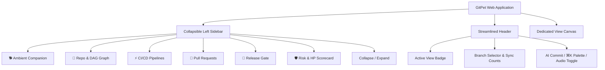

# 📖 GitPet End-User Guide

**Welcome to GitPet!**  
GitPet is an **ambient, intelligent DevSecOps companion** that lives beside your code editor. It continuously monitors your Git branch drift, uncommitted working tree diffs, CI/CD pipeline runs, pull requests, and security posture—translating raw telemetry into an expressive virtual companion (Byte) with 100% human-in-the-loop, reversible remediation workflows.

This guide outlines every feature, page, modal, workflow, and safety mechanism available in the deployed web application.

---

## 📑 Table of Contents
1. [Interface Navigation & Layout](#1-interface-navigation--layout)
2. [Global Controls & Modals](#2-global-controls--modals)
3. [Page 1: Ambient Companion](#3-page-1-ambient-companion-companion)
4. [Page 2: Repository Details & DAG Graph](#4-page-2-repository-details--dag-graph-repository)
5. [Page 3: CI/CD Pipeline Telemetry](#5-page-3-cicd-pipeline-telemetry-cicd)
6. [Page 4: Pull Request Intelligence](#6-page-4-pull-request-intelligence-pr)
7. [Page 5: Release Gate & Deployment Sign-Off](#7-page-5-release-gate--deployment-sign-off-release)
8. [Page 6: 7-Factor Risk Scorecard & Health Pool](#8-page-6-7-factor-risk-scorecard--health-pool-risk)
9. [Operating Modes: Sandbox vs. Live Local Git](#9-operating-modes-sandbox-vs-live-local-git)
10. [Safety Guarantees & Zero Data Loss Policy](#10-safety-guarantees--zero-data-loss-policy)
11. [Keyboard Shortcuts Cheat Sheet](#11-keyboard-shortcuts-cheat-sheet)

---

## 1. Interface Navigation & Layout

GitPet features a clean, responsive layout designed to minimize clutter while providing instant access to deep-dive analytics:



### Collapsible Left Sidebar (`SidebarNav`)
* **Expanded View (`w-64`)**: Displays the GitPet avatar mark, full destination titles, subtitles, live telemetry badges (e.g. uncommitted files count, CI failure, PR review action, release readiness %, HP pool), and your verified review streak.
* **Collapsed View (`w-18`)**: Sleek icon dock with instant hover tooltips, maximizing horizontal canvas space for DAG graphs and side-by-side diff viewers.
* **Collapse Toggle**: Click the chevron button at the bottom of the sidebar to collapse or expand at any time.
* **Mobile Responsive Drawer**: On mobile or tablet screens, tap the hamburger icon in the header to slide the sidebar in as an overlay drawer.

### Streamlined Top Bar (`TopBar`)
* **Active Breadcrumb**: Shows the icon and title of the current page.
* **Branch Selector Dropdown**: Quickly switch branches or see current branch status.
* **Sync Counts Pill**: Displays commits ahead (`↑`) of and behind (`↓`) upstream origin.
* **AI Conventional Commit Button**: Opens the AI Commit Generator Modal with one click.
* **Command Palette Button (`⌘K` / `Ctrl+K`)**: Launches the fuzzy search command palette.
* **Audio Effects Mute Toggle**: Enables or disables ambient sound effects.

---

## 2. Global Controls & Modals

### AI Conventional Commit Generator Modal
* **Purpose**: Generates standardized, semantic Git conventional commits (e.g., `feat(auth): add OAuth2 refresh token handling`) using active diff analysis.
* **How to Open**: Click the **AI Commit** button in the header or on the Repository page.
* **Capabilities**:
  * Automatically analyzes your dirty working tree.
  * Formats commits conforming to the Conventional Commits 1.0.0 specification (`feat`, `fix`, `refactor`, `docs`, `test`, `chore`, `perf`, `ci`).
  * Generates commit body and breaking change warnings.
  * One-click copy or direct application to the assistant.

### Preview Changes & Diff Confirmation Modal
* **Purpose**: Human-in-the-loop safety gate that ensures no command executes blindly.
* **Trigger**: Appears whenever you click **Preview Changes** or **Preview Diff & Scope** on any recommended action.
* **Capabilities**:
  * Shows the exact shell command that will be executed.
  * Calculates blast radius and affected files.
  * Displays pre-computed safe reversal command (e.g., `git reset --keep`, `git stash pop`, `git rebase --abort`).
  * Explicit **Confirm & Execute** action button.

### Quick Command Palette (`⌘K` / `Ctrl+K`)
* **Purpose**: Global keyboard-driven fuzzy command center.
* **How to Open**: Press `⌘K` (macOS) or `Ctrl+K` (Windows/Linux), or click the search icon in the header.
* **Actions Available**:
  * Fast navigation to any of the 6 pages.
  * Instant scenario switching across all 18 simulated anomalies.
  * 1-Click Rollback of the last executed command.
  * Quick audio toggle and mascot petting.

---

## 3. Page 1: Ambient Companion (`#companion`)

The **Ambient Companion** view is your mission control dashboard. It provides an immediate emotional and diagnostic visual pulse of your repository.

```
+------------------------------------+-------------------------------------------+
| [🐕 Pixel Mascot Canvas]           | [Multi-Turn Gemini Companion]             |
| Status: Attention • Uneasy & Alert | Role: Byte Mascot | Architect | Auditor   |
| Health: 68% HP [========------]    | Model: Fast | General | Deep Reasoning    |
| Speech: "Behind remote by 3!"      |                                           |
| Actions: [🐾 Pet] [☕ Fuel] [💬 Ask]| "Hello! I'm Byte. Behind by 3 commits.    |
|                                    | Stash your work before pulling!"          |
+------------------------------------+-------------------------------------------+
| [4-Card Live Telemetry Quick Deck] | [Recommended Safe Action Card]            |
| 🌲 Branch Drift  | ⚡ CI/CD Health  | Command: `git stash && git pull ...`      |
| 🔀 PR Intelligence | 🚀 Release Gate| [Preview Diff]  [Confirm Safe Fix]        |
+------------------------------------+-------------------------------------------+
```

### The Byte Avatar & 18 Symptom Auras
Byte physically responds to your repository's state using ambient color halos, facial expressions, and accessory animations:
* **Healthy (90–100% HP, Green Aura)**: Relaxed, playful posture. Pristine working tree.
* **Attention (60–89% HP, Amber Aura)**: Uneasy, alert posture. Commits behind upstream.
* **Blocked (30–59% HP, Orange Aura)**: Distressed, tangled posture. Merge conflicts or PR change requests.
* **Critical Hazard (0–29% HP, Pulsing Red Aura)**: Shielded posture, grayscale contrast. Immediate work-loss risk.

### Interactive Mascot Dock
* **🐾 Pet (`Spacebar`)**: Pets Byte, triggering sound effects, floating hearts, and playful quips.
* **☕ Fuel**: Hands Byte a fresh coffee mug, boosting mascot energy (+100 velocity).
* **🎩 Outfit**: Cycles through wearable accessories (AR Cyber Visor, Dev Headphones, Git Wizard Hat, Patrol Badge).
* **💬 Ask**: Prompts Byte to share pro-tips on atomic commits, rebase hygiene, or stash safety.

### 4-Card Live Telemetry Mission Control Deck
Located directly under Byte, these cards give you a 1-second pulse check with 1-click deep links:
1. **🌲 Branch Drift & Working Tree**: Shows commits ahead/behind and dirty files. Clicking opens the **Repository Details & Graph** page.
2. **⚡ Pipeline & Test Health**: Displays pass rates and CVE vulnerability counts. Clicking opens the **CI/CD Pipelines** page.
3. **🔀 PR Intelligence**: Shows active PR status, reviewer comments, and waiting days. Clicking opens the **Pull Request** page.
4. **🚀 Release Gate**: Displays overall readiness % and ship gate sign-off status. Clicking opens the **Release Gate** page.

### Multi-Turn Gemini Companion Stream
* **Persona Selection**:
  * **Byte Mascot**: Friendly, encouraging, ambient companion.
  * **Senior Architect**: Technical rigor, DAG topology, merge-base analysis.
  * **Safety Auditor**: Zero data loss compliance, strict reversal steps.
  * **Git Tutor**: Mental models, pedagogical explanations of Git internals.
* **Model Speed/Depth Tier**:
  * **Fast**: Instant responses powered by `gemini-2.5-flash`.
  * **General**: Balanced reasoning for daily workflows.
  * **Deep Reasoning**: Complex architectural analysis powered by `gemini-2.5-pro`.
* **Evidence Signals Box**: Assistant responses cite concrete repository data (branch, drift counts, dirty file lists) with deep-link jump buttons.
* **Categorized Prompt Chips**: Instant 1-click diagnostic prompts (`📊 Status Report`, `🚨 Work-Loss Risk`, `🌲 DAG Lineage`, `🔀 PR Feedback`, `⚡ CI Failures`).

---

## 4. Page 2: Repository Details & DAG Graph (`#repository`)

A full-page dedicated workspace for visualizing Git topology, inspecting diffs, and managing backups.

### Tab 1: Interactive DAG Graph (`GitDagVisualizer`)
* **Multi-Lane Lineage**: Visualizes local commits, upstream commits, merge bases, and fork points across parallel visual lanes.
* **Interactive Commit Inspector**: Click any node to view commit hash, author, message, timestamp, and lineage relationship (`HEAD`, `local_ahead`, `remote_behind`, `merge_base`).
* **Legend Indicators**: Clean visual key demarcating local commits from upstream origin commits.

### Tab 2: Working Tree & Diffs (`DiffViewer`)
* **File Selection & Search**: Type in the filter bar to find specific files in large changesets.
* **Interactive Staging**: Check the box beside any file to stage/unstage, or click **Stage All / Unstage All**.
* **Status Badges**: Color-coded chips for `modified`, `staged`, `untracked`, and `conflicted`.
* **Syntax-Highlighted Diff Viewer**: Inspect exact line additions (`+`) and deletions (`-`) with unified diff formatting.

### Tab 3: Stash Stack
* **Snapshot Inventory**: Lists all safety stashes generated by GitPet or created locally (`stash@{0}`, `stash@{1}`).
* **Preserved File Counts**: Inspect files included in each stash snapshot.
* **1-Click Restore**: Click **Restore to Working Tree** to safely apply changes back to your active tree.

### Tab 4: Immutable Audit Trail & Rollback
* **Execution History**: Records every command executed through GitPet with timestamps and descriptions.
* **1-Click Rollback**: Click **Rollback Last Action** to trigger the pre-computed safe reversal command.

---

## 5. Page 3: CI/CD Pipeline Telemetry (`#cicd`)

Dedicated pipeline health dashboard for tracking deployment pipelines, flaky test suites, and supply chain vulnerabilities.

### 5-Stage Progression Tracker
* Tracks the state of your build across:
  1. **Lint & Formatting**
  2. **Unit & Contract Tests**
  3. **Security & CVE Scan**
  4. **Container Artifact Build**
  5. **Staging Smoke Verification**
* **Expandable Stage Logs**: Click any stage card to toggle a terminal drawer displaying detailed build outputs.
* **Rerun Pipeline Simulation**: Click **Rerun Pipeline** in the header to trigger an animated simulated re-execution.

### Flaky Test Suite Diagnostics
* Identifies tests that fail intermittently without source code modifications.
* Displays pass rates, failure frequencies over the last 10 runs, and the commit where the failure last occurred.
* Click **Quarantine & Analyze** to simulate test isolation.

### Supply Chain Security & CVE Scans
* Highlights high-severity CVEs in third-party dependencies (e.g., `jsonwebtoken@8.5.1`).
* Provides clear remediation guidance with target safe version (e.g., upgrade to `9.0.2`).
* Click **Draft Dependabot Patch** to generate dependency upgrade pull requests.

---

## 6. Page 4: Pull Request Intelligence (`#pr`)

A dedicated PR workspace designed to accelerate code reviews and eliminate reviewer blockers.

### Review Approval & Turnaround Meter
* **Approval Counters**: Tracks current approvals vs. required reviewer thresholds (e.g. `1 of 2 required`).
* **Turnaround Duration**: Monitors review turnaround time to prevent PR stagnation.
* **Mergeability**: Real-time status (`clean`, `conflicted`, `blocked`).

### Inline Review Threads & AI Reply Composer
* **Thread Inspection**: Review open comments on specific lines and files.
* **Draft AI Resolution Response**: One-click prompt that drafts a respectful, concrete resolution reply explaining what code was changed and what tests were added.
* **Interactive Reply Box**: Post replies directly to the review thread.

### 1-Click "Squash & Merge" Simulation
* When checks pass and approvals are met, click **Squash & Merge** to trigger safe merge integration.

---

## 7. Page 5: Release Gate & Deployment Sign-Off (`#release`)

The **5-Pillar Release Gate** evaluates your repository against strict release criteria before any code reaches production.

### The 5 Evaluated Pillars
1. **Tests Passing (25% Weight)**: Verification that 100% of unit and integration test suites pass (`100% passing`).
2. **Code Coverage (20% Weight)**: Enforces test coverage targets across new modifications (`≥ 80% line coverage`).
3. **Vulnerability Count (25% Weight)**: Scans for zero high or critical unpatched CVEs (`0 High/Critical CVEs`).
4. **PR Approvals (15% Weight)**: Verifies peer sign-offs and resolution of all reviewer comments (`≥ 2 Peer Approvals`).
5. **Branch Freshness (15% Weight)**: Confirms the branch is up to date with origin without divergence (`0 commits behind`).

### Blocker Remediation
* Explicitly lists all active deployment blockers preventing sign-off.
* Click **Remediate** next to any blocker to have Byte generate a step-by-step fix.

### Artifact Export & Sign-Off
* **Copy Markdown Summary**: Formats a human-readable release audit note ready for Slack or release documentation.
* **Download JSON Artifact**: Downloads a machine-readable JSON report (`release-readiness-[repo]-[timestamp].json`) of the 5-pillar sign-off state for compliance logs.
* **Sign Off Release Button**: Armed only when `canShip` is true, enabling final production deployment.

---

## 8. Page 6: 7-Factor Risk Scorecard & Health Pool (`#risk`)

A granular breakdown of your repository's overall Health Pool (0–100 HP) across 7 weighted DevSecOps dimensions defined in `computeRepositoryHealth()`.

### The 7 Risk Factors
1. **Branch Divergence & Drift (0 to -35 pts)**: Hazard from falling behind upstream origin.
2. **Failed & Flaky Tests (0 to -28 pts)**: Failures in compilation, unit tests, or crash-looping container pods.
3. **Secrets & Security Policies (0 to -30 pts)**: High-entropy credentials, leaked tokens, or anonymous storage access.
4. **Open Vulnerabilities (0 to -22 pts)**: Exposed CVE vulnerabilities in third-party dependency manifests.
5. **Code Smells & Debt (0 to -15 pts)**: Linter deviations, excessive TODO tags, or uncommitted files > 8.
6. **Unreviewed Commits & PR Lag (0 to -15 pts)**: PR change requests pending or review wait duration >= 3 days.
7. **Large PR Size (0 to -12 pts)**: Changed volume exceeding reviewability threshold (> 400 lines or > 15 files).

### Interactive Filtering & Remediation
* **Filter Tabs**: Filter factors by **All**, **Critical Hazards**, **Warnings**, or **Healthy**.
* **Remediate with Byte**: Click any factor's action button to jump into the companion chat with a tailored remediation query pre-loaded.
* **Copy Scorecard**: Export the scorecard to clipboard for standup or incident reports.

---

## 9. Operating Modes: Sandbox vs. Live Local Git

GitPet operates in two distinct operational modes:

```
[ Sandbox Presets ]   [ Live Local Git 🟢 ]
```

### 1. Sandbox Presets Mode (Default)
* **Purpose**: Safe exploration of 18 pre-configured Git and DevOps scenarios without touching your real workspace.
* **Available Scenarios**:
  * Clean Healthy Repository (100% HP)
  * Remote Updates Ahead (Branch Drift)
  * Working Tree Modified Changes
  * Merge Conflict State (Tangled Yarn)
  * Critical Hazard (0% HP Work-Loss Risk)
  * CI Build Failure (Job #1042)
  * Flaky Test Suite (`auth.spec.ts`)
  * Supply Chain CVE Alert (`CVE-2026-8819`)
  * PR Changes Requested, Pending Review, Conflicted, Approved
  * Cloud Infrastructure Symptoms (State Lock Lost, Smoke Cloud, Shield Cracked)
* **Anomaly Injector Buttons**: Inject `+1 Remote Commit`, `+1 Local Edit`, or `Conflict` with 1 click to test GitPet's reactions.

### 2. Live Local Git Mode
* **Purpose**: Inspect real, active Git repositories on your machine or public GitHub repositories.
* **How to Enable**: Click the **Live Local Git** button on the scenario switcher bar.
* **Features**:
  * Scans your working tree, current branch, ahead/behind counts, and stash list in real-time.
  * Click **Scan Repo** to refresh state immediately.

---

## 10. Safety Guarantees & Zero Data Loss Policy

GitPet adheres to strict DevSecOps safety protocols:

1. **Zero Force-Push Boundary**:
   * Commands like `git push --force` or `git reset --hard` without safety stashes are **strictly prohibited** and blocked by the safety engine (`safety.ts`).
2. **Mandatory Human-in-the-Loop Confirmation**:
   * GitPet will **never** mutate your repository autonomously. Every action requires explicit user approval via the Preview Changes modal.
3. **Pre-Computed Reversal Commands**:
   * Every suggested action comes with an immutable reversal command (e.g., `git stash pop`, `git rebase --abort`).
4. **Secret Redaction**:
   * High-entropy tokens, API keys, and sensitive environment variables are automatically masked (`[REDACTED_SECRET]`) before prompt generation.

---

## 11. Keyboard Shortcuts Cheat Sheet

| Shortcut | Action | Where Available |
| :--- | :--- | :--- |
| **`Space`** | Pet Byte & trigger floating heart reactions | Companion Page |
| **`⌘K` / `Ctrl+K`** | Open Quick Command Palette | Global (Anywhere) |
| **`Esc`** | Close open modals or drawers | Global (Anywhere) |
| **`Enter`** | Send chat message in conversation stream | Companion Chat Box |
| **`Shift + Enter`** | Insert new line in chat input | Companion Chat Box |
| **`P`** | Launch Pitch Deck Modal | Global (Anywhere) |

---

*GitPet — Built by Ribbon Patrol (Team 05) for DevOps for GenAI Hackathon 2026.*
