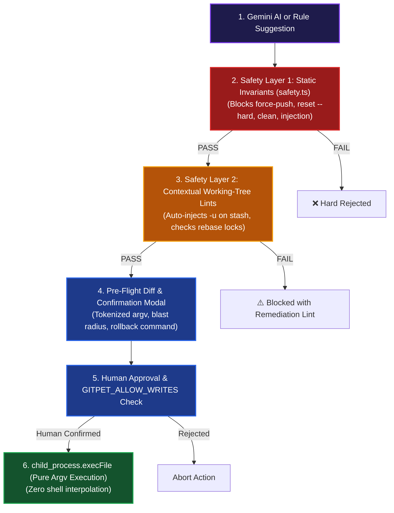

# 🎯 GitPet Post-Presentation Q&A Master Playbook

**Project:** GitPet — Ambient DevSecOps Repository Companion  
**Team:** Ribbon Patrol (Team 05) — Lucas Whitaker & David Castelli  
**Event:** [AWS Community Day Ottawa 2026](https://awscommunityday.ca/) — DevOps for GenAI Hackathon  
**Target Audience:** Hackathon Judges, Cloud Architects, DevSecOps Engineers, AI Researchers, and Technical Evaluators  
**Accompanying Slide Deck:** `GitPet_Professional_Deck 11.pptx` (13 Slides)  
**Live Application Target:** `http://localhost:3004` (`npm run dev`)

---

## 🧭 Navigation & Topic Index

1. [Elevator Cheat Sheet for Presenters (30-Second Quick Answers)](#1-elevator-cheat-sheet-for-presenters-30-second-quick-answers)
2. [Category 1: Core Value Proposition & UX Ergonomics](#category-1-core-value-proposition--ux-ergonomics)
3. [Category 2: AI Architecture, Google Gemini Models & Prompt Grounding](#category-2-ai-architecture-google-gemini-models--prompt-grounding)
4. [Category 3: DevSecOps Safety, OWASP LLM08 & 2-Layer Policy Engine](#category-3-devsecops-safety-owasp-llm08--2-layer-policy-engine)
5. [Category 4: Repository Workspace, DAG Graph & Diff Studio](#category-4-repository-workspace-dag-graph--diff-studio)
6. [Category 5: CI/CD Pipeline Telemetry, Flaky Tests & CVEs](#category-5-cicd-pipeline-telemetry-flaky-tests--cves)
7. [Category 6: Pull Request Intelligence & Turnaround Latency](#category-6-pull-request-intelligence--turnaround-latency)
8. [Category 7: Release Gate & Dynamic 0–100 HP Health Pool](#category-7-release-gate--dynamic-0100-hp-health-pool)
9. [Category 8: Live Workspace Mode vs 18 Deterministic Sandboxes](#category-8-live-workspace-mode-vs-18-deterministic-sandboxes)
10. [Category 9: Production Rigor, 31 Vitest Tests & Governance (P-01 to P-15)](#category-9-production-rigor-31-vitest-tests--governance-p-01-to-p-15)
11. [Category 10: AWS Ecosystem Integration & Future Roadmap](#category-10-aws-ecosystem-integration--future-roadmap)

---

## 1. Elevator Cheat Sheet for Presenters (30-Second Quick Answers)

When a judge asks a rapid question, deliver these concise, high-impact responses before elaborating:

```
┌────────────────────────────────────────────────────────────────────────────────────────────────────────┐
│                               30-SECOND RAPID DEFENSE MATRIX                                           │
│                                                                                                        │
│  "Why a virtual pet?"         ──► Peripheral ambient awareness. Turns terminal polling into passive    │
│                                   visual & acoustic cues without interrupting developer flow.          │
│                                                                                                        │
│  "Why not autonomous AI?"     ──► Solves OWASP LLM08 (Excessive Agency). Direct shell access is        │
│                                   destructive; pure argv execution + diff confirmation guarantees safety.│
│                                                                                                        │
│  "What if Gemini goes down?"  ──► 3-tier model cascade (3.7 -> 3.6 -> 3.1 Lite) + rock-solid           │
│                                   deterministic rule engine with zero downtime.                        │
│                                                                                                        │
│  "How is health scored?"      ──► Mathematical 0-100 HP health pool derived from 7 real-time telemetry │
│                                   deductions (drift, test failures, CVEs, conflicts, PR lag).          │
│                                                                                                        │
│  "Is this production-ready?"  ──► 31 passing Vitest tests, STRIDE threat model, CycloneDX SBOM,        │
│                                   NIST AI RMF governance, and zero hardcoded secrets.                  │
└────────────────────────────────────────────────────────────────────────────────────────────────────────┘
```

---

## Category 1: Core Value Proposition & UX Ergonomics

### Q1.1: Why create an ambient virtual companion (Byte) instead of just another CLI tool or IDE extension?
> **Speaker:** Lucas Whitaker  
> **Key Points:** Peripheral vision vs. cognitive friction • Eliminating terminal polling • Emotional connection & psychological safety
* **The Problem with CLIs:** Developers must remember to run `git status`, `git diff`, and check CI dashboards repeatedly. Terminal commands hide upstream drift and merge-base divergence until a release or pull breaks.
* **The Ambient Advantage:** GitPet uses the human brain's peripheral vision. A developer glancing at Byte’s posture (e.g., *heavy backpack* for unpushed work, *tangled yarn* for merge conflicts) or hearing a subtle Web Audio chime immediately registers repository health without stopping their coding flow.
* **Psychological Safety:** Complex Git commands (detached HEADs, interactive rebases) create anxiety for junior and mid-level engineers. Byte demystifies these states with plain-language explanations, explicit confidence scores, and pre-computed undo commands.

---

### Q1.2: Who is the primary target persona for GitPet in an enterprise development team?
> **Speaker:** David Castelli  
> **Key Points:** Full-stack developers • Platform/DevOps engineers • Release managers • Junior contributors
* **Full-Stack Developers:** Eliminates merge surprises, auto-formats conventional commit messages, and provides 1-click PR review reply drafting.
* **DevOps & Platform Teams:** Protects repositories against force-push accidents, monitors CI/CD pipeline reliability, and quarantines flaky test suites.
* **Release Managers & Security Leads:** Automated 5-Pillar Release Readiness Scorecard evaluates test pass rates, coverage, CVEs, and PR approvals before authorizing deployment.
* **Junior Engineers & Open-Source Contributors:** Interactive Git Tutor persona and visual DAG graph explain Git internals (blobs, trees, commit pointers) interactively.

---

### Q1.3: How does GitPet avoid adding to developer notification fatigue?
> **Speaker:** Lucas Whitaker  
> **Key Points:** Non-intrusive ambient telemetry • In-memory state machine • Procedural audio muting • Command Palette (`⌘K`)
* **Passive Rather than Intrusive:** GitPet does not send pop-up spam or OS notification banners. It lives quietly in the sidebar or a dedicated secondary monitor tab.
* **Tiered Severity:** Audio chimes only trigger when health crosses critical boundaries (e.g., transition into *Blocked* or *Unsafe* states).
* **Instant Mute & Controls:** Global audio toggle with state persistence across browser sessions, and quick navigation via `⌘K` / `Ctrl+K`.

---

## Category 2: AI Architecture, Google Gemini Models & Prompt Grounding

### Q2.1: Which Google Gemini models are used, and how does your tiered model routing work?
> **Speaker:** Lucas Whitaker  
> **Key Points:** `@google/genai` SDK v2.4.0 • 3 speed tiers • Fallback cascade
* **Deep Tier (`gemini-3.7-flash`):** Used for complex Git DAG topological reasoning, multi-file rebase conflict resolution, and release gate compliance auditing.
* **General Tier (`gemini-3.6-flash`):** Used for conversational guidance, diff reviews, persona roleplay, and Git tutoring.
* **Fast Tier (`gemini-3.1-flash-lite`):** Sub-second status reports, quick summaries, and AI conventional commit message generation.
* **Multi-Tier Cascade:** If a model returns a 404, 429 quota exhaustion, or 503 high demand, `generateWithFallback()` in `server.ts` automatically steps down to the next tier and finally to the deterministic rule engine.

---

### Q2.2: How does the Gemini Live Audio WebSocket streaming work in real-time?
> **Speaker:** Lucas Whitaker  
> **Key Points:** Bidirectional 16kHz PCM audio • `gemini-3.1-flash-live-preview` • `WebSocket /live`
* **Architecture:** The client microphone captures 16kHz linear PCM audio, streaming raw chunks over `ws://localhost:3004/live`.
* **Server-Side Session:** Express connects directly to Google GenAI's live session API (`gemini-3.1-flash-live-preview`), handling audio chunks and text transcript tokens concurrently.
* **Barge-In / Interruption Support:** When the user speaks while Byte is talking, the WebSocket detects an `interrupted` frame and immediately cuts audio playback.
* **Offline Fallback:** If offline or unconfigured, the frontend automatically falls back to browser `webkitSpeechRecognition` and `SpeechSynthesis`.

---

### Q2.3: How does the Pet Image Studio generate and isolate custom mascot avatars?
> **Speaker:** Lucas Whitaker  
> **Key Points:** `gemini-3.1-flash-image` • 30-minute in-memory preview registry • Iterative prompt editing
* **Live Image Synthesis:** Sends structured visual prompts to `gemini-3.1-flash-image` via `POST /api/ai/images/generate`.
* **Sandboxed Preview Registry:** Newly synthesized avatars are assigned a temporary `prev_` ID with a **30-minute TTL** (`assetRegistry` map in `server.ts`).
* **Iterative Multi-Turn Editing:** Users can refine the image via `POST /api/ai/images/edit` by referencing `sourceAssetId` and supplying prompt delta modifications.
* **Explicit Approval Gate:** Only when the user clicks **Approve as Active Avatar** (`POST /api/ai/images/:id/approve`) is the asset promoted to the active pet graphic.
* **Offline SVG Fallback:** When offline, `generateFallbackAvatar()` dynamically synthesizes high-contrast cyberpunk or pixel-art SVG badges with glowing halos.

---

### Q2.4: How do you prevent hallucinated Git commands and ensure AI responses are grounded?
> **Speaker:** Lucas Whitaker  
> **Key Points:** Grounded prompt injection • Evidence citations • 2-layer safety code barrier
* **Telemetry Context Injection:** Every AI prompt includes structured repository state (active branch, upstream, ahead/behind counts, dirty file lists with line deltas, remote commit SHAs).
* **Structured Response Contracts:** The AI is instructed to return an **Evidence Signals Box** listing concrete commit hashes and file paths alongside a **Confidence Rating (%)**.
* **Code Policy as Truth:** Even if the model hallucinates a dangerous command, the backend passes it through the **2-layer safety engine (`safety.ts`)** before it ever reaches the user.

---

## Category 3: DevSecOps Safety, OWASP LLM08 & 2-Layer Policy Engine



---

### Q3.1: How does GitPet address the OWASP LLM08 (Excessive Agency) vulnerability?
> **Speaker:** Lucas Whitaker  
> **Key Points:** Zero direct shell access • Pure argv arrays • Mandatory human confirmation gate
* **The Threat:** AI assistants with direct `child_process.exec("bash -c ...")` access can inadvertently run destructive commands (`git push --force`, `git reset --hard HEAD~5`, `rm -rf .git`).
* **Our Defense:**
  1. **Strict Binary Whitelist:** Only the `git` binary can be executed.
  2. **Pure Argv Execution:** Commands are parsed into token arrays (`['stash', 'push', '-u']`) and executed via `child_process.execFile`—preventing shell command chaining (`;`, `&&`, `|`, `` ` ``, `$()`).
  3. **Mandatory Preview Gate:** No command ever executes autonomously. The developer must inspect the tokenized command, affected files, and rollback plan in the **Preview Changes Modal**.

---

### Q3.2: What is the difference between Layer 1 (Static Invariants) and Layer 2 (Contextual Lints)?
> **Speaker:** Lucas Whitaker  
> **Key Points:** Universal dangerous syntax vs. live working-tree awareness
* **Layer 1 (Static Rules):** Evaluates command strings purely against danger invariants:
  - Blocks `git push --force` (auto-suggests `--force-with-lease`).
  - Blocks `git reset --hard`, `git clean -fdx`, `git branch -D`, and `git filter-branch`.
  - Rejects shell metacharacters (`;&|>$`).
* **Layer 2 (Contextual Lints):** Evaluates commands against *live repository telemetry*:
  - **Untracked Stash Lint (`stash-misses-untracked`):** If the working tree has untracked files and the command is `git stash`, GitPet automatically upgrades it to `git stash -u` to prevent silent data loss.
  - **Operation-in-Progress Guard:** If the repository is paused mid-rebase, it blocks non-rebase commands and forces `--continue`, `--skip`, or `--abort`.
  - **Diverged Pull Guard:** If local and remote branches have diverged, it prevents dirty merges and enforces safe rebasing with stash protection.

---

### Q3.3: How does the Rollback / Undo mechanism work?
> **Speaker:** Lucas Whitaker  
> **Key Points:** Pre-computed reversal commands • Immutable audit trail • `headBefore` / `headAfter` anchors
* Every recommended action calculates its mathematical inverse before running:
  - `git stash push` ──► `git stash pop`
  - `git pull --rebase` ──► `git rebase --abort` (in flight) or `git reset --keep ORIG_HEAD` (completed)
  - `git switch -c <name>` ──► `git switch <prev-branch>`
* All executions record timestamped state snapshots in the **Audit History Log**, enabling 1-click rollback.

---

## Category 4: Repository Workspace, DAG Graph & Diff Studio

### Q4.1: How is the multi-lane topological Git DAG visualizer generated?
> **Speaker:** David Castelli  
> **Key Points:** `GitDagVisualizer.tsx` • `gitDagNormalizer.ts` • Cubic bezier splines • 11 commit roles
* **Topological Sorting:** Parses raw commit history, traverses parent-child graph links, and computes topological sort order.
* **Lane Allocation:** Assigns commits to non-intersecting parallel vertical lanes, dynamically allocating new lanes for feature branches and collapsing them at merge points.
* **Cubic Bezier Splines:** Renders smooth SVG connection curves (`M x1 y1 C x1 yMid, x2 yMid, x2 y2`) between parents and children.
* **Merge-Base Highlighting:** Detects the lowest common ancestor (LCA) between local branch and upstream, rendering it with a distinctive double-ring halo node.
* **11 Commit Roles:** Color-codes nodes by role (*HEAD*, *Upstream HEAD*, *Local Ahead*, *Remote Behind*, *Merge Base*, *Detached*, *Conflicted Hazard*).

---

### Q4.2: How does the Working Tree Diff Studio support granular file staging?
> **Speaker:** David Castelli  
> **Key Points:** `DiffViewer.tsx` • `diffParser.ts` • Checkbox staging • Syntax-highlighted diffs
* **Granular Checkbox Controls:** Developers can select specific files to stage rather than being forced to run `git add .`.
* **Unified & Split Diffs:** Parses standard unified diffs into additions (green), deletions (red), and hunk headers.
* **Search Filter:** Instant real-time search filtering across large working trees with hundreds of modified files.
* **AI Conventional Commit Integration:** Staged file diffs can be passed directly to the AI Commit Generator to synthesize semantic commit messages (`feat`, `fix`, `refactor`).

---

## Category 5: CI/CD Pipeline Telemetry, Flaky Tests & CVEs

### Q5.1: How does GitPet identify and quarantine flaky test suites?
> **Speaker:** David Castelli  
> **Key Points:** `CICDPage.tsx` • Pass rate analytics • 1-click quarantine recommendations
* **Pass Rate Diagnostics:** Analyzes historical CI pipeline test executions. If a test suite exhibits intermittent failures (e.g. 70% pass rate over 10 runs), it is flagged with a **Flaky Test Warning**.
* **1-Click Quarantine:** GitPet proposes an atomic quarantine action (`test.skip` or tagging with `@flaky`) so pipeline deployment gates aren't blocked by intermittent timing bugs while engineers investigate the root cause.

---

### Q5.2: How does GitPet handle supply chain vulnerabilities (CVEs)?
> **Speaker:** David Castelli  
> **Key Points:** Dependency tree analysis • Severity ratings • Dependabot patch drafting
* **Vulnerability Telemetry:** Scans package manifests for high and critical CVEs (e.g. `CVE-2026-8819` in `jsonwebtoken@8.5.1`).
* **Automated Remediation:** Drafts upgrade pull requests and patch commands with one click, verifying that upstream lockfiles remain consistent.

---

## Category 6: Pull Request Intelligence & Turnaround Latency

### Q6.1: How does GitPet calculate PR Turnaround Latency and identify bottlenecks?
> **Speaker:** David Castelli  
> **Key Points:** `PRIntelligencePage.tsx` • Turnaround clock • Review approval ratios
* **Turnaround Duration Clock:** Tracks days elapsed since PR submission (e.g. *Waiting 3 days for review*).
* **Review Approval Ratios:** Displays progress bars comparing current approvals against required thresholds (e.g. `1 of 2 required approvals`).
* **Nudge Reviewers:** Proposes a polite, formatted reminder comment via GitHub CLI (`gh pr comment`) to ping assigned reviewers without manual context-switching.

---

### Q6.2: How does the AI Resolution Reply Composer draft responses to reviewer comments?
> **Speaker:** David Castelli  
> **Key Points:** Inline review threads • Context-aware code replies • Gemini 3.1 Flash Lite
* **Thread Telemetry:** Reads reviewer feedback, affected file path, and exact line numbers (`src/auth/authService.ts:L42`).
* **One-Click Drafts:** Gemini analyzes the reviewer request (e.g. *"Please sanitize token payload"*) and drafts a polite, technical response: *"Added AbortController timeout and sanitization helper in auth.spec.ts. Ready for re-review!"*
* **Developer Review:** The draft is placed into an editable text field for developer refinement before posting.

---

## Category 7: Release Gate & Dynamic 0–100 HP Health Pool

### Q7.1: How does the 5-Pillar Release Gate calculate readiness scores?
> **Speaker:** Lucas Whitaker  
> **Key Points:** `releaseReadiness.ts` • 5 weighted pillars • AI executive verdict • JSON & Markdown export

```
┌────────────────────────────────────────────────────────────────────────────────────────────────────────┐
│                               5-PILLAR RELEASE GATE SCORING FORMULA                                    │
│                                                                                                        │
│  Pillar 1: Tests Passing Rate (25% Weight)    ──► 100% Passing = 25 pts                                │
│  Pillar 2: Code Coverage % (20% Weight)       ──► ≥ 80% Coverage = 20 pts                              │
│  Pillar 3: CVE Security Scan (25% Weight)     ──► 0 High/Crit CVEs = 25 pts (1 High = 10 pts)          │
│  Pillar 4: PR Review Approvals (15% Weight)   ──► All Required Approvals Met = 15 pts                  │
│  Pillar 5: Branch Freshness (15% Weight)      ──► Up to Date with Main = 15 pts                        │
│                                                                                                        │
│  Total Score: Sum of 5 Pillars (0 to 100%)                                                             │
│  • ≥ 90%: 🟢 READY TO SHIP (Green)                                                                     │
│  • 70% – 89%: 🟡 CAUTION / REVIEW (Amber)                                                               │
│  • < 70%: 🔴 BLOCKED / DO NOT SHIP (Red)                                                               │
└────────────────────────────────────────────────────────────────────────────────────────────────────────┘
```

* **AI Executive Synthesis:** `POST /api/ai/release-readiness` generates structured release headlines, risk summaries, and blocker inventories.
* **Compliance Artifact Export:** 1-click download of JSON audit manifests and Markdown release notes for deployment pipeline gates.

---

### Q7.2: How is the 0–100 HP Dynamic Health Pool calculated across the 7 risk factors?
> **Speaker:** Lucas Whitaker  
> **Key Points:** `mockScenarios.ts` • 7 real-time deduction factors • Deep-link remediation
* **Base Score:** 100 HP.
* **Mathematical Deductions:**
  1. **Branch Divergence:** -8 to -35 pts (based on ahead/behind count & untracked files).
  2. **Failed & Flaky Tests:** -14 to -28 pts (based on build failures or test intermittency).
  3. **Secrets & Security Deviations:** -15 to -30 pts (exposed credentials or public S3 bucket policies).
  4. **Supply Chain CVEs:** -10 to -25 pts (high/critical vulnerabilities).
  5. **Merge Conflicts & Code Smells:** -25 to -40 pts (active conflict markers).
  6. **PR Review Lag:** -5 to -15 pts (unreviewed PRs > 3 days).
  7. **Oversized PR Scope:** -5 to -10 pts (> 400 lines or > 15 files).
* **Remediate with Byte:** Every factor features a 1-click deep link that navigates directly to the companion chat with diagnostic context pre-populated.

---

## Category 8: Live Workspace Mode vs 18 Deterministic Sandboxes

### Q8.1: How does GitPet ensure safety when inspecting live local Git workspaces?
> **Speaker:** Lucas Whitaker  
> **Key Points:** Read-only default • `GITPET_ALLOW_WRITES` gate • Dual live sources
* **Default Read-Only:** The live scanner (`/api/git/live-status`) uses read-only commands (`git status -uall`, `rev-parse`, `log`).
* **Explicit Opt-In Writes:** To execute mutating commands, the developer must explicitly configure `GITPET_ALLOW_WRITES=true` in `.env`.
* **Public GitHub Fixture:** Reviewers can test live repository drift without configuring local paths via the public fixture [`farisnour/gitpet-acme-corp-ecommerce-store`](https://github.com/farisnour/gitpet-acme-corp-ecommerce-store).

---

### Q8.2: Why are the 18 deterministic sandbox scenarios so important for judges and reviewers?
> **Speaker:** David Castelli  
> **Key Points:** Guideline P-15 compliance • Zero setup friction • Comprehensive edge-case exploration
* Judges do not need to corrupt their personal workstation's `.git` folder to evaluate complex Git states.
* Instantly reproduces edge cases: detached HEADs, stale merged branches, high CVEs, flaky tests, Kubernetes CrashLoopBackOffs, Terraform S3 state locks, and force-push work-loss hazards.

---

## Category 9: Production Rigor, 31 Vitest Tests & Governance (P-01 to P-15)

### Q9.1: What automated testing and verification exists in the codebase?
> **Speaker:** Lucas Whitaker  
> **Key Points:** 31 Vitest tests • 3 specialized test suites • 100% pass rate
* `tests/security.test.ts` (9 tests): Prompt sanitization, credential redaction (Google API keys, GitHub PATs, Bearer tokens), jailbreak rejection, and human approval gates.
* `tests/executor.test.ts` (19 tests): 8 static safety rules, 7 contextual working-tree lints, dry-run diff simulation, and parameter error handling.
* `tests/markdown.test.ts` (3 tests): Markdown parsing, GFM rendering, syntax highlighting, and XSS sanitization.

---

### Q9.2: How does GitPet comply with Hackathon Guidelines P-01 through P-15?
> **Speaker:** Lucas Whitaker  
> **Key Points:** [docs/GUIDELINES_COMPLIANCE.md](file:///c:/Users/lwhitaker/main/gitPet/DevOps-for-GenAI---Ottawa-2026---Team-05-Ribbon-Patrol/docs/GUIDELINES_COMPLIANCE.md)
* **P-01 (Team Size):** Compliant (Ribbon Patrol: Lucas Whitaker & David Castelli).
* **P-02 (Single Theme):** DevOps for GenAI Track.
* **P-04 (Working System):** Full-stack React 19 + Express application on port 3004.
* **P-06 (AI Transparency):** Disclosed Gemini 3.6/3.7/3.1 Flash and pair programming tools.
* **P-07 (Security by Design):** STRIDE threat model, 2-layer safety policy, token redactor.
* **P-08 (Governance):** NIST AI RMF 1.0 AI System Card and human oversight matrix.
* **P-09 (Testing):** 31 automated Vitest unit and security tests.
* **P-13 (No Secrets):** Runtime secret redactor, `.gitignore`, and zero committed keys.
* **P-14 (Supply Chain):** MIT License, CycloneDX SBOM (`npm run sbom`).
* **P-15 (Demo Integrity):** Fully classified live subsystems vs. deterministic sandboxes vs. fallbacks in `DEMO_NOTES.md`.

---

## Category 10: AWS Ecosystem Integration & Future Roadmap

### Q10.1: How could GitPet integrate into a native AWS enterprise cloud ecosystem?
> **Speaker:** Lucas Whitaker  
> **Key Points:** AWS CodePipeline • Amazon Bedrock • Amazon CloudWatch • AWS Secrets Manager
* **AWS CodePipeline & CodeBuild:** GitPet can ingest build telemetry directly from CodeBuild webhooks and CloudWatch log groups into the CI/CD Telemetry workspace.
* **Amazon Bedrock Multi-Model Routing:** In enterprise AWS environments, the tiered routing layer can seamlessly proxy between Amazon Nova, Claude 3.5 Sonnet on Bedrock, and Google Gemini via Bedrock Converse APIs.
* **AWS Security Hub & Amazon Inspector:** Directly pull CVE findings, S3 bucket policy deviations, and IAM privilege escalations into the Risk Scorecard.
* **Amazon ECS / AWS Fargate Deployment:** Containerized with Docker and ready for scalable enterprise deployment behind AWS ALB with Cognito authentication.

---

### Q10.2: What is the post-hackathon roadmap for GitPet?
> **Speaker:** David Castelli  
> **Key Points:** IDE extensions • Native desktop menu bar app • Multi-repo dashboard
1. **VS Code & JetBrains Native Companion Plugin:** Embedding Byte directly into the status bar and editor sidebar.
2. **macOS / Windows Menu Bar Companion:** System-tray resident companion monitoring all local git repositories in the background.
3. **Multi-Repository Enterprise Fleet Dashboard:** Aggregated health pool monitoring across hundreds of microservices for platform engineering teams.

---

## 🎯 Final Quick-Reference Checklist for Presentation Day

- [ ] Dev server running on `http://localhost:3004` (`npm run dev`)
- [ ] Dark mode selected as default visual presentation style
- [ ] Audio enabled and verified (procedural chiptunes active)
- [ ] Working microphone ready for **Live Voice Modal** demonstration
- [ ] Slide deck `GitPet_Professional_Deck 11.pptx` ready on primary display
- [ ] Terminal window open with passing test output (`npm test` — 31 tests passed)
- [ ] Both presenters (Lucas Whitaker & David Castelli) aligned on slide handoffs and Q&A leads

---

*GitPet — Built with passion by Ribbon Patrol (Team 05) for AWS Community Day Ottawa 2026.*
